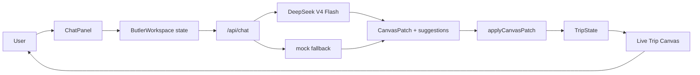
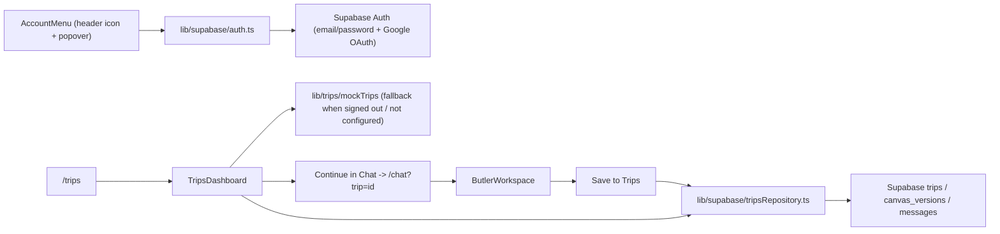
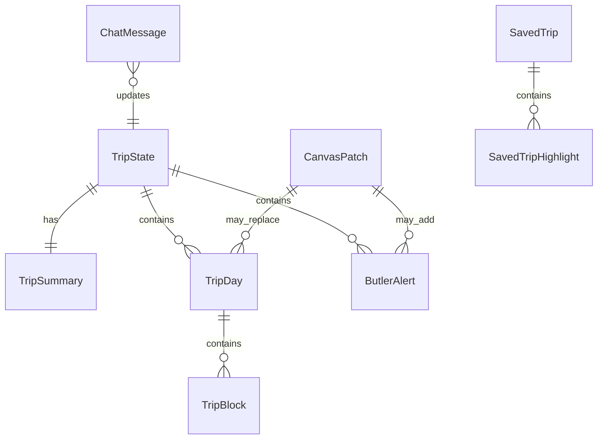

# VisePanda — 设计文档

## 架构概览

VisePanda 采用 Next.js App Router 架构。核心体验是 AI Butler workspace：用户在右侧聊天，客户端调用服务端 `/api/chat`，服务端优先使用 DeepSeek V4 Flash 返回结构化 canvas patch，失败时回落到 mock provider，左侧 Trip Canvas 实时更新。



`v0.1.11` 开始，Trips 和 Chat 共用一个真实 Supabase persistence 闭环：登录且配置 Supabase 时使用真实数据，否则回落到 `lib/trips/mockTrips`。



`v0.1.12` 起，`ButlerWorkspace` 在用户未登录时把当前 draft（`trip` + `messages`）写入 `localStorage`（`visepanda:guest-draft`），刷新或重新打开页面会还原；一旦该用户通过登录成功，组件检测到 session 从 `null` 变为有值，且本地仍有未保存的草稿（`tripId` 为空且有消息），就自动调用与 "Save to Trips" 相同的保存路径，把草稿写入 Supabase 并清空本地存储，无需用户再手动点击保存。

### ADR-013：guest draft 迁移为什么用 `localStorage` + 登录事件触发，而不是服务端 session 合并

- 背景：guest 用户在未登录状态下使用 Chat 生成 trip draft，登录后这份草稿不应该丢失。
- 决策：用浏览器 `localStorage` 暂存 draft（trip canvas + 消息），在 `useSupabaseSession` 报告的 `session` 从 `null` 变为非空那一刻，于客户端自动调用现有的 `saveTripCanvas` / `appendMessage`（与手动 "Save to Trips" 完全相同的路径），而不是引入服务端 session 合并逻辑或匿名用户表。
- 原因：当前没有匿名 Supabase Auth 用户，guest 状态没有任何服务端身份可以关联草稿；用客户端 `localStorage` + 登录事件触发是最小实现，且复用已有的 persistence 入口（`tripsRepository.ts`），不引入新的数据模型或后端流程。
- 代价：草稿只存在发起浏览器的 `localStorage` 里，换设备/换浏览器或清除站点数据会丢失未登录草稿；这是当前阶段可接受的限制，留给未来如果要支持跨设备 guest 草稿时再升级为服务端匿名身份方案。

## 技术选型

| 选项 | 选择 | 理由 |
|------|------|------|
| 框架 | Next.js App Router | 原生适配 Vercel，后续可自然加入 API routes、server actions、动态页面。 |
| UI | React + TypeScript | Chat 状态驱动画布更新，组件化和类型契约更稳定。 |
| 样式 | 全局 CSS tokens + 组件 class | 第一阶段减少依赖，方便精确控制 warm New Chinese 视觉。 |
| 图标 | lucide-react | 顶部导航使用轻量线性图标，避免字母占位，同时保持与 Vercel/Next.js 前端栈兼容。 |
| 数据库 | Supabase（预留） | 后续适合 auth、trips、chat history、canvas snapshots。 |
| AI | DeepSeek V4 Flash + mock fallback | 真实 API 可以验证产品主链路；mock fallback 保证无 key 或模型异常时仍稳定可用。 |
| 部署 | Vercel | 与 Next.js 路线一致，适合静态页面 + API route。 |
| 测试 | Vitest + Testing Library + Playwright | 覆盖纯逻辑、组件交互、桌面/移动浏览器烟测。 |

## 数据模型



核心类型：

- `TripState`：画布完整状态，包括 summary、days、alerts、lastUpdatedReason。
- `TripSummary`：标题、天数、节奏、用户类型、目的地、置信状态。
- `TripDay`：单日行程，包括城市、节奏、时间块、餐饮、住宿、交通、备注。
- `ButlerAlert`：签证、支付、预订、交通、天气、语言、风险、应急提醒。
- `CanvasPatch`：AI provider 返回的结构化更新。
- `ChatMessage`：聊天记录。
- `suggestions`：`/api/chat` 顶层返回的两个上下文建议问题，不写入 `CanvasPatch`，避免污染行程数据契约。
- `SavedTrip`：Trips Dashboard 当前使用的静态行程卡类型，后续会映射到 Supabase trips。
- `tripStatusDescriptions` / `tripStatusNextActions`：Trips 状态说明和下一步操作文案，Dashboard 与 Trip Detail 共用。
- `DestinationScene`：目的地水墨背景场景，由 `lib/visual/destinationBackground.ts` 根据 `TripSummary.destinations` 推导。
- `ExploreProviderStatus`：Explore provider readiness metadata，说明当前 provider 模式、覆盖范围、候选真实数据源、限制和下一步接入重点。
- `ToolsProviderStatus`：Tools provider readiness metadata，说明当前 provider 模式、覆盖范围、候选真实数据源、限制和下一步接入重点。
- `UserRow` / `TripRow` / `CanvasVersionRow` / `MessageRow`（`lib/supabase/schema.ts`）：对应 `supabase/migrations/0001_init_trip_schema.sql` 中 `users`、`trips`、`canvas_versions`、`messages` 表的 TypeScript 契约，当前未接入真实 Supabase 客户端。

## 关键设计决策

### ADR-001：为什么 DeepSeek 接入后仍保留 mock fallback

- 背景：真实 AI 输出质量、key 配置、provider 可用性都会影响 MVP 稳定性。
- 方案对比：仅真实 AI 更接近最终产品，但任何 key、限流、格式错误都会阻断画布；DeepSeek + mock fallback 可验证真实链路，同时保留 deterministic fallback 兜底。
- 结论：`/api/chat` 优先调用 DeepSeek V4 Flash；缺少 `DEEPSEEK_API_KEY`、HTTP 失败或 JSON patch 不合法时回落到 mock。

### ADR-002：为什么先做 Chat，再逐步扩展 Trips / Explore / Tools

- 背景：用户明确要求 Chat 是本轮主体验，右侧持续聊天、左侧实时生成行程画布。
- 方案对比：同时做所有 tab 范围过大，容易牺牲核心体验；先做 Chat 可以更快验证产品主线。
- 结论：阶段一完整实现 Chat / AI Butler；`v0.1.8` 开始把 Trips 从占位扩展为行程库骨架。

### ADR-003：为什么场景化背景放到后续（已在 v0.1.23 实现）

- 背景：按北京/上海切换水墨背景会显著增强体验。
- 方案对比：当前立即实现需要 destination state、asset mapping、切换动画、性能处理；后续实现可以先保证基础背景和工作台稳定。
- 结论：`v0.1.9`-`v0.1.22` 使用单一水墨背景，`v0.1.23` 完成 destination-aware background switching（见 ADR-025）。

### ADR-004：为什么 Day 详情使用抽屉而不是直接展开

- 背景：当前阶段优先电脑横屏端，主画布需要快速扫描，同时用户希望直接看到 Morning / Afternoon / Evening 的一天结构。
- 方案对比：主界面直接展开所有详情信息完整，但会挤压行程总览；三段式 Day 卡 + 抽屉详情让主画布可扫读，也保留编辑深度。
- 结论：Trip Canvas 主界面显示 Day 时间线和 Morning / Afternoon / Evening 三段摘要，完整描述、酒店、交通、备注和本地修改进入侧边抽屉。

### ADR-005：为什么桌面工作台固定为一屏

- 背景：Chat 是右侧持续对话，左侧是实时画布；横屏端应像稳定工作台，而不是长页面。
- 方案对比：页面级滚动实现简单，但聊天、画布和抽屉会互相错位；一屏固定 + 区域内部滚动更像产品工具。
- 结论：桌面端使用一屏固定布局，聊天流、日程列表、Trips 列表和抽屉内部自行滚动。

### ADR-006：为什么 suggestions 不放进 CanvasPatch

- 背景：建议问题属于聊天体验，不属于行程画布状态。
- 方案对比：放进 `CanvasPatch` 实现简单，但会污染 trip/canvas 数据契约；作为 `/api/chat` 顶层字段返回更清晰。
- 结论：`/api/chat` 返回 `{ patch, suggestions }`，其中 suggestions 固定为 2 个上下文相关问题。

### ADR-007：为什么 Trips 先用 mock data

- 背景：Trips 是保存行程、继续编辑和分享的关键入口，但 Supabase schema 尚未确认。
- 方案对比：立即接数据库会过早固定数据模型；先做静态 dashboard 可以验证页面信息结构、筛选和导航入口。
- 结论：`v0.1.8` Trips 使用 `lib/trips/mockTrips.ts`，后续再接 Supabase persistence 和 trip detail。

### ADR-008：为什么移除 Canvas 顶部五张任务卡

- 背景：用户希望 Live Canvas 更像行程本体，而不是提醒/任务面板；Visa、Payment、Booking 等任务框占用了画布首屏空间。
- 方案对比：保留任务卡能表达 AI 管家提醒，但会压缩每日行程；移除任务卡能让 Day 1 / Day 2 / Day 3 和三段行程成为视觉主角。
- 结论：`v0.1.9` 从 `TripCanvas` 移除 `CanvasTaskStrip` 渲染。提醒能力后续通过 `ButlerReminders` 组件（位于行程时间线下方，v0.1.26）以 Tools 深链形式呈现，不再显示在 Canvas 顶部。

### ADR-009：为什么 Supabase schema 用 canvas_versions 而不是直接拆分 trip_days 表

- 背景：`TripState` 包含 summary、days、alerts，结构会随 AI patch 频繁整体替换；Trips 后续还需要支持恢复历史版本和分享某个快照。
- 方案对比：把 `TripDay`、`ButlerAlert` 拆成各自的表能做更细粒度查询，但会让 patch 应用从一次 JSON 替换变成多表事务，且历史版本难以整体回滚；用 `canvas_versions.canvas` 存整份 `TripState` JSON，能直接复用现有 `applyCanvasPatch` 输出，并天然支持版本历史和回滚。
- 结论：`trips` 表存元信息和状态，`canvas_versions` 表存每次保存的完整 `TripState` JSON 快照，`trips.current_canvas_version_id` 指向最新快照；`messages` 表存聊天记录，结构对应 `ChatMessage`。Schema 文件：`supabase/migrations/0001_init_trip_schema.sql`，对应 TypeScript 契约：`lib/supabase/schema.ts`。

### ADR-010：为什么 Account 登录从 magic link 改为邮箱密码 + Google OAuth（v0.1.16 起取代原决策）

- 背景：任务 2.4 最初用 Supabase magic link（`signInWithOtp`）做最小可用登录。`v0.1.16` 用户要求把 Account 从独立页面收进顶部导航的一个图标 + 悬浮窗口，并改用邮箱密码登录或 Google 登录，登录后能改名、改密码、登出。
- 方案对比：继续用 magic link 需要用户跳出产品去查收邮件再跳回来，和"悬浮窗口里直接完成登录"的产品目标冲突；自建密码找回/校验流程成本高。Supabase 内置 `signInWithPassword`/`signUp`（邮箱密码）和 `signInWithOAuth({ provider: "google" })`（Google 登录）都是零自建后端代码的标准能力，且 `updateUser` 同时支持改密码（`password`）和改名（`data.full_name`），可以直接满足悬浮窗口内的账号管理需求。
- 结论：`lib/supabase/auth.ts` 改为导出 `signInWithPassword`、`signUpWithPassword`、`signInWithGoogle`、`updateDisplayName`、`updatePassword`、`signOut`；不再提供 magic link 入口。Google 登录的回调仍依赖浏览器 Supabase 客户端默认的 `detectSessionInUrl: true` 自动消费回跳 session，不需要额外的服务端 OAuth 回调路由。

### ADR-011：为什么 Trips/Chat persistence 直接用浏览器端 Supabase 客户端而不是新建 API route

- 背景：`/api/trips` 之前是占位 route；真实保存只涉及 `trips`/`canvas_versions`/`messages`,不涉及任何服务端密钥。
- 方案对比：经过 `/api/trips` 服务端转发会多一层网络跳转和重复的 schema 校验代码；让浏览器端 Supabase 客户端（用 `NEXT_PUBLIC_SUPABASE_ANON_KEY`）直接读写，由 Postgres RLS policies（`auth.uid() = owner_id`）保证隔离,逻辑更直接也更安全。
- 结论：`lib/supabase/tripsRepository.ts` 是浏览器端读写 trips 数据的唯一入口，被 `ButlerWorkspace`（保存当前 canvas）和 `TripsDashboard`（读取行程列表/恢复 canvas）共用；`SUPABASE_SERVICE_ROLE_KEY` 仍保留给未来需要绕过 RLS 的服务端任务，目前未使用。

### ADR-012：为什么 Chat 用 `window.location` / `history.replaceState` 而不是 `next/navigation`

- 背景：需要把保存后的 trip id 写进 `/chat` 的 URL，并在打开 `/chat?trip=<id>` 时读取它来恢复 canvas。
- 方案对比：`useSearchParams`/`useRouter`（`next/navigation`）是 Next App Router 的标准方式，但它们需要被挂载在真实的 Next Router 树下；现有 Vitest 组件测试直接 `render(<ButlerWorkspace />)`，没有 Router context，会在测试里抛错，还需要额外的测试基础设施改造。直接用浏览器原生 `window.location.search` 读、`window.history.replaceState` 写，行为等价（同样不触发整页跳转），且不依赖任何 Router 上下文，测试和组件解耦更简单。
- 结论：`ButlerWorkspace` 用原生 `window.location` / `history.replaceState` 读写 `?trip=` 参数，不引入 `next/navigation` 依赖。

### ADR-014：为什么分享链接用宽松的 RLS 读策略，而不是在数据库层匹配具体 token

- 背景：`v0.1.14` 需要让任何人（包括未登录访客）通过 `/share/[token]` 只读查看某条已分享行程，但 `trips`/`canvas_versions` 默认 RLS 只允许 `owner_id = auth.uid()`。
- 方案对比：可以尝试在 RLS policy 里直接比较 `share_token` 和请求参数，但 Postgres RLS policy 无法直接读取应用层传入的 query 参数（只能用 `auth.uid()`、`current_setting` 等会话级上下文），伪造这种比较意义不大；更简单可靠的方式是用一条宽松策略允许"任何 `share_token is not null` 的行可读"，真正的 token 精确匹配交给应用层查询的 `.eq("share_token", shareToken)` 完成。
- 结论：新增 `supabase/migrations/0002_trip_archive_and_share.sql`，为 `trips` 增加 `for select using (share_token is not null)` 策略，为 `canvas_versions` 增加基于 `exists` 子查询（检查对应 trip 是否有 `share_token`）的只读策略；`messages` 表不开放公开读取，保证分享页看不到聊天记录。该迁移是独立文件而不是直接改 `0001_init_trip_schema.sql`，因为已上线的 Supabase 项目已经执行过 0001，需要按顺序追加执行 0002。

### ADR-015：为什么 Explore provider 用接口 + 静态实现，而不是直接接 Amap/Trip.com/Meituan

- 背景：任务 4.1/4.2 需要让 Explore 展示城市、景点、美食、住宿，但真实第三方 API（Amap、Trip.com、Meituan）的能力边界、配额和合作关系还未验证；过早绑定某一家会让 UI 和数据格式被该厂商的响应结构锁死。
- 方案对比：可以先直接接一个真实 API 验证可行性，但这样会让 `ExploreBoard` 组件直接依赖该厂商的字段命名和分页逻辑，后续换厂商或多厂商聚合时需要重写 UI；用接口先行（`ExploreProvider`）能让 UI 只依赖稳定的领域类型（`ExploreCity`、`ExploreAttraction`、`ExploreFoodSpot`、`ExploreStay`），具体数据来源可以随时替换。
- 结论：`lib/explore/types.ts` 定义 `ExploreProvider` 接口和领域类型；`lib/explore/staticProvider.ts` 用精选静态数据实现该接口（覆盖 Beijing、Shanghai、Chengdu、Xi'an）；`lib/explore/index.ts` 的 `getExploreProvider()` 是组件唯一允许调用的工厂函数。后续接入真实 Amap/Trip.com/Meituan 时，只需要新增一个实现该接口的 provider 并在工厂里切换，`components/explore/ExploreBoard.tsx` 不需要改动。

### ADR-016：为什么把 Account 从独立页面改成头部图标 + 悬浮窗口

- 背景：`/account` 作为独立页面需要整页导航才能登录/管理账号，而登录、改名、改密码、登出都是轻量的瞬时操作，不需要占用整页。
- 方案对比：保留独立页面结构清晰但打断当前任务上下文（用户从 Chat/Trips/Explore 跳走再跳回）；做成头部常驻的图标 + 悬浮窗口可以在任意页面就地完成登录和账号管理，不离开当前上下文，也不需要任何路由跳转。
- 结论：新增 `components/account/AccountMenu.tsx`，渲染在 `AppShell` 头部、`NavTabs` 旁边，自带 `open` 状态控制悬浮窗口显示；删除 `app/account/page.tsx` 和 `components/account/AccountPanel.tsx`，`NavTabs` 的 `AppTab` 类型移除 `"account"`。悬浮窗口内部按 `useSupabaseSession` 的 `configured/loading/session` 三态切换：未配置时显示 guest 提示，未登录时显示邮箱密码登录/注册表单和 Continue with Google 按钮，已登录时显示 Change name / Change password / Log out。

### ADR-017：为什么 Explore 的 Add to Trip 用「跳转 Chat 并自动发送消息」而不是直接拼装 CanvasPatch

- 背景：任务 4.4 需要让用户在 `/explore` 看到某个景点/美食/住宿后，能一键把它加入当前行程画布；但 `AGENTS.md` 明确约束「AI 输出必须通过 `CanvasPatch` 结构进入画布，不要让 UI 直接解析自然语言」，也不允许任何非 Chat 界面直接构造或合并 `TripDay`/`TripState`。
- 方案对比：可以让 `ExploreBoard` 直接在本地拼出一份 `CanvasPatch`（比如把景点名字塞进某一天的 Morning block）插入画布，这样不需要跳转页面，但会绕开 `/api/chat` 和 DeepSeek/mock fallback，导致两套生成画布内容的逻辑并存，且新内容无法获得 AI 对行程节奏、冲突、合理性的判断；改为「跳转 Chat 并自动发送一条草稿消息」则完全复用已有的 `handleSend` → `/api/chat` → `CanvasPatch` → `applyCanvasPatch` 流程，新内容和用户手打的请求走相同代码路径，不需要新增任何画布写入入口。
- 结论：`ExploreBoard` 的每个条目新增一个 "Add to Trip" 按钮，点击后用 `window.location.href` 跳转到 `/chat?add=<encodeURIComponent(草稿消息)>`；`ButlerWorkspace` 挂载时用一个一次性 `useEffect` 读取 `add` 参数，若存在则立即清空 URL（`history.replaceState`）并调用现有的 `handleSend(addParam)`，画布更新路径与用户手动发消息完全一致。

### ADR-018：为什么 Tools 第一版用静态参考清单 + provider 接口，而不是直接接实时汇率/翻译/签证 API

- 背景：任务 5.1 要求把 Tools 从占位页升级为签证入境、支付设置、翻译、汇率、地铁、eSIM/VPN、应急 7 个真实工具页面，但实时汇率、机器翻译、签证规则查询都需要第三方 API 和持续维护的数据源，目前没有已验证的合作方或配额。
- 方案对比：可以先接一个真实 API（比如汇率换算）验证可行性，但这会让其余 6 个仍是占位的分类显得不一致，也会把 `ToolsBoard` 的渲染逻辑和某一家 API 的响应结构绑死；参考 ADR-015 对 Explore 的处理方式，先用接口加静态内容把 7 个分类都做成可用的骨架（每个分类给出准确、不易过期的通用建议，而不是承诺实时数据），用户立刻可以读到有用的清单，且后续接入真实数据源时只需替换 provider 实现。
- 结论：新增 `lib/tools/types.ts` 定义 `ToolsProvider` 接口（`listCategories()`）和 `ToolCategory` 类型（`id`/`name`/`summary`/`tips`）；`lib/tools/staticProvider.ts` 用精选静态内容实现该接口，覆盖 7 个分类；`lib/tools/index.ts` 的 `getToolsProvider()` 是组件唯一允许调用的工厂函数。`Currency`/`Translate` 等分类的文案明确写出"实时数据未接入，请查询银行/官方渠道"，避免用户误以为是实时结果。后续接入真实汇率/翻译 API 时，只需新增一个实现该接口的 provider 并在工厂里切换，`components/tools/ToolsBoard.tsx` 不需要改动。

### ADR-019：为什么 Tools 分类深链使用 `?category=` 参数而不是恢复 Canvas 任务卡

- 背景：任务 5.2 需要让任务/提醒入口能跳到对应工具分类，但用户已明确要求移除 Canvas 顶部 Visa / Payment / Booking / Less tiring / Food-focused 五个任务框，当前画布应优先展示 Day 时间线和 Morning / Afternoon / Evening。
- 方案对比：恢复顶部任务卡能提供显眼入口，但会破坏 `v0.1.9` 确认过的画布信息架构；用 `/tools?category=<tool-category-id>` 深链则让 Chat、Canvas、未来轻量提醒或外部链接都能指向同一工具分类，不需要在画布上重新占位。
- 结论：`ToolsBoard` 挂载后读取 `window.location.search` 中的 `category` 参数，如果匹配当前 provider 返回的 `ToolCategory.id` 就自动选中该分类，否则回退到第一个分类；用户手动点击分类时用 `history.replaceState` 更新地址栏，方便复制和复用深链。该实现继续只通过 `getToolsProvider()` 获取工具数据。

### ADR-020：为什么桌面端继续一屏锁定并压缩标题区

- 背景：用户要求 Chat / Trips / Explore / Tools 都尽量把展示面积留给主体内容，页面展示不下时使用滑动条，而不是让整个页面纵向滚动。
- 方案对比：页面级滚动实现简单，但顶部导航、Chat rail 和 Trip Canvas 会在滚动时错位；一屏锁定 + 内部滚动可以保持产品工作台感，但要求标题、摘要、筛选、卡片间距都更克制。
- 结论：桌面端 `.app-main` 保持 `overflow: hidden`；Chat 的 `.trip-canvas__days`、Trips 的 `.trip-library`、Explore 的 `.explore-board__columns`、Tools 的 `.tools-category-detail` 使用内部滚动。`v0.1.19` 压缩了顶部导航高度、Live Trip Canvas 标题、Trip Draft summary、Trips/Explore/Tools 页头和卡片间距。

### ADR-021：为什么顶部导航使用 lucide-react 图标

- 背景：之前 Chat / Trips / Explore / Tools 导航只用 C/T/E/X 字母占位，识别度低，也不像成品。
- 方案对比：自画 SVG 可以少一个依赖，但不利于统一线宽和未来扩展；`lucide-react` 是轻量、Tree-shake 友好的 React 图标库，能直接提供 MessageCircle、Luggage、Compass、Wrench 等语义明确的线性图标。
- 结论：`components/shell/NavTabs.tsx` 引入 `lucide-react` 的四个图标，保留原来的文字 label 和 active 状态，不改变路由结构。

### ADR-022：为什么 Trips 状态说明集中在 `lib/trips/mockTrips.ts`

- 背景：Trips Dashboard 和 Trip Detail 都需要解释 draft / ready / shared / archived 的含义。如果每个组件各写一套文案，后续状态语义很容易漂移。
- 方案对比：组件内硬编码最快，但会重复；把状态说明和下一步动作放在 domain mock 数据旁边，可以让静态示例、真实 Supabase rows 映射后的 UI、详情页共用一套语言。
- 结论：`lib/trips/mockTrips.ts` 新增 `tripStatusDescriptions` 和 `tripStatusNextActions`。Dashboard 渲染状态 guide，Trip Detail 渲染当前状态说明。真实 Supabase 的 `TripRow.status` 继续复用同一组状态 key。

### ADR-023：为什么继续扩展 Explore 静态 provider 而不是直接接第三方 API

- 背景：Explore 需要看起来更像真实发现页，但 Amap/Trip.com/Meituan 的具体授权、字段、配额还未确认。
- 方案对比：现在接任意一个第三方 API 会让 UI 提前依赖该服务的字段结构；继续扩展静态 provider 能验证城市、景点、美食、住宿的展示密度和 Add to Trip 流程，同时保持 provider interface 稳定。
- 结论：`lib/explore/staticProvider.ts` 扩展到北京、上海、成都、西安、广州、杭州、苏州、重庆。Add to Trip 的消息统一要求 VisePanda 在 Chat 中重新平衡路线，仍然通过 `/chat?add=` 进入既有 AI pipeline。

### ADR-024：为什么 Tools provider 增加 `sections` / `offlineTips` / `apiPriority`

- 背景：Tools 第一版只有简单 tips，像参考清单，不够像旅行落地工具；用户也要求补离线可读体验和后续 API 接入优先级。
- 方案对比：只在 `ToolsBoard` 里硬编码额外文案会破坏 provider abstraction；扩展 `ToolCategory` 类型能让静态 provider 和未来真实 provider 共享同一数据契约。
- 结论：`ToolCategory` 新增 `sections`（结构化清单）、`offlineTips`（离线 pocket notes）、`apiPriority`（后续真实数据源优先级说明）。`ToolsBoard` 只渲染 provider 返回的数据，不直接 import 静态数据。

### ADR-025：为什么目的地背景切换先用 CSS 场景层而不是多张真实图片

- 背景：用户希望规划北京时呈现长城/故宫风格水墨，规划上海时呈现外滩/园林风格水墨。这个体验能增强惊艳感，但不能牺牲当前桌面一屏工作台的加载速度。
- 方案对比：为每个城市新增独立大图更接近最终视觉，但会增加资源体积、首屏加载和后续图片资产管理成本；用同一张 `ink-landscape.png` 加 destination scene CSS 层，可以先验证"目的地感知"的交互效果，同时保持缓存命中和低复杂度。
- 结论：新增 `lib/visual/destinationBackground.ts`，由 `TripSummary.destinations` 推导 `DestinationScene`；`TripCanvas` 将场景写入 `document.body.dataset.destinationScene`，CSS 根据 `beijing-imperial`、`shanghai-jiangnan`、`jiangnan-lake`、`mountain-river` 或 `default-ink` 切换水墨氛围。未来如果引入真实城市图，只替换 CSS asset mapping，不改变 Trip Canvas 数据流。

### ADR-026：为什么 Explore/Tools 先加 provider readiness metadata

- 背景：下一步要评估真实第三方 provider，但当前还没有 Amap、Trip.com、Meituan、Tripadvisor、汇率、翻译、签证规则等可用凭据和字段确认。
- 方案对比：直接接某个 API 会过早绑定供应商字段；只写文档又无法让产品界面和代码契约提前适配真实 provider 切换。
- 结论：`ExploreProvider` 和 `ToolsProvider` 都新增 `getProviderStatus()`，由 provider 返回 mode、coverage、candidates、limitations 和 nextIntegration。页面只渲染 provider 返回的状态，不在组件里硬编码第三方供应商细节。后续真实 provider 接入时，状态信息和业务数据一起从 provider 层替换。

### ADR-027：为什么 ButlerReminders 用轻量条目 + 深链而不是恢复顶部任务卡（v0.1.26）

- 背景：`ButlerAlert`（`type`/`priority`/`title`/`body`/`action`）从 `v0.1.9` 起就没有任何 UI 渲染入口——`CanvasTaskStrip`（顶部五张任务卡：Visa/Payment/Booking/Less tiring/Food-focused）已被移除且 `AGENTS.md` 明确禁止恢复它；同时 `v0.1.19` 已通过 `/tools?category=` 深链把 Tools 分类做成了可寻址的目标页面。
- 方案对比：恢复 `CanvasTaskStrip` 并加上深链实现最快，但直接违反既有约束，且五张固定任务卡和真实 `alerts` 数组的语义并不一致（卡片是固定 5 类，`alerts` 是可变长度、可变类型的列表）；把提醒塞进 Chat 消息流里语义不清晰（alerts 来自 canvas patch，不是某一条具体消息）。改为在行程时间线下方新增一个不占首屏空间的轻量列表，按 `AlertType` 映射到对应 Tools 分类 id（`visa`→`visa-and-entry`、`payment`→`payment-setup`、`language`→`translate`、`transport`→`metro`、`risk`/`emergency`→`emergency`），点击即跳转 `/tools?category=<id>`；无对应分类的提醒类型（如 `booking`、`weather`）渲染为纯文本 action，不生成链接。
- 结论：新增 `components/canvas/ButlerReminders.tsx`，渲染在 `TripCanvas` 的 `.trip-canvas__days` 之后；映射表 `alertToolCategoryMap` 集中在该组件，后续如有新 alert 类型或新 Tools 分类只修改映射表，不改 `TripCanvas` 或 `ToolsBoard`；`CanvasTaskStrip.tsx` 文件继续保留但不被引用，作为已废弃的历史实现。

### ADR-028：为什么通过内部代理路由接入第三方 API 而不是直接在 provider 里 fetch 外部 URL（v0.1.27）

- 背景：`ExchangeRate-API` 和 `Amap` 都需要 API Key。Tools/Explore provider 的工厂函数在客户端 `useEffect` 里被调用，客户端 JavaScript 不能安全持有任何私密 Key。同时现有测试（Vitest/jsdom）没有运行中的 Next.js server，需要不破坏现有测试的方式接入。
- 方案对比：①直接在 provider 里 `fetch("https://v6.exchangerate-api.com/...")` 并把 Key 传进去 → Key 会出现在客户端 bundle，违反安全原则；②新增内部代理路由 `/api/exchange-rate` 和 `/api/explore/amap`，由 Next.js server 读取 `process.env.*` 并转发请求 → Key 永远不到达浏览器；provider 的客户端代码只调用同域的 `/api/*` 路由；③在 provider 里直接读 `process.env.EXCHANGE_RATE_API_KEY` → 该变量是服务端变量，客户端 bundle 里 `process.env` 不包含它，会返回 `undefined`。
- 结论（方案②）：新增 `/api/exchange-rate/route.ts` 和 `/api/explore/amap/route.ts` 作为安全的服务端代理层；`lib/tools/liveToolsProvider.ts` 和 `lib/explore/amapProvider.ts` 从客户端调用这两个同域路由；路由未配置 key 时返回 503，provider 的 `try/catch` 捕获非 ok 响应，回落到 `createStaticToolsProvider()` / `createStaticExploreProvider()`，Vitest 测试中 fetch 到 `/api/*` 会抛出，同样被 catch 捕获，保证测试通过而不需要 mock。

### ADR-029：翻译页面为什么是独立页面而不是嵌入 Tools（v0.1.28）

- 背景：用户明确要求"将 translator 作为独立一个 page"，需要文字翻译、OCR 扫描翻译+TTS、常用短语词典，并规划 STT（语音转文字）为后续功能。
- 方案对比：把翻译嵌入 Tools 分类 → 用户通过下拉/侧栏选中才能到达，层级深且与 Tools 的"静态参考清单"定位不符；独立 `/translate` 页面 → 可作为第五个主 Tab，和 Chat/Trips/Explore/Tools 平级，通过 NavTabs 直达。
- 结论：新增 `/translate` 页面（`AppShell activeTab="translate"`）+ `TranslatorPage` 三 Tab 布局；Tools 的 Translate 分类保留现有内容并新增数据驱动的 CTA 链接（`cta?: { label; href }`），`ToolsBoard` 渲染时展示该链接，不在组件里硬编码跳转逻辑；`NavTabs` 新增第五个 Tab（`Languages` 图标）；DeepSeek 翻译和 OCR.space 识别都通过服务端代理路由（`/api/translate/text`、`/api/translate/ocr`），key 不暴露给浏览器。
- TTS 方案：使用浏览器内置 `window.speechSynthesis`（lang `zh-CN`，rate 0.85），无需任何额外 API 或包，且在无网络环境下也可使用。
- STT 规划：`SpeechRecognition` API 规划为后续任务（10.5），当前在 TranslatorPage footer 显示"语音转文字功能即将推出"占位。

### ADR-030：为什么移除 TripCanvas 中的 ButlerReminders 渲染（v0.1.28）

- 背景：用户请求"chat 页面的 butler remainder 这个部份可以移除"。
- 结论：从 `TripCanvas.tsx` 移除 `ButlerReminders` 的 import 和 `<ButlerReminders alerts={...} />` JSX；`components/canvas/ButlerReminders.tsx` 文件保留（不删除），以备后续在其他位置复用或恢复；`tests/canvas-components.test.tsx` 中依赖 ButlerReminders 输出的断言（"Set up Alipay before arrival"、review payment setup 链接）同步移除，新增断言确认"Butler reminders"标题不在 DOM 中。

## 社区页面规划（Phase 11，仅规划，暂不实现）

独立 `/community` 页面。核心能力：
1. 用户公开发布/浏览 trips（标题、目的地、天数、亮点图片）。
2. 照片上传分享（Supabase Storage + CDN）。
3. 景点/美食点评，与高德 POI / 美团评分数据联动。
4. 城市维度热门榜单（景点/餐厅），每日更新。
5. 点赞/收藏，Supabase Realtime 推送社区动态。

技术依赖：`posts`/`photos`/`likes` Supabase 表、Supabase Storage、高德 POI API、美团餐饮 API（评分/评价，需申请企业资质）、Supabase Realtime。

## 路由/页面结构

- `/`：重定向到 `/chat`
- `/chat`：AI Butler 主工作台
- `/trips`：Saved Trips Dashboard 骨架
- `/trips/[id]`：Trip Detail 页面，支持归档状态切换和分享链接管理
- `/share/[token]`：公开只读分享页，无需登录即可查看已分享行程的 Canvas
- `/explore`：Explore，按城市展示景点、美食、住宿（Amap 实时 POI，无 key 时回落 8 城静态数据）
- `/tools`：Tools，按分类展示 7 类旅行工具（Currency 分类已接入实时汇率，其余仍为静态内容）；支持 `/tools?category=<tool-category-id>` 直接打开指定分类；Translate 分类带 CTA 链接跳转到 `/translate`
- `/translate`：翻译工具页面 — 文字翻译（EN↔ZH）、OCR 扫描翻译、常用短语词典和特殊词语（景点/菜名/标识）
- `/api/chat`：DeepSeek V4 Flash chat API，失败时返回 mock canvas patch
- `/api/exchange-rate`：ExchangeRate-API 代理（服务端，需 `EXCHANGE_RATE_API_KEY`）
- `/api/explore/amap`：高德 POI 搜索代理（服务端，需 `AMAP_API_KEY`；查询参数：`cityId` + `type`）
- `/api/translate/text`：DeepSeek 翻译代理（服务端，需 `DEEPSEEK_API_KEY`；POST `{ text, from, to }` → `{ ok, translation, pinyin }`）
- `/api/translate/ocr`：OCR.space 扫描识别代理（服务端，`OCR_SPACE_API_KEY` 或免费 key；POST `{ imageBase64, mimeType }` → `{ ok, text }`）
- `/api/trips`：placeholder API
- `/api/explore`：placeholder API（通用占位）
- `/api/tools`：placeholder API

## 代码结构

- `app/`：Next.js routes、layout、global CSS、API routes。
- `components/shell/`：AppShell、NavTabs（不再包含 account tab，AppShell 直接在头部渲染 `AccountMenu`；NavTabs 使用 lucide-react 图标）。
- `components/chat/`：ButlerWorkspace（挂载时读取 `?trip=`、`?add=` URL 参数，分别用于恢复保存的画布和自动发送 Explore 的 Add to Trip 草稿消息）、ChatPanel。
- `components/canvas/`：TripCanvas、TripSummary、DayCard、DayDetailDrawer、ButlerReminders（文件保留，v0.1.28 已从 TripCanvas 移除渲染）、CanvasTaskStrip（保留文件但当前不在 TripCanvas 渲染）。
- `components/translate/`：TranslatorPage（三 Tab 布局）、TextTranslator、OcrTranslator、PhraseBook。
- `lib/translate/`：`types.ts`（Phrase/SpecialTerm 类型）、`phrases.ts`（44 条常用短语 + 28 条特殊词语静态数据）。
- `lib/visual/destinationBackground.ts`：根据当前 trip destinations 推导目的地水墨背景场景。
- `components/trips/`：TripsDashboard、TripDetail；Dashboard 和详情页共用 `lib/trips/mockTrips.ts` 的状态说明。
- `components/placeholders/`：PlaceholderPage。
- `lib/ai/`：DeepSeek provider 与 fallback orchestration。
- `lib/mock-ai/`：mock butler fallback provider。
- `lib/canvas/`：canvas patch reducer。
- `lib/trips/`：Trips mock data 和后续 trip library helpers。
- `lib/supabase/`：Supabase 集成层 —— `schema.ts`（表结构契约）、`client.ts`（浏览器客户端 + 配置检测）、`auth.ts`（邮箱密码登录/注册、Google OAuth、改名、改密码、登出/session）、`useSupabaseSession.ts`（React hook）、`tripsRepository.ts`（trips/canvas_versions/messages 读写，含归档状态更新和分享 token 生成/撤销/公开读取）。
- `supabase/migrations/`：Supabase SQL schema 迁移文件；需要按顺序在真实 Supabase 项目的 SQL Editor 中手动执行（`0001_init_trip_schema.sql` 之后追加 `0002_trip_archive_and_share.sql`）。
- `components/account/AccountMenu.tsx`：头部图标 + 悬浮窗口，按 session 三态切换 guest 提示 / 邮箱密码登录注册 + Google 登录 / 已登录后的改名、改密码、登出。
- `app/trips/[id]/page.tsx`、`components/trips/TripDetail.tsx`：trip detail 页面，已登录且配置 Supabase 时渲染真实 `TripCanvas`，并提供 Mark as Ready / Archive / Restore from archive 状态切换和 Get share link / Revoke share link 操作；未登录或未配置时回落到示例行程摘要或 not-found 提示。
- `app/share/[token]/page.tsx`、`components/share/ShareView.tsx`：公开只读分享页，不依赖登录态，仅渲染分享行程的 `TripCanvas` 快照，不包含 `AppShell` 导航。
- `lib/explore/`：Explore provider abstraction —— `types.ts`（`ExploreProvider` 接口、provider status 和领域类型）、`staticProvider.ts`（当前唯一实现，静态城市/景点/美食/住宿数据 + provider readiness metadata）、`index.ts`（`getExploreProvider()` 工厂，组件唯一允许调用的入口）。
- `app/explore/page.tsx`、`components/explore/ExploreBoard.tsx`：Explore 页面，城市筛选 + 该城市的景点/美食/住宿三栏展示，数据来自 `getExploreProvider()`；静态 provider 当前覆盖 Beijing/Shanghai/Chengdu/Xi'an/Guangzhou/Hangzhou/Suzhou/Chongqing；每个条目带 Add to Trip 按钮，跳转 `/chat?add=<草稿消息>` 并要求 VisePanda 重新平衡路线。
- `lib/tools/`：Tools provider abstraction —— `types.ts`（`ToolsProvider` 接口、provider status 和 `ToolCategory` 类型，含 `sections` / `offlineTips` / `apiPriority`）、`staticProvider.ts`（当前唯一实现，签证入境/支付设置/翻译/汇率/地铁/eSIM-VPN/应急 7 个分类的静态参考清单 + provider readiness metadata）、`index.ts`（`getToolsProvider()` 工厂，组件唯一允许调用的入口）。
- `app/tools/page.tsx`、`components/tools/ToolsBoard.tsx`：Tools 页面，分类列表 + 选中分类的摘要、建议清单、结构化分组、离线 pocket notes 和 API priority，数据来自 `getToolsProvider()`；`ToolsBoard` 读取并维护 `?category=` URL 参数用于分类深链，供 `ButlerReminders` 等入口使用。
- `lib/types/`：共享类型。
- `lib/env/`：环境变量状态 registry。
- `tests/`：Vitest 和 Playwright 测试。
- `public/`：项目静态资产。
## v0.1.30 Design Update - Translator Qwen Stack

Translator provider architecture now uses one server-side Aliyun Bailian helper:

- `lib/aliyun/qwen.ts` centralizes API key lookup, DashScope endpoint defaults, model constants, chat-completions calls, JSON parsing, and data URL normalization.
- API key lookup order: `DASHSCOPE_API_KEY`, then `ALIYUN_BAILIAN_API_KEY`.
- OpenAI-compatible default endpoint: `https://dashscope.aliyuncs.com/compatible-mode/v1`.
- DashScope HTTP default endpoint for TTS: `https://dashscope.aliyuncs.com/api/v1`.

Model routing:

| Capability | Route | Model | Endpoint style |
| --- | --- | --- | --- |
| Text translation | `/api/translate/text` | `qwen-mt-flash` | OpenAI-compatible chat completions |
| OCR | `/api/translate/ocr` | `qwen3.5-ocr` | OpenAI-compatible multimodal chat completions |
| TTS | `/api/translate/tts` | `qwen3-tts-instruct-flash` | DashScope multimodal generation |
| STT | `/api/translate/stt` | `qwen3-asr-flash` | OpenAI-compatible chat completions with `input_audio` |

ADR-031: Translator uses Qwen across text/OCR/TTS/STT instead of mixed providers.

- Background: The previous Translator path mixed DeepSeek translation, OCR.space OCR, and browser Web Speech TTS, while STT was only planned. The user asked to consolidate OCR scan translation, TTS, and STT on Aliyun Bailian Qwen.
- Decision: Keep all external provider calls behind Next.js API routes and use model-specific Qwen routes for each capability. Frontend components never receive API keys.
- Consequence: Translator behavior is more consistent and easier to configure on Vercel. Audio files are currently passed as data URLs or public URLs; later storage-backed uploads can be added without changing the STT route contract.

## v0.1.31 Design Update - Community Local MVP and Membership

Community remains frontend-first for this iteration.

- `lib/community/types.ts` now includes `MemberTierId`, `MemberTier`, author `avatarId`, and author `memberTierId`.
- `lib/community/membership.ts` defines the five-level membership system used by Community UI.
- `lib/account/avatars.ts` defines six bundled panda avatars and the `visepanda:selected-avatar` localStorage key.
- `public/avatars/*.svg` stores local panda avatar assets so Account and Community do not depend on external image delivery.
- `CommunityFeed` stores local posts, likes, saves, and comments in `localStorage`.
- `CommunityPhotos` stores local photo cards and photo likes in `localStorage`.
- `AccountMenu` stores avatar selection in `localStorage`; future Supabase profile sync can read the same avatar id.

ADR-032: Community uses localStorage before Supabase tables.

- Background: The user asked to finish Community and add member levels, while the current repo only has mock community data and no community schema.
- Decision: Finish the product experience first with localStorage-backed interactions and document Supabase persistence as the next backend step.
- Reason: This keeps the MVP usable on Vercel immediately, avoids introducing half-built storage/moderation flows, and preserves the existing provider/fallback style.
- Future migration: Add `community_posts`, `community_media`, `community_likes`, `community_comments`, `community_bookmarks`, profile avatar fields, Supabase Storage buckets, and moderation queues.

## v0.1.32 Design Update - Tools Card Drawers

Tools keeps the provider abstraction but no longer exposes provider-readiness metadata to travelers.

- `lib/tools/staticProvider.ts` now returns six user-facing categories: `visa-and-entry`, `payment-setup`, `currency`, `metro`, `esim-vpn`, and `emergency`.
- The Translate capability remains implemented under `/translate` and is intentionally absent from the Tools category list.
- `components/tools/ToolsBoard.tsx` loads categories through `getToolsProvider()`, renders name-only category cards, and renders the selected category as a drawer-like detail area below the cards.
- `ToolsBoard` still reads valid `?category=<id>` params for deep links, but invalid or absent params leave the drawer closed rather than selecting the first category.
- `ToolsProvider.getProviderStatus()` remains available for internal readiness tracking and tests, but `ToolsBoard` does not render it.
- `ToolCategory.apiPriority` remains in the data model for provider planning, but it is not rendered in the current traveler-facing Tools UI.
- The retained `ButlerReminders` helper now uses an href map: Tools-backed alerts still route to `/tools?category=<id>`, while `language` routes directly to `/translate`.

ADR-033: Keep Tools provider status internal-only for the traveler UI.

- Background: The previous Tools page displayed provider labels, coverage, next integration, and candidate API-source strings. The user asked to remove these words from the Tools page and make the surface card/drawer based.
- Decision: Remove provider status and API-priority rendering from `ToolsBoard`, while preserving provider metadata in the data layer for future implementation planning.
- Reason: Travelers need practical checklists, not integration roadmap copy. Keeping metadata internal preserves future provider-switching context without adding visual noise.

## v0.1.33 Design Update - Desktop Visual Layout System

This iteration adds a visual-system layer without changing the product data flow.

- `docs/superpowers/specs/2026-06-30-visual-layout-refresh-design.md` records the approved layout direction.
- `app/globals.css` now ends with a v0.1.33 override layer for the global shell, Warm New Chinese palette, compact serif headings, page frames, paper cards, input styling, and desktop one-page internal scrolling.
- Chat keeps the same `ButlerWorkspace`, `TripCanvas`, and `ChatPanel` component boundaries, but CSS now controls a tighter two-column desktop layout, smaller canvas heading, compact prompt chips, scrollable chat log, and separated composer/save/status rows.
- Trips, Explore, Tools, Translate, and Community keep their existing component/data/provider contracts, but share the same compact header, card, tab, and internal-scroll treatment.
- Translator and Community page components were cleaned at the page-label level to remove visible mojibake from primary headers/tabs. The Qwen API route contract is unchanged.

ADR-034: Add a CSS visual-system layer instead of refactoring UI primitives.

- Background: The user asked for a design-led pass focused on typography, spacing, page layout, and text boxes across multiple already-working pages.
- Decision: Keep functional component boundaries stable and apply a scoped v0.1.33 CSS override layer, with only small component text cleanups where visible labels were broken.
- Reason: This reduces regression risk, preserves existing tests and provider flows, and creates a clear place for future design refinements before a larger component-system refactor.

## v0.1.42 Design Update - Unified Translator Workspace

- `components/translate/UnifiedTranslator.tsx` is the new traveler-facing Translator surface. `TranslatorPage` renders it directly instead of the old four-panel Text/OCR/Voice/Phrases grid.
- The old `TextTranslator`, `OcrTranslator`, `VoiceTranslator`, and `PhraseBook` components remain in the codebase for reuse/reference, but they are no longer mounted by `/translate`.
- Direction is derived from `useTranslation().locale`: active site locale ↔ Chinese. `LOCALE_LABELS` maps EN/ES/AR/JA/KO/FR to human-readable labels.
- Text input posts to `/api/translate/text`; image input resizes client-side then calls `/api/translate/ocr` and feeds recognized text into `/api/translate/text`; voice uses `MediaRecorder` and `/api/translate/stt`, then feeds the transcript into `/api/translate/text`; TTS uses `/api/translate/tts`.
- `/api/translate/text` now maps all supported locale codes to target language names so Qwen prompts Spanish/Arabic/Japanese/Korean/French correctly instead of treating every non-Chinese target as English.
- Desktop layout is a fixed one-viewport translation desk: two equal top text panels for source/output, then a horizontal phrase and term rail below.
- Visual treatment is background-forward: heavy translucent panels are avoided; text floats on the ink landscape with hairline dividers and very low-opacity paper backing.
- Account avatar selection now points the existing six stable avatar IDs to six new PNG assets in `public/avatars`, preserving existing localStorage/community references while replacing the visible artwork.

## v0.1.44 Design Update - Mobile Portrait Layout

All changes are CSS-only in `app/globals.css`, appended as a final `@media (max-width: 760px)` block that wins the cascade over all earlier blocks.

- `.nav-tabs` gets `position: fixed; bottom: 0; left: 0; right: 0; z-index: 50` on mobile. The tab bar is removed from the normal document flow; the header becomes a compact top strip showing only brand mark, LanguageSwitcher, and AccountMenu.
- `.day-drawer-shell` on mobile: `inset: auto 0 56px 0; height: 80dvh; width: 100%; border-radius: 16px 16px 0 0`. The 56px bottom offset clears the fixed nav. A CSS `::before` pseudo-element provides a drag-handle hint.
- `.account-menu__popover` on mobile: `width: calc(100vw - 28px); right: -10px; max-height: 82dvh; overflow-y: auto`.
- `.explore-city-filters` scrolls horizontally on mobile (`overflow-x: auto; flex-wrap: nowrap`).
- `.explore-board__columns` forced to `grid-template-columns: 1fr` on mobile.
- `.app-shell` gets `padding-bottom: calc(64px + env(safe-area-inset-bottom, 0px))` to prevent content hiding behind the fixed nav on any device including notch phones.

ADR-036: CSS-only mobile layout — fixed bottom nav + bottom-sheet drawer.

- Background: On mobile portrait, the 6-icon nav at the top requires stretching to reach; the day drawer at 34vw is ~133px on a 390px phone and is unusable.
- Decision: Use CSS `position: fixed` to reposition nav to the bottom (no component changes needed — fixed elements leave the document flow, so the header naturally collapses to brand + utils). Use CSS to reposition `.day-drawer-shell` as a bottom sheet (full width, 80dvh, slides up from bottom).
- Reason: Pure CSS changes minimize regression risk, require no new component logic, and are easy to override or extend in future iterations. The established late-cascade pattern (v0.1.36) is already used in this project and documented as the correct approach.

## v0.1.43 Design Update - Repair Fallbacks and Detail Hierarchy

- `/api/translate/text` now uses provider fallback routing: try Qwen/DashScope first, normalize its JSON/plain response, then fall back to DeepSeek chat completions with the same JSON response contract if Qwen is missing or fails.
- Translator fallback keeps all keys server-side. Client components still only call internal `/api/translate/*` routes.
- `TripSummary` accepts an optional right-side action slot. Normal Chat/Share usage remains unchanged; real Trip Detail pages pass compact status/action controls into that slot.
- `TripCanvas` accepts optional `summaryActions` and forwards them to `TripSummary`, avoiding Trip Detail-specific branching inside the canvas timeline.
- `DayDetailDrawer` is now read-only. The day card CTA changed from `Edit` to `View details`, matching the current product intent that the drawer reveals itinerary detail rather than edits canvas state.
- Trip Detail pages with saved canvases keep their `h1` accessible via `sr-only`, but visually reduce the top header so the Live Trip Canvas and day-by-day itinerary become the primary content.

ADR-035: Use provider fallback for text translation and compact controls for trip details.

- Background: The unified Translator still failed when Qwen was unavailable, and Trip Detail pages spent too much first-viewport space on actions/status copy instead of the itinerary.
- Decision: Keep Qwen as the preferred Translator provider but fall back to DeepSeek for text translation; move Trip Detail actions into the TripSummary slot and remove day drawer editing controls.
- Reason: This repairs production usefulness without adding new provider UI or changing persistence. It also keeps Trip Detail focused on concrete itinerary review.

## v0.1.45 Design Update - Intelligent Chat Pipeline & Data Fusion (Architecture Planning)

This is a documentation-only planning iteration; no code changes. It records the target architecture for the seven implementation iterations that follow (v0.1.46–v0.1.52). The current runtime remains: `Chat → /api/chat → requestButlerPatch (DeepSeek) → CanvasPatch → applyCanvasPatch → TripCanvas`, with Explore reading `/api/explore/amap` and falling back to the static provider.

### Target architecture — three layers

```
Layer 1  Preference Profile        UserPreferenceProfile, persisted (Supabase | localStorage)
            │ injected into every Butler system prompt
Layer 2  Tool-Calling Butler       /api/chat runs a bounded tool loop:
            │                       search_pois | get_poi_detail | search_dianping
            │                       server executes real Amap/Dianping calls mid-conversation
Layer 3  Rich TripBlock            {time,title,description} + poiId, rating, priceEstimate,
                                    openHours, phone, photoUrl, mapUrl, location{lat,lng}
```

### The Chat pipeline: Input → Classify → Route → Handle → Normalize

The current design routes every message identically through a full LLM call. The target design inserts a fast classification and routing stage before the LLM:

```
User input
  → Stage 1  Intent classifier (regex+keyword, <50ms) + entity extraction
  → Stage 2  Route by intent:
       ask_factual        → static lookup in lib/tools (no LLM, inline tool card)
       preference_signal  → profile update only, one-line ack (no canvas patch)
       ask_recommendation → tool call (Amap/Dianping) → real cards → light summarize
       concern            → alert template (no LLM)
       create/adjust/add  → full Butler LLM with enriched context
  → Stage 3  Normalize output to {headline, body, highlights[], watchOut[], nextStep}
```

`refinedPrompt` (structured, entity-extracted) is what reaches DeepSeek, not the raw casual message.

### Tool-calling loop (v0.1.49 target)

`/api/chat/route.ts` becomes a bounded multi-round loop (max 3 rounds). DeepSeek returns `tool_calls` → the server executes real data-source calls (reusing the existing `/api/explore/amap` logic for `search_pois`) → results are fed back as tool messages → the model responds again with real data. Tools: `search_pois(city, category, keyword?, priceLevel?)`, `get_poi_detail(poiId, city)`, `search_dianping(city, keyword, category?, minRating?)` (stubbed until Dianping is approved).

### Data model extensions (backwards-compatible, all optional)

- `ExploreRichMeta` in `lib/explore/types.ts`: `rating`, `reviewCount`, `pricePerPerson`, `priceLevel`, `tel`, `openHours`, `photoUrl`, `bookingUrl`, `sourceLabel`. `ExploreAttraction`/`ExploreFoodSpot`/`ExploreStay` extend it. Static provider leaves these undefined.
- `AmapPoi` is widened to capture fields the Amap `/v3/place/text?extensions=all` response already returns but the current provider discards: `rating`, `cost`, `tel`, `opentime_week`, `photos`, `business_area`.
- `TripBlock` in `lib/types/trip.ts` gains optional `poiId`, `sourceLabel`, `rating`, `priceEstimate`, `openHours`, `phone`, `photoUrl`, `mapUrl`, `bookingUrl`, `location{lat,lng}`. Existing mock data and the read-only day drawer render gracefully when these are absent.

### Bidirectional Chat ↔ Explore sync

- Explore → Chat keeps the existing `/chat?add=` pipeline, enhanced to pass `poiId` so the Butler can enrich via `get_poi_detail`.
- Chat → Explore: when a `CanvasPatch` contains blocks with real `poiId`, Explore cards for the active city show an "In your trip" badge (via a shared trip-state context).
- Preference → Explore: Explore columns re-rank by profile interests using local weights — no extra API calls.

ADR-037: Classify-and-route before calling the LLM.

- Background: Every chat message currently triggers a full DeepSeek call regardless of type, causing avoidable latency, cost, and inconsistent output for factual and preference messages.
- Decision: Add a fast local intent classifier and route `ask_factual`/`preference_signal`/`concern` to non-LLM handlers; only itinerary-affecting intents reach the generative Butler. Send a structured `refinedPrompt` to the model, not raw text.
- Reason: An estimated 30–40% of traffic is factual/preference and can be answered instantly from static content or a profile update. This reduces cost and latency and standardizes responses, while the LLM is reserved for genuinely generative work.

ADR-038: Extract preferences silently; persist a UserPreferenceProfile.

- Background: The Butler has no memory of user preferences between messages; each turn starts cold, and a form-style questionnaire would feel like a visa application.
- Decision: Extract preferences from natural language into a `UserPreferenceProfile` (Supabase for logged-in, localStorage for guests), inject it into every system prompt, and enforce a one-clarifying-question-per-turn rule gated on "would a wrong answer break the itinerary."
- Reason: This makes the Butler feel like it understands the traveler without interrogation, and gives downstream tool-calling and onboarding a shared source of truth.

ADR-039: Tool-calling Butler over RAG for live POI data.

- Background: The Butler generates itineraries from training data alone, so it cannot know real POI IDs, current opening hours, or real ratings.
- Decision: Upgrade `/api/chat` to a bounded server-side tool loop that calls Amap/Dianping during planning, rather than pre-embedding a static knowledge base (RAG).
- Reason: Travel planning needs live facts (is this restaurant open on the visit day? does this attraction need advance tickets?). Tool calling queries at planning time; RAG only reflects a static snapshot. The loop is bounded (max 3 rounds) and uses `response_format: json_object` for stable parsing.

ADR-040: Backwards-compatible rich data model with optional fields.

- Background: `ExploreAttraction`/`TripBlock` are thin (name/description only) and cannot represent ratings, prices, hours, photos, or coordinates.
- Decision: Add an all-optional `ExploreRichMeta` and widen `TripBlock` with optional rich fields; static/mock providers leave them undefined and the UI degrades gracefully.
- Reason: Optional fields let live providers enrich cards without breaking the provider abstraction, existing tests, mock data, or the read-only day drawer. No forced migration of existing data.

ADR-041: Two Amap keys — server POI key vs. public JS-map key.

- Background: v0.1.52 adds a map widget. The existing `AMAP_API_KEY` is a billable server-side POI search key that must never reach the browser.
- Decision: Keep `AMAP_API_KEY` server-side only for REST POI search; introduce a separate `NEXT_PUBLIC_AMAP_MAPS_KEY` for browser map rendering, gated by an HTTP-Referer domain whitelist (`go2china.space`).
- Reason: The JS map key is safe to expose because it is domain-locked and display-only, while the POI key stays protected from quota abuse. This preserves the standing security constraint that billable/server keys never enter client code.

ADR-042: Restructure navigation into two modes.

- Background: Six flat tabs (Chat · Trips · Explore · Tools · Translate · Community) present six co-equal destinations, but users operate in two modes: Planning (before) and Travelling (in China).
- Decision: Reduce to four tabs (Chat · Trips · Tools · Community); make Translate a floating global action; demote Explore to a sub-feature accessed from Chat; render Tools content inline in Chat where relevant.
- Reason: Aligns the surface with how travelers actually work, makes Chat the spine that reaches Explore/Tools/Translate data, and reduces tab-switching that currently fragments the experience. This is a UX-surface change layered on the intelligence and data layers, scheduled after them.

## v0.1.46 Design Update - Product Expansion (Architecture Planning)

Documentation-only planning iteration; no code changes. Authoritative deep-dive: `docs/planning/v0.1.46-product-expansion.md`. Decisions ADR-043 through ADR-049 record the target architecture for seven expansion tracks.

ADR-043: Optimize for quality over token cost.

- Background: The v0.1.45 pipeline routed factual/preference messages away from the LLM primarily to save cost. The product owner has stated cost is not a constraint; UX and answer quality are the core requirement.
- Decision: Keep the intent classifier, but reframe its purpose as routing for quality and correctness (select the right specialist model or verified data source), not cost reduction. Permit larger models, multi-model ensembles, and multi-pass refine-and-verify loops. Constrain only on latency (keep acceptable) and correctness (never fabricate China-specific facts).
- Reason: For a high-stakes travel-planning product, a wrong visa rule or a hallucinated closed restaurant is far more costly than compute. Spending more inference to be right is the correct trade.

ADR-044: Multi-model Chinese LLM orchestration behind a provider-agnostic layer.

- Background: A single generalist model is weaker than the best specialist per sub-problem (itinerary reasoning vs. Chinese POI comprehension vs. long-context summarization vs. China-specific facts).
- Decision: Introduce `lib/ai/modelRegistry.ts` (per-provider capabilities + server-side key names) and `lib/ai/orchestrator.ts` (selects single / ensemble+judge / refine-verify patterns by intent). Wrap each provider (DeepSeek, Qwen/DashScope, Zhipu GLM, Moonshot Kimi, Baidu ERNIE, optional MiniMax) behind a common `ChatCompletionProvider` interface; reuse one OpenAI-compatible client where possible; keep the existing Qwen helper; add ERNIE's access-token auth. Every path falls back to the mock Butler.
- Reason: A provider-agnostic orchestrator lets the product route to the strongest model per task and run ensembles for high-stakes answers, while preserving the standing fallback guarantee and keeping all keys server-side.

ADR-045: Native mobile via React Native + Expo, reusing the TypeScript core.

- Background: The product requires genuinely native iOS/Android apps, not a WebView wrapper. Two paths exist: React Native + Expo, or dual native (Swift + Kotlin).
- Decision: Recommend React Native + Expo. Extract a shared core package (`lib/types`, `lib/i18n`, provider interfaces, orchestrator client) consumed by both web and mobile; the existing Next.js API routes become the mobile backend unchanged. Native UI, offline-first SQLite cache, native camera/mic/push, and Amap native map. Document dual-native as the fallback if platform fidelity demands it.
- Reason: RN+Expo is genuinely native (compiles to native views) while reusing the existing TypeScript domain layer, types, i18n, and API — one team, fastest path, no logic duplication. China distribution (备案/软著/MIIT) is a separate legal/ops track with long lead time.

ADR-046: Tools gain optional interactive widgets without breaking the provider abstraction.

- Background: Five of six Tools are static text; travelers need functional capability (converters, route planners, eligibility checks, one-tap emergency).
- Decision: Extend `ToolCategory` with an optional `interactive` descriptor (widget type + config); render an interactive component (`components/tools/widgets/*`) below the static content, degrading to text when data is unavailable. Add server routes only where needed (`/api/tools/transit` for Amap transit; reuse `/api/exchange-rate`). Keep the `ToolsProvider` abstraction and server-side keys.
- Reason: An additive, optional descriptor lets each tool become functional independently, preserves existing tests/content, and keeps third-party keys server-side.

ADR-047: Professional Account center + progressive-profiling lead capture.

- Background: The current `AccountMenu` popover is minimal and does not capture leads. The product needs a trust-signaling account UI and a lead pipeline (留资).
- Decision: Add a dedicated `/account` page (professional/formal, banking/airline-grade structure) alongside the popover. Capture leads via progressive profiling stored in a Supabase `leads` table (linked to user or guest session id), with tiered fields (contact → trip qualification → enrichment) and explicit, timestamped, source-tagged consent. Never block core planning behind the form.
- Reason: Progressive profiling maximizes lead quality without form fatigue; a professional account center builds the trust required to ask for personal/travel details; explicit consent keeps PIPL/GDPR compliance.

ADR-048: Role-gated admin backend with LLM-distilled customer briefs.

- Background: Staff need to understand each customer quickly from leads + conversation, without reading full transcripts.
- Decision: Add a role-gated `/admin` area (never in traveler nav). Run each customer's lead fields + chat + trip state through the multi-model orchestrator to produce a cached, structured `CustomerBrief` (summary, trip intent, budget signal, readiness-to-book score, key preferences, open questions, objections, suggested next action, language). Admin API routes are server-side only, gated by Supabase session + role check; `SUPABASE_SERVICE_ROLE_KEY` stays server-side; access is logged. New tables via `0004_leads_and_admin.sql` with admin-wide read RLS.
- Reason: An LLM brief turns raw data into an at-a-glance sales-ready summary while keeping raw data available; strict server-side gating and logging protect PII per the standing service-role-key constraint.

ADR-049: Formalize a design system before scaling surfaces and mobile.

- Background: Pages currently hand-roll styles over a v0.1.33 CSS layer; new surfaces (Account, Admin, Tools widgets) and the native app will multiply inconsistency without a system.
- Decision: Formalize design tokens (the Warm New Chinese palette + spacing/type scale) and a small reusable component library (Button, Card, Field, Pill, Modal, Sheet, Toast); add motion/feedback, designed empty/error states, an accessibility pass, responsive/tablet polish, performance work, and a brand illustration system. Run this as a continuous track, front-loaded before the native-app core extraction.
- Reason: A mature design system reduces per-page CSS drift, gives the native app a coherent system to inherit, and raises perceived quality/trust — reinforcing the professional tone required by the Account/lead-capture work.

## v0.1.47 Design Update - Multi-LLM Butler Orchestrator (implemented)

First code iteration of ADR-044 (阶段十三). The Butler is now provider-agnostic:

```
/api/chat
  → requestOrchestratedButlerPatch (lib/ai/orchestrator.ts)
      → classifyIntent (lib/ai/intentClassifier.ts)          // 10 intents, local regex
      → getConfiguredProviders + selectProvidersForIntent     // lib/ai/modelRegistry.ts
      → high-stakes? parallel ensemble (prefer primary)
        else fallback chain (specialist → … )
      → each provider.complete()                              // ChatCompletionProvider
      → parseButlerPatch (lib/ai/butlerPrompt.ts)
      → on total failure: createMockButlerPatch               // fallback preserved
```

- `lib/ai/providers/types.ts` defines `ChatCompletionProvider`; `openaiCompatibleProvider.ts` implements it once for all six providers (they share the OpenAI `/chat/completions` shape).
- `lib/ai/modelRegistry.ts` lists the six providers with capability tags and server-side key envs (+ aliases), and provides `selectProvidersForIntent` (capability-priority ranking + fallback) and `isHighStakesIntent`.
- `lib/ai/butlerPrompt.ts` holds the shared system/user prompt + patch parser, kept separate from the legacy `lib/ai/deepseekButler.ts` (retained for back-compat and its test).
- The route returns `mode`, `modelLabel`, `intent`, `strategy`, `providersTried`; `ButlerWorkspace` surfaces `modelLabel`.

ADR-050: One OpenAI-compatible provider implementation for all Chinese LLMs.

- Background: DeepSeek, Qwen (DashScope compatible-mode), Zhipu GLM, Moonshot Kimi, Baidu Qianfan (ERNIE), and MiniMax all expose an OpenAI-shaped `POST {baseUrl}/chat/completions` with `Authorization: Bearer <key>`. Writing six bespoke clients would duplicate logic and drift.
- Decision: Implement a single `createOpenAiCompatibleProvider(config)` factory; each provider is just a registry config entry (id, label, capabilities, key env + aliases, default base URL + override env, default model + override env). ERNIE uses Baidu Qianfan v2's bearer-token OpenAI-compatible endpoint rather than the legacy access-token flow. Qwen chat uses DashScope compatible-mode (separate from the existing translation helper).
- Reason: One tested implementation, uniform behavior, per-deployment base-URL/model overrides for resilience, and trivial addition of future providers — all while keeping every key server-side and the mock fallback intact. Providers that later need a non-OpenAI shape can add their own `ChatCompletionProvider` without touching the orchestrator.

## v0.1.48 Design Update - Structured Butler Replies (implemented)

The configured production providers are now reflected in the registry defaults:

- DeepSeek: `deepseek-v4-flash`
- Qwen: `qwen3.6-flash`
- Zhipu: `glm-5`
- Moonshot: `kimi-2.5`

All remain server-side and overridable via `DEEPSEEK_MODEL`, `QWEN_CHAT_MODEL`, `ZHIPU_CHAT_MODEL`, and `MOONSHOT_CHAT_MODEL`.

ADR-051: Add structured assistant responses without breaking the existing canvas contract.

- Background: v0.1.45 planned normalized replies (`headline`, `body`, `highlights`, `watchOut`, `nextStep`) so Butler answers are scannable. Existing Chat persistence and canvas patch consumers still expect `assistantMessage` as a plain string.
- Decision: Extend `CanvasPatch` with optional `assistantResponse` and `ChatMessage` with optional `response`. `assistantMessage` remains required. `parseButlerPatch` asks live providers for `assistantResponse`, but if a provider returns the old JSON shape it derives a minimal structured response from `assistantMessage` and the first suggestion.
- Reason: This makes structured Chat UI shippable immediately while preserving backwards compatibility with historical messages, the legacy DeepSeek path, and the mock Butler fallback.

## v0.1.49-v0.1.51 Design Update - Rich POI, Tool Context, Preference Memory

ADR-052: Share Amap rich POI normalization between Explore and Chat.

- Background: Explore and Chat both need real POI data. Duplicating Amap parsing in each surface would drift quickly.
- Decision: Add `lib/explore/amapSearch.ts` as the shared Amap search/normalization layer. `/api/explore/amap` uses it for the route, `amapProvider.ts` uses the same rich-meta mapper client-side from route results, and `lib/ai/toolContext.ts` uses it server-side to provide bounded POI context to the Butler.
- Reason: One normalization point keeps rating/price/hours/photo/source semantics consistent while keeping API keys server-side and retaining static fallback.

ADR-053: First Chat tool calling is bounded POI context, not full multi-round function calling.

- Background: The roadmap calls for function-calling loops, but the current app must remain stable while provider function-calling support varies by model.
- Decision: For v0.1.50, the orchestrator infers city/category for relevant intents, fetches up to five Amap POIs, and injects them as `liveToolContext` into the model prompt. The provider still returns a normal `CanvasPatch`.
- Reason: This delivers real-data grounding immediately without changing the response protocol or risking an unbounded tool loop. Full tool-calling can layer on later.

ADR-054: Preference memory starts as guest localStorage and prompt context.

- Background: The product needs to feel like it remembers the traveler, but Supabase profile persistence requires a schema migration and consent decisions.
- Decision: Add a local `UserPreferenceProfile` extractor that updates on each user message, persists guest state to localStorage, sends the profile to `/api/chat`, and displays compact chips in Chat.
- Reason: This gives visible personalization now while deferring cross-device persistence to a later Supabase `profiles` migration.

## v0.1.52 Design Update - Product Interaction System (Planning Only)

Documentation-only strategic iteration. No runtime code changes. Full blueprint: `docs/planning/v0.1.52-product-interaction-blueprint.md`.

### Target product architecture

The product should be understood as one traveler operating loop, not six equal tabs:

```
Intent / archetype
  -> Chat command center
  -> Preference memory + live data/tool context
  -> Trip Canvas source of truth
  -> Small next-step controls
  -> Trips readiness / sharing / continuity
  -> Tools, Translate, Explore, Account, Community as contextual support surfaces
```

This does not remove the existing routes immediately. It changes the design priority: new capabilities should first strengthen the Chat/Canvas/Trips loop, then become standalone pages only when the standalone use case is strong.

ADR-055: Treat Chat + Trip Canvas as the product spine.

- Background: The current UI exposes Chat, Trips, Explore, Tools, Translate, and Community as co-equal destinations. That is accurate as an implementation inventory, but it makes the traveler decide which tool to use before the product understands their need.
- Decision: Chat remains the command center and Trip Canvas remains the source of truth. Explore, Tools, Translate, Account, and Community should feed into or act on that spine whenever possible.
- Reason: Foreign visitors are not buying a collection of tabs. They need one trusted butler that carries memory and reduces uncertainty across entry, payment, connectivity, language, and itinerary concerns.

ADR-056: Design by journey stage before page ownership.

- Background: Feature pages can become locally polished while the end-to-end journey still feels fragmented.
- Decision: Future UX work must start from one of five journey stages: Curious, Planning, Preparing, In China, Share/Get help. Each feature should state which anxiety it reduces and what success looks like for that stage.
- Reason: This keeps product decisions customer-led. For example, Translate as a floating utility matters because the In China stage needs a 10-second solve, while Account lead capture should wait until Share/Get help because trust and intent are higher.

ADR-057: Prefer contextual controls over large new surfaces.

- Background: The app already has many surfaces. Adding more panels can hide the actual itinerary and force users to navigate away.
- Decision: Favor small controls in the active context: `nextStep` chips in Chat, quick actions on Canvas days, inline Tools cards, compact Trip detail actions, and floating Translate. Full pages remain available for deep work.
- Reason: The fastest product improvement is reducing tab switching and prompt-engineering burden. Contextual controls keep the user inside the current decision while still routing through the established AI/provider pipeline.

ADR-058: Keep operational trip data optional but persistent once available.

- Background: Rich POI context is currently available to Explore and Chat, but the itinerary itself still mostly stores text blocks.
- Decision: When implementing the next data layer, add optional operational fields to trip blocks and day details: Chinese name/address, coordinates, rating, open hours, phone, map/deeplink, source label, and "why it fits" rationale. These fields remain optional for backwards compatibility.
- Reason: The product promise is practical travel, not pretty text. Persisting operational data lets Trips detail, share pages, Translate shortcuts, and future mobile/in-China flows work from the same source of truth.

ADR-059: Traveler-facing language must hide internal implementation status.
 
- Background: Some existing surfaces still expose internal words such as provider status, confidence, draft/refined, or implementation readiness.
- Decision: Traveler UI should use status language based on the user's task: Taking shape, Looking good, Travel-ready, Needs payment setup, Missing hotel area, Ready for review. Internal provider/model/API metadata belongs in docs, logs, admin/debug tools, or subtle support copy.
- Reason: Trust improves when the product speaks in terms of the traveler's next decision instead of the stack's current state.

## v0.1.53 Design Update - One-Stop FIT Travel Butler (Offline Vault, Cultural Context, Payment Routing, Contextual Promotion, Bilingual Export)

We have refined the architectural specifications for VisePanda as a one-stop AI travel butler for independent foreign travelers (FITs), integrating planning, booking, dining, translation, transit, payment, and maps, with detailed strategic designs for offline resilience, payment card routing, cultural context interpretation, contextual tool promotion, and bilingual export.

ADR-060: Offline-First Travel Vault and Local Storage Cache Strategy.
- Background: Internet reliability in China is a major traveler anxiety. High network latency, VPN blockages, and roaming data limits can render online trip tools unusable.
- Decision: Implement an Offline-First Travel Vault that caches the active `TripState` JSON, offline pocket notes, emergency numbers, local bilingual addresses, and essential translator phrasebooks. When connection is lost, show a clear "Offline Desk" banner, disable network-dependent actions (e.g. Chat input, community Feed updates), and render only cached elements.
- Reason: Provides immediate traveler utility under connection loss, ensuring key details (like taxi cards, hotel addresses, or offline emergencies) are always accessible in under 3 seconds.

ADR-061: Cultural Context Interpreter and Grounded AI Butler Reasoning.
- Background: Travel in China involves specific digital rules (passport reservations, WeChat Mini-programs, cashless street stalls) that foreigners are unaware of.
- Decision: Enhance the AI Butler system prompts to require cultural and operational interpretation. The Butler must identify reservation rules (e.g. Forbidden City 7-day advance booking), national holiday crowding alerts, and payment mode guidance (cash vs. mobile wallets) based on the locations and dates in the Trip Canvas.
- Reason: Reduces traveler surprise and operational errors, moving the AI from a text planner to an authentic China travel advisor.

ADR-062: Contextual Tool Promotion and Page-State Linkage.
- Background: Navigating through six separate tabs to find local utility tools (like Metro routes or Payment guides) increases user friction during active travel.
- Decision: Link active page states to tool configurations. If the current active itinerary is set to "Shanghai", tools like "Metro Route Planner" and "Alipay Guide" are floated to the top of the Tools drawer, and Translate menu-recognition prompts are pre-loaded.
- Reason: Minimizes clicks and eliminates manual lookup, placing contextually useful widgets exactly when the user needs them.

ADR-063: Bilingual Export and Print Kit Generation.
- Background: Travelers frequently need to show taxi drivers and hotel staff their itinerary. Natural language English descriptions are useless for non-English speakers.
- Decision: Add a "Bilingual Export & Print Kit" that renders high-contrast, large-font Chinese/English address cards for taxi drivers ("Show Taxi Driver") and exports clean, compact print-ready PDF/PNG canvases.
- Reason: Seamlessly bridges the gap between digital planning and offline real-world execution.

## v0.1.54 Design Update - Interaction Shell I Implementation

This code iteration implements the first practical shell around the Chat/Canvas spine without changing provider contracts or persistence schemas.

ADR-064: Archetype starts are Butler prompts, not hardcoded itineraries.

- Background: Home needs high-confidence first starts for FIT travelers, but directly creating a finished canvas from Home would bypass the AI pipeline and duplicate itinerary logic.
- Decision: Define shared archetype metadata in `lib/chat/archetypes.ts`. Home links to `/chat?archetype=<id>`, and `ButlerWorkspace` resolves that id into a natural-language Butler prompt sent through `handleSend`.
- Reason: The user gets a no-typing start while all canvas writes still flow through `/api/chat`, `CanvasPatch`, and `applyCanvasPatch`, preserving mock fallback and future live provider grounding.

ADR-065: Promote `nextStep` as an action, not only response text.

- Background: Structured Butler replies already include `nextStep`, but it was rendered inside the message body where users could miss it.
- Decision: `ChatPanel` derives the latest assistant `nextStep` and renders it as a primary action card below the conversation. Clicking it sends the next step through the same `onSend` path as typed messages.
- Reason: This turns structured AI guidance into a concrete interaction loop without adding a new command surface or direct state mutation.

ADR-066: Traveler-facing canvas status is a presentation mapping.

- Background: Existing canvas confidence values (`Draft`, `Refined`, `Ready to save`) are useful internal state but read like implementation labels to travelers.
- Decision: `TripSummary` maps confidence to traveler copy (`Taking shape`, `Looking good`, `Travel-ready`) while leaving the underlying `TripState` contract unchanged.
- Reason: This improves clarity and trust with no data migration or saved-trip compatibility risk.

## v0.1.55 Design Update - UX Layout & Frontend Design System (planning)

Documentation-only. `docs/planning/ux-design-and-layout-spec.md` is the design contract layered on the v0.1.52 interaction blueprint and v0.1.53 technical blueprint. It specifies presentation/layout and a component system, not new data flows, so it adds no new ADR — it operationalizes ADR-049 (design-system) and ADR-055/057 (Chat spine, contextual controls).

- Single-surface spatial model (persistent top strip / Canvas+Chat workspace / Translate FAB / bottom nav) + an information-architecture table binding each layer to persistence and entry points.
- Component-level interaction mechanics (structured `assistantResponse` block rendering, canvas-patch animation, day quick-actions via structured intents, precise Add-to-Trip) — consistent with the guardrail that quick actions never mutate the canvas directly (ADR-057) and structured replies (ADR-051).
- Formalized design tokens + a reusable component library (Button/Card/Field/Pill/Modal/Sheet/Toast/RatingStars/PriceLevel/ProgressMeter/POICard/MessageBlock) so surfaces stop hand-rolling styles — the concrete follow-through ADR-049 called for.
- A phase→design-section map so each already-planned code phase builds against a defined layout/interaction contract.

## v0.2.2 Design Update - Chat Core-Loop Fixes

ADR-067: Race providers in parallel instead of sequential fallback.

- Background: The orchestrator tried candidate providers one-by-one with no timeout. A slow or misconfigured model (e.g. a wrong model id) made every reply crawl through failures before falling back, and the fallback often produced no `days` — so replies were slow AND the canvas stopped reflecting the chat.
- Decision: Race all candidate providers in parallel (`Promise.any`, first valid patch wins), give each provider call an 18s abort timeout, and time-bound the Amap tool-context prefetch to 6s. Strategy is now `parallel` | `single` | `mock`. Cost is not a concern (ADR-043), so parallel racing is the correct trade for latency and resilience.
- Reason: Reply latency becomes ≈ the fastest healthy model, and no single provider can stall the chat. The mock fallback is still the final floor.

ADR-068: The mock fallback must keep Chat and Canvas in sync (destination-aware).

- Background: The fallback butler only generated a full itinerary for "first time"/"5 days" messages; everything else returned no `days`, so `applyCanvasPatch` kept the previous canvas and the two surfaces appeared disconnected.
- Decision: The mock butler extracts city names (EN + 中文) and a day/week count and generates a matching skeleton itinerary for create-style messages. The live-model system prompt additionally requires a complete `days` array on any itinerary change.
- Reason: The Chat↔Canvas link is the core promise; it must hold even without live models, and live models must not under-return partial itineraries.

ADR-069: Chats auto-save; no manual Save button.

- Background: Users expect their planning to persist without a manual step.
- Decision: Signed-in chats auto-save to Trips after each assistant reply (silent note), and the manual button is removed. Guests keep the localStorage draft. Sign-in sync claims the message count so it does not double-write with auto-save.
- Reason: Reduces friction and matches the "single memory butler" positioning; persistence is a background behavior, not a chore.

## v0.2.3 设计更新 —— UI 优化路线(纯规划)

本轮为设计契约补全,无运行时变化、无新 ADR(落实 ADR-049 设计系统、ADR-055/057 对话主线与情境控件、ADR-067~069 核心环路修复的后续)。要点:

- 差距审计 G1–G10 聚类为三轮主题:行程可操作(v0.2.4)→ 对话像管家(v0.2.5)→ 界面成体系(v0.2.6)。顺序理由:先做实"行程实体"(零外部依赖),再顺"对话主线"(消费完成度数据),最后设计系统收口(前两轮组件成为组件库首批客户,避免先建空系统)。
- 关键机制约束重申:Day 卡快捷动作只发预制意图走 `handleSend`,绝不直改 canvas;内联工具卡数据只来自 `lib/tools` 静态层;`ToolCategory.interactive` 为可选描述符,缺数据整体降级为静态清单;完成度评分为纯函数便于测试。
- 动效准则:只做有含义的动效(出现 240ms/变更脉冲 1 次/完成打勾),100ms 反馈底线,尊重 prefers-reduced-motion。


## v0.2.4 设计更新 —— 交互深化规格(纯规划)

无新 ADR(细化 ADR-057 情境控件与 v0.2.3 设计契约)。关键机制决定:

- 变更可见性经 `lib/canvas/diffTripState.ts` 纯函数产出 day/alert 级 diff,由"变更摘要卡"承载;点击定位复用金色脉冲通道。
- 撤销 = 预制 undo 意图走 AI 管道;本地 TripState 快照仅作 AI 失败时的兜底回滚(AGENTS 已注明为唯一直改例外)。
- 伪流式 = 分阶段呈现(headline 先出,60ms stagger),不改 API、不引入 SSE。
- 动效实现必须抄 `v0.2.4-interaction-deep-dive.md` 第五部分参数表,统一落为工具类;reduced-motion 全量退化。

## v0.2.5 设计更新 —— 规划融合 + Readiness Seed

本轮合并远端 v0.2.4 交互深化规格与本地 FIT travel desk visual polish seed。无新 ADR;这是对 ADR-049(设计系统)、ADR-057(情境控件)、ADR-067~069(核心环路)的路线融合与边界澄清。

- Readiness 现阶段是 `TripSummary` 从既有 `TripState` 派生的展示 seed,不是持久化 completion model。完整六维评分、可点缺口、prep blockers、alert.done 与 Change Digest 仍由 v0.2.6 实现。
- Summary/readiness/action rail 被保留为 Canvas 行动层的视觉基础。后续实现应扩展它,而不是另起一个并列的完成度模块。
- 本地视觉 polish 与远端深潜规格冲突时,以远端 `docs/planning/v0.2.4-interaction-deep-dive.md` 的组件级规格为最终验收标准;本地 CSS seed 可作为参考,不视为设计系统最终形态。
- 后续实现版本线统一为 v0.2.6/v0.2.7/v0.2.8,避免再使用过期的 v0.2.5/v0.2.6/v0.2.7 三轮编号。


## v0.2.6 设计更新 —— FlyAI(飞猪)Skill 集成路径(纯规划)

无新 ADR(遵循既有 Explore/Tools provider 抽象与 Dianping/Meituan 官方合作原则,未引入新架构决策)。关键判断:

- flyai-cli 是 MCP `streamable_http` 协议的瘦客户端,底层由飞猪官方托管服务提供数据,不是一个有稳定公开 HTTP 端点文档的第三方 API;因此不能像 Amap/ExchangeRate-API 那样直接在 `/api/*` 路由里发 fetch 调用。
- 若未来飞猪官方开放生产合作,集成方式应严格复用既有模式:新建 `lib/booking/fliggyProvider.ts`,通过服务端 `/api/booking/*` 路由代理,key 全服务端,provider 抽象层不变,静态/AI 生成文案作为 fallback 保留——与 Amap/Dianping 的既定 provider 模式完全一致,不引入新的架构范式。
- 本轮唯一的仓库改动是新增 `.claude/skills/flyai/`(开发工具向的 Claude Code Skill,vendor 自上游 MIT 项目),不属于产品运行时代码,不影响任何现有 ADR 或组件契约。


## v0.2.7 Design Update - Canvas Action Layer (implemented)

First code round of the v0.2.4 interaction deep-dive spec, on top of the v0.2.5 readiness seed.

```
Day-card quick action click
  -> buildQuickActionMessage(kind, day)          // lib/canvas/quickActions.ts, always includes day number + city
  -> onSend(message)                              // existing handleSend -> /api/chat -> CanvasPatch pipeline
  -> applyPatchAndDigest(patch)                    // ButlerWorkspace: snapshots previous trip, applies patch,
                                                    //   computes diffTripState(previous, next), attaches digest
                                                    //   to the new assistant ChatMessage
  -> ChangeDigestCard renders under that reply     // click an entry -> highlightSignal bump -> TripCanvas scrolls
                                                    //   + DayCard replays its pulse animation (useReplayableAnimation)
  -> Undo button on the digest -> local deterministic restore from undoSnapshotRef (see ADR-070)
```

- `lib/trips/completeness.ts` replaces the inline 5-check `getTripReadiness` that lived in `TripSummary.tsx` with a proper six-dimension pure function (route/stay/food/transport/payment/visa). Payment/visa completeness is defined as "no outstanding (not-done) alert of that type" — vacuously complete when no such alert exists at all.
- `lib/canvas/diffTripState.ts` is a pure day-level (added/revised/removed, content-hash comparison excluding `status`) + alert-level (new alert) diff. Returns `[]` when nothing changed, so the Change Digest card correctly does not render for pure Q&A turns.
- `lib/canvas/useReplayableAnimation.ts` implements the standard "remove class, force reflow, re-add class" technique so a CSS pulse animation can be replayed on an element whose key (and therefore DOM identity) does not change between two consecutive "revised" patches — a naive class-name toggle would not restart the animation on a second consecutive revision.
- `ButlerAlert.done?: boolean` (optional, backwards compatible) is the only new field on the existing `TripState` contract this round.

ADR-070: Undo is a local deterministic restore, not an AI-mediated round trip.

- Background: the v0.2.4 interaction deep-dive spec (section 1.4) called for Undo to send a prefab "Undo the last change and restore the previous itinerary" message through the normal AI pipeline, falling back to a local snapshot only if that AI call failed.
- Decision: implement Undo as a local, deterministic restore from a single-slot `undoSnapshotRef` as the *only* path (not a fallback). No `/api/chat` call is made; a plain confirmation message is appended locally.
- Reason: the AI pipeline as currently wired sends the *current* (already-patched) `trip` as context, not the state *before* the patch — the model has no authoritative reference to reconstruct exactly. Asking an LLM to "undo" without feeding it the exact prior state produces a plausible-but-different itinerary, not a true undo, which would make a button labeled "Undo" behave unpredictably. A deterministic local restore is strictly more correct, is instant, and is squarely within the spirit of the existing "quick actions must go through the AI pipeine, undo may bypass it" exception already documented in AGENTS.md — this decision makes local restore the primary path instead of a secondary fallback, since routing it through the AI first would only add latency and unreliability for no benefit.

ADR-071: Remove `TripCanvas`'s local `editableTrip` buffer; render the `trip` prop directly.

- Background: `TripCanvas` kept a local `editableTrip` state synced from the `trip` prop via a `useEffect`, dating from the pre-v0.1.43 era when the day drawer was locally editable. The drawer has been read-only since v0.1.43, so nothing writes to `editableTrip` except that sync effect — it was vestigial.
- Decision: remove `editableTrip`/`setEditableTrip` entirely; render `trip` directly throughout `TripCanvas`.
- Reason: the two-pass update (prop change commits once, then the sync effect fires and schedules a second commit with the synced copy) created a real timing gap between state that updates directly from props (like `ChatPanel`'s Change Digest, driven by `ButlerWorkspace`'s `messages` state) and state that goes through this extra buffered hop. Under load this gap was observable as the Change Digest card appearing before the corresponding Day card content had visibly updated — a genuine latent correctness risk, not just a test-environment artifact. Removing the redundant buffer removes the risk at its root instead of papering over a symptom.

## v0.2.8 Design Update - Chat/Canvas Visual Redesign (implemented)

Triggered by an operator-supplied high-fidelity mockup for the Chat page, delivered mid-way through the v0.2.7 wrap-up. The redesign is purely presentational plus a small set of new *operational* local interactions (title rename, dismiss next-step) — it introduces no new bypass of the `handleSend -> /api/chat -> CanvasPatch -> applyCanvasPatch` pipeline for itinerary *content*.

- `TripSummary`: inline title rename (pencil icon -> input -> `onRenameTrip(nextTitle)`), a status badge (dot + label + progress bar + caption + first-incomplete-dimension next-step cell), an at-a-glance chip row, and a two-cluster action row. `Add day` / `Rebalance route` call `onAddDay` / `onRebalanceRoute`, both of which build a prefab message and send it through the existing AI pipeline (`ButlerWorkspace.handleAddDay` / `handleRebalanceRoute`) — they do not mutate `TripState` directly. `View map` / `Trip settings` are real `disabled` buttons with `title="Coming soon"`, matching the project's existing convention for functionality that does not exist yet (never a decorative fake control).
- `DayCard`: a new per-day completeness badge (`calculateDayCompleteness`), Morning/Afternoon/Evening blocks now show a real photo (`block.photoUrl`, never fabricated) or an icon placeholder when absent, plus an optional `highlights` checklist (falls back to a single-item list built from `description` when absent). Quick actions split into `DAY_PRIMARY_ACTIONS` (always visible) and `DAY_SECONDARY_ACTIONS` (behind a "…" overflow `role="menu"`) — both still route through `buildQuickActionMessage` and the AI pipeline exactly as in v0.2.7; only the *presentation* of the action list changed.
- `ChatPanel`: an avatar+title header (a real link to `/trips` for history, a disabled Pin), per-message byline (avatar, role, `createdAt` timestamp, a sent-checkmark for user messages), structured `highlights` rendered as icon cards, a feedback row (thumbs up/down toggle and copy-to-clipboard — both local-only UI state, no backend persistence, no telemetry), a dismissible Next Step card, and an icon-based composer (disabled Attach/Mic, functional Enter-to-send, a working Send button) with an AI disclaimer footer.
- `ChatMessage.createdAt?: string` (optional, backwards compatible) is the only new field on the message contract this round.

ADR-072: Non-functional affordances shown in a design mockup are rendered as real disabled controls, never decorative fakes.

- Background: the operator's mockup includes several controls VisePanda cannot yet back with real functionality — Attach, Mic, Pin, View map, Trip settings. A tempting shortcut would be to render them as inert `<span>`s styled to look like buttons, or omit them entirely to "simplify."
- Decision: every one of these is a real `<button disabled title="Coming soon">` (or, for the composer icons, `.chat-composer__icon-button`), keeping the exact icon and position the mockup specifies.
- Reason: a disabled button with a native tooltip is honest about capability — assistive technology announces it as unavailable, and a sighted user gets a hover hint instead of clicking a dead decorative element that silently does nothing. This is a direct extension of the project's existing "never remove the mock/static fallback, always degrade gracefully" principle (see CLAUDE.md security constraints) applied to UI affordances rather than data sources: showing the intended future shape of the product without pretending it already works.

## v0.2.9 Design Update - Chat factual fast-path + inline Tools cards (implemented)

ADR-073: Answer high-confidence factual travel questions from Tools before calling an LLM.

- Background: the v0.2.4 interaction spec called for `ask_factual` answers to feel instant and appear as inline cards. Sending every visa/payment/eSIM/currency question through the full multi-model itinerary orchestrator adds latency and risks verbose answers when the project already has conservative Tools knowledge for those topics.
- Decision: add `lib/tools/factualToolCards.ts` as a deterministic bridge from the local intent classifier to existing Tools provider content. The orchestrator checks this bridge before provider selection; a confident match returns `mode: "tools"` and `strategy: "tool"` with a normal `CanvasPatch` carrying `assistantResponse.toolCards`. Unmatched messages keep the existing multi-provider race and mock fallback.
- Reason: this preserves the Chat spine while avoiding duplicate knowledge in UI components. The card content comes from the same Tools source as `/tools`, it works without LLM keys, and it keeps the no-fabrication rule intact: cards link only to existing Tools deep links and do not claim live visa/payment/booking authority.

ADR-074: Inline tool cards extend `AssistantResponse`; they do not create a second chat-message protocol.

- Background: Chat already renders structured assistant responses (`headline`, `body`, `highlights`, `watchOut`, `nextStep`). Adding a separate top-level message type for tool cards would split persistence and copy/rendering paths.
- Decision: make `toolCards?: InlineToolCard[]` an optional field on `AssistantResponse`, with parser validation that drops malformed cards. `ChatPanel` renders cards when present, and historical/plain responses continue to render unchanged.
- Reason: this keeps message persistence backward compatible and gives future Tools widgets a clear upgrade path: v0.2.10 can replace or enrich individual card bodies without changing the chat transport contract again.

## v0.2.10 Design Update - Tools Widgets I (implemented)

ADR-075: Tools widgets are metadata-driven extensions of `ToolCategory`, not separate page-specific logic.

- Background: Tools already has a provider abstraction and static fallback content. Building a currency converter, visa checker, and payment wizard as hardcoded branches in `ToolsBoard` would make Chat cards and Tools drift.
- Decision: add `ToolCategory.interactive?: ToolInteractiveDescriptor` and render it through `components/tools/widgets/ToolWidget.tsx`. The static provider owns the widget metadata; `ToolsBoard` only places the widget in the modal. Categories without the descriptor render exactly as before.
- Reason: this preserves provider boundaries and gives future live providers a clean place to enrich behavior without rewriting the Tools UI. It also keeps static tips/sections/offline notes as fallback content when widgets are incomplete or unavailable.

ADR-076: First Tools widgets provide conservative planning help, not authoritative transactions.

- Background: currency, visa, and payment are high-trust travel concerns. A widget can reduce anxiety, but overclaiming official status or transaction capability would be dangerous.
- Decision: the RMB converter labels fallback values as estimates, the visa checker always tells users to confirm official rules, and the payment wizard outputs setup steps only. No widget stores sensitive card/passport data, calls a payment API, adjudicates a visa, or pretends to book anything.
- Reason: VisePanda becomes more useful while staying inside current data/legal boundaries. The next integration step can add official/live sources behind the same descriptor without changing the user-facing structure.

## v0.2.11 Design Update - Frontend Design Resource Stack (documentation only)

Added `PRODUCT.md` and `docs/planning/v0.2.11-frontend-design-resource-stack.md` as the design-resource configuration layer for the operator-requested frontend/UI skill stack. This does not change runtime UI, dependencies, schema, or provider behavior.

ADR-077: External design resources are advisory; the local VisePanda design system remains authoritative.

- Background: the operator asked to configure a broad list of frontend/design resources: frontend design, UI design system, CSS animation, creative aesthetics, Awwwards landing inspiration, web design guidelines, Vercel React best practices, Superpowers, Impeccable, better-icons, UI Design Brain, DESIGNmd, and related discovery keywords.
- Decision: record those resources in `docs/planning/v0.2.11-frontend-design-resource-stack.md` as a workflow map instead of importing or installing them as runtime dependencies. `DESIGN.md`, `PRODUCT.md`, `PRD.md`, `AGENTS.md`, `app/globals.css`, and the existing React components remain the active source of truth.
- Reason: VisePanda already has a specialized travel-desk visual direction and a mature set of product constraints. External design tools are valuable for critique, vocabulary, component-pattern recall, icon discovery, and design-system inspiration, but letting them overwrite local tokens or product contracts would regress consistency.

ADR-078: Impeccable readiness is achieved through product/design context, not a forced install.

- Background: Impeccable's workflow expects product context and design-system files, and can optionally run install/update/detect commands. The current sandbox did not need a tool install to satisfy this configuration pass.
- Decision: add `PRODUCT.md` and align the design stack document with the existing `DESIGN.md`, but do not install Impeccable, better-icons, UI Design Brain, MCP servers, or new npm packages.
- Reason: a documentation-only setup is reversible, reviewable, and safe in a production app. If the operator later asks for an actual tool install, that should be a separate explicit step with the official installer for the target agent environment and a normal git diff review.

## v0.2.12 Design Update - Documentation handoff alignment

ADR-079: Version handoff documents must distinguish current state from historical planning rounds.

- Background: v0.2.10 shipped Tools widgets, v0.2.11 configured frontend design resources, and the operator asked to update all MD documents to v0.2.12 so another device can resume without ambiguity.
- Decision: v0.2.12 is a documentation/version alignment pass. It does not alter runtime architecture, provider selection, schema, CSS behavior, or UI contracts. It updates the active handoff surface so the next implementation is clearly v0.2.13 TripBlock POI / Day detail operational upgrade.
- Reason: the project uses MD files as cross-device memory. Keeping the current version and next-step numbering explicit is part of the architecture, because it prevents parallel agents from redoing or skipping iterations.

## v0.2.13 Design Update - TripBlock POI operations

ADR-080: TripBlock owns optional operational POI fields.

- Background: Day detail needed to become executable for FIT travelers: Chinese address, opening hours, map handoff, and taxi-driver copy matter more than another paragraph of itinerary prose.
- Decision: extend `TripBlock` with optional execution fields (`address`, `chineseAddress`, `phone`, `openingHours`, `mapUrl`, `bookingUrl`, `sourceLabel`, `coordinates`) instead of creating a separate POI store or changing Supabase schema.
- Reason: Trip JSON is already the canvas source of truth, and optional fields preserve backward compatibility with old saved trips and model/provider output. A later live provider can enrich these same fields.

ADR-081: Booking links are informational until a real transaction layer exists.

- Background: A future FlyAI/booking integration may supply hotel, ticket, or transport URLs, but the product does not yet own inventory, checkout, refunds, or payment risk.
- Decision: `bookingUrl` is rendered as "Booking info" only. It must not be labeled as purchase, reserve, or checkout unless a later production integration implements the full transaction boundary.
- Reason: This gives travelers practical next steps without overstating capability or trust boundaries.

## v0.2.14 Design Update - Real POI context write-through

ADR-082: Live POI context is written through after provider parsing.

- Background: v0.1.50 injected bounded Amap POI context into the prompt, and v0.2.13 gave TripBlocks a place to store execution fields. Models may still omit safe fields even when they used the POI name.
- Decision: add a deterministic post-parse write-through layer that matches provider-generated block titles to `liveToolContext.pois` and fills only missing optional fields.
- Reason: This keeps the canvas grounded in real POI context without making the prompt brittle or trusting every provider to copy metadata perfectly.

ADR-083: Booking candidates are non-transactional planning objects.

- Background: FIT travelers need hotel/ticket/restaurant candidates, but VisePanda does not yet own inventory, checkout, refund, or payment flows.
- Decision: introduce `BookingCandidate` with `status: "info-only" | "planned"` and render info-only candidates as guidance, not transaction capability.
- Reason: The product can structure future booking readiness while maintaining a clear trust boundary.

## v0.2.15 Design Update - Explore Add-to-Trip POI write-through

ADR-084: Explore Add to Trip carries a structured POI payload alongside the Chat draft.

- Background: The previous Explore flow sent only `?add=<message>`. That preserved the user intent but dropped useful POI metadata already available in Explore, such as id, source, coordinates, hours, phone, map URL, and non-transactional booking candidates.
- Decision: Add `lib/explore/addToTrip.ts` as the shared encoder/parser/write-through helper. `ExploreBoard` passes both `add` and `poi` params; `ButlerWorkspace` parses `poi` during first-run auto-send and merges it into the resulting canvas patch.
- Reason: This keeps the Chat pipeline as the content-change spine while making Add to Trip deterministic. The AI can still rebalance, but the client no longer depends on the model to remember or invent POI execution fields.

ADR-085: Unmatched Explore POIs become visible Flexible candidate blocks.

- Background: A model or mock fallback may acknowledge an Add-to-Trip request without creating a new day block. If the POI is only stored in state or ignored, the traveler sees no result after clicking.
- Decision: If no existing block title matches the payload, append a `Flexible` TripBlock to the matching city day, and render Flexible blocks in both Day cards and Day detail.
- Reason: Flexible is honest: the POI is a candidate that still needs scheduling/rebalancing, not a fabricated morning/afternoon/evening commitment. Rendering it visibly makes the interaction trustworthy and recoverable.
