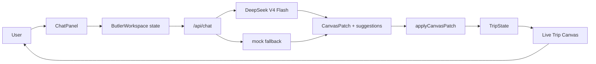
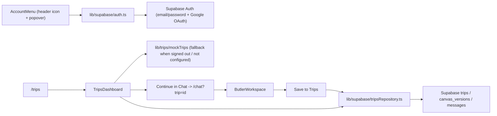
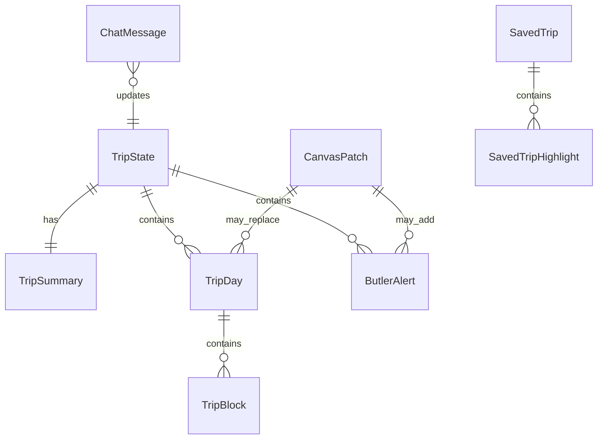

# VisePanda — 设计文档

## 架构概览

VisePanda 采用 Next.js App Router 架构。核心体验是 AI Butler workspace：用户在右侧聊天，客户端调用服务端 `/api/chat`，服务端优先使用 DeepSeek V4 Flash 返回结构化 canvas patch，失败时回落到 mock provider，左侧 Trip Canvas 实时更新。

`v0.1.11` 开始，Trips 和 Chat 共用一个真实 Supabase persistence 闭环：登录且配置 Supabase 时使用真实数据，否则回落到 `lib/trips/mockTrips`。

`v0.1.12` 起，`ButlerWorkspace` 在用户未登录时把当前 draft（`trip` + `messages`）写入 `localStorage`（`visepanda:guest-draft`），刷新或重新打开页面会还原；一旦该用户通过登录成功，组件检测到 session 从 `null` 变为有值，且本地仍有未保存的草稿（`tripId` 为空且有消息），就自动调用与 "Save to Trips" 相同的保存路径，把草稿写入 Supabase 并清空本地存储，无需用户再手动点击保存。

### ADR-013：guest draft 迁移为什么用 `localStorage` + 登录事件触发，而不是服务端 session 合并

- 背景：guest 用户在未登录状态下使用 Chat 生成 trip draft，登录后这份草稿不应该丢失。
- 决策：用浏览器 `localStorage` 暂存 draft（trip canvas + 消息），在 `useSupabaseSession` 报告的 `session` 从 `null` 变为非空那一刻，于客户端自动调用现有的 `saveTripCanvas` / `appendMessage`（与手动 "Save to Trips" 完全相同的路径），而不是引入服务端 session 合并逻辑或匿名用户表。
- 原因：当前没有匿名 Supabase Auth 用户，guest 状态没有任何服务端身份可以关联草稿；用客户端 `localStorage` + 登录事件触发是最小实现，且复用已有的 persistence 入口（`tripsRepository.ts`），不引入新的数据模型或后端流程。
- 代价：草稿只存在发起浏览器的 `localStorage` 里，换设备/换浏览器或清除站点数据会丢失未登录草稿；这是当前阶段可接受的限制，留给未来如果要支持跨设备 guest 草稿时再升级为服务端匿名身份方案。

## 技术选型

| 选项 | 选择 | 理由 |
|------|------|------|
| 框架 | Next.js App Router | 原生适配 Vercel，后续可自然加入 API routes、server actions、动态页面。 |
| UI | React + TypeScript | Chat 状态驱动画布更新，组件化和类型契约更稳定。 |
| 样式 | 全局 CSS tokens + 组件 class | 第一阶段减少依赖，方便精确控制 warm New Chinese 视觉。 |
| 图标 | lucide-react | 顶部导航使用轻量线性图标，避免字母占位，同时保持与 Vercel/Next.js 前端栈兼容。 |
| 数据库 | Supabase（预留） | 后续适合 auth、trips、chat history、canvas snapshots。 |
| AI | DeepSeek V4 Flash + mock fallback | 真实 API 可以验证产品主链路；mock fallback 保证无 key 或模型异常时仍稳定可用。 |
| 部署 | Vercel | 与 Next.js 路线一致，适合静态页面 + API route。 |
| 测试 | Vitest + Testing Library + Playwright | 覆盖纯逻辑、组件交互、桌面/移动浏览器烟测。 |

## 数据模型

核心类型：

- `TripState`：画布完整状态，包括 summary、days、alerts、lastUpdatedReason。
- `TripSummary`：标题、天数、节奏、用户类型、目的地、置信状态。
- `TripDay`：单日行程，包括城市、节奏、时间块、餐饮、住宿、交通、备注。
- `ButlerAlert`：签证、支付、预订、交通、天气、语言、风险、应急提醒。
- `CanvasPatch`：AI provider 返回的结构化更新。
- `ChatMessage`：聊天记录。
- `suggestions`：`/api/chat` 顶层返回的两个上下文建议问题，不写入 `CanvasPatch`，避免污染行程数据契约。
- `SavedTrip`：Trips Dashboard 当前使用的静态行程卡类型，后续会映射到 Supabase trips。
- `tripStatusDescriptions` / `tripStatusNextActions`：Trips 状态说明和下一步操作文案，Dashboard 与 Trip Detail 共用。
- `DestinationScene`：目的地水墨背景场景，由 `lib/visual/destinationBackground.ts` 根据 `TripSummary.destinations` 推导。
- `ExploreProviderStatus`：Explore provider readiness metadata，说明当前 provider 模式、覆盖范围、候选真实数据源、限制和下一步接入重点。
- `ToolsProviderStatus`：Tools provider readiness metadata，说明当前 provider 模式、覆盖范围、候选真实数据源、限制和下一步接入重点。
- `UserRow` / `TripRow` / `CanvasVersionRow` / `MessageRow`（`lib/supabase/schema.ts`）：对应 `supabase/migrations/0001_init_trip_schema.sql` 中 `users`、`trips`、`canvas_versions`、`messages` 表的 TypeScript 契约，当前未接入真实 Supabase 客户端。

## 关键设计决策

### ADR-001：为什么 DeepSeek 接入后仍保留 mock fallback

- 背景：真实 AI 输出质量、key 配置、provider 可用性都会影响 MVP 稳定性。
- 方案对比：仅真实 AI 更接近最终产品，但任何 key、限流、格式错误都会阻断画布；DeepSeek + mock fallback 可验证真实链路，同时保留 deterministic fallback 兜底。
- 结论：`/api/chat` 优先调用 DeepSeek V4 Flash；缺少 `DEEPSEEK_API_KEY`、HTTP 失败或 JSON patch 不合法时回落到 mock。

### ADR-002：为什么先做 Chat，再逐步扩展 Trips / Explore / Tools

- 背景：用户明确要求 Chat 是本轮主体验，右侧持续聊天、左侧实时生成行程画布。
- 方案对比：同时做所有 tab 范围过大，容易牺牲核心体验；先做 Chat 可以更快验证产品主线。
- 结论：阶段一完整实现 Chat / AI Butler；`v0.1.8` 开始把 Trips 从占位扩展为行程库骨架。

### ADR-003：为什么场景化背景放到后续（已在 v0.1.23 实现）

- 背景：按北京/上海切换水墨背景会显著增强体验。
- 方案对比：当前立即实现需要 destination state、asset mapping、切换动画、性能处理；后续实现可以先保证基础背景和工作台稳定。
- 结论：`v0.1.9`-`v0.1.22` 使用单一水墨背景，`v0.1.23` 完成 destination-aware background switching（见 ADR-025）。

### ADR-004：为什么 Day 详情使用抽屉而不是直接展开

- 背景：当前阶段优先电脑横屏端，主画布需要快速扫描，同时用户希望直接看到 Morning / Afternoon / Evening 的一天结构。
- 方案对比：主界面直接展开所有详情信息完整，但会挤压行程总览；三段式 Day 卡 + 抽屉详情让主画布可扫读，也保留编辑深度。
- 结论：Trip Canvas 主界面显示 Day 时间线和 Morning / Afternoon / Evening 三段摘要，完整描述、酒店、交通、备注和本地修改进入侧边抽屉。

### ADR-005：为什么桌面工作台固定为一屏

- 背景：Chat 是右侧持续对话，左侧是实时画布；横屏端应像稳定工作台，而不是长页面。
- 方案对比：页面级滚动实现简单，但聊天、画布和抽屉会互相错位；一屏固定 + 区域内部滚动更像产品工具。
- 结论：桌面端使用一屏固定布局，聊天流、日程列表、Trips 列表和抽屉内部自行滚动。

### ADR-006：为什么 suggestions 不放进 CanvasPatch

- 背景：建议问题属于聊天体验，不属于行程画布状态。
- 方案对比：放进 `CanvasPatch` 实现简单，但会污染 trip/canvas 数据契约；作为 `/api/chat` 顶层字段返回更清晰。
- 结论：`/api/chat` 返回 `{ patch, suggestions }`，其中 suggestions 固定为 2 个上下文相关问题。

### ADR-007：为什么 Trips 先用 mock data

- 背景：Trips 是保存行程、继续编辑和分享的关键入口，但 Supabase schema 尚未确认。
- 方案对比：立即接数据库会过早固定数据模型；先做静态 dashboard 可以验证页面信息结构、筛选和导航入口。
- 结论：`v0.1.8` Trips 使用 `lib/trips/mockTrips.ts`，后续再接 Supabase persistence 和 trip detail。

### ADR-008：为什么移除 Canvas 顶部五张任务卡

- 背景：用户希望 Live Canvas 更像行程本体，而不是提醒/任务面板；Visa、Payment、Booking 等任务框占用了画布首屏空间。
- 方案对比：保留任务卡能表达 AI 管家提醒，但会压缩每日行程；移除任务卡能让 Day 1 / Day 2 / Day 3 和三段行程成为视觉主角。
- 结论：`v0.1.9` 从 `TripCanvas` 移除 `CanvasTaskStrip` 渲染。提醒能力后续通过 `ButlerReminders` 组件（位于行程时间线下方，v0.1.26）以 Tools 深链形式呈现，不再显示在 Canvas 顶部。

### ADR-009：为什么 Supabase schema 用 canvas_versions 而不是直接拆分 trip_days 表

- 背景：`TripState` 包含 summary、days、alerts，结构会随 AI patch 频繁整体替换；Trips 后续还需要支持恢复历史版本和分享某个快照。
- 方案对比：把 `TripDay`、`ButlerAlert` 拆成各自的表能做更细粒度查询，但会让 patch 应用从一次 JSON 替换变成多表事务，且历史版本难以整体回滚；用 `canvas_versions.canvas` 存整份 `TripState` JSON，能直接复用现有 `applyCanvasPatch` 输出，并天然支持版本历史和回滚。
- 结论：`trips` 表存元信息和状态，`canvas_versions` 表存每次保存的完整 `TripState` JSON 快照，`trips.current_canvas_version_id` 指向最新快照；`messages` 表存聊天记录，结构对应 `ChatMessage`。Schema 文件：`supabase/migrations/0001_init_trip_schema.sql`，对应 TypeScript 契约：`lib/supabase/schema.ts`。

### ADR-010：为什么 Account 登录从 magic link 改为邮箱密码 + Google OAuth（v0.1.16 起取代原决策）

- 背景：任务 2.4 最初用 Supabase magic link（`signInWithOtp`）做最小可用登录。`v0.1.16` 用户要求把 Account 从独立页面收进顶部导航的一个图标 + 悬浮窗口，并改用邮箱密码登录或 Google 登录，登录后能改名、改密码、登出。
- 方案对比：继续用 magic link 需要用户跳出产品去查收邮件再跳回来，和"悬浮窗口里直接完成登录"的产品目标冲突；自建密码找回/校验流程成本高。Supabase 内置 `signInWithPassword`/`signUp`（邮箱密码）和 `signInWithOAuth({ provider: "google" })`（Google 登录）都是零自建后端代码的标准能力，且 `updateUser` 同时支持改密码（`password`）和改名（`data.full_name`），可以直接满足悬浮窗口内的账号管理需求。
- 结论：`lib/supabase/auth.ts` 改为导出 `signInWithPassword`、`signUpWithPassword`、`signInWithGoogle`、`updateDisplayName`、`updatePassword`、`signOut`；不再提供 magic link 入口。Google 登录的回调仍依赖浏览器 Supabase 客户端默认的 `detectSessionInUrl: true` 自动消费回跳 session，不需要额外的服务端 OAuth 回调路由。

### ADR-011：为什么 Trips/Chat persistence 直接用浏览器端 Supabase 客户端而不是新建 API route

- 背景：`/api/trips` 之前是占位 route；真实保存只涉及 `trips`/`canvas_versions`/`messages`,不涉及任何服务端密钥。
- 方案对比：经过 `/api/trips` 服务端转发会多一层网络跳转和重复的 schema 校验代码；让浏览器端 Supabase 客户端（用 `NEXT_PUBLIC_SUPABASE_ANON_KEY`）直接读写，由 Postgres RLS policies（`auth.uid() = owner_id`）保证隔离,逻辑更直接也更安全。
- 结论：`lib/supabase/tripsRepository.ts` 是浏览器端读写 trips 数据的唯一入口，被 `ButlerWorkspace`（保存当前 canvas）和 `TripsDashboard`（读取行程列表/恢复 canvas）共用；`SUPABASE_SERVICE_ROLE_KEY` 仍保留给未来需要绕过 RLS 的服务端任务，目前未使用。

### ADR-012：为什么 Chat 用 `window.location` / `history.replaceState` 而不是 `next/navigation`

- 背景：需要把保存后的 trip id 写进 `/chat` 的 URL，并在打开 `/chat?trip=<id>` 时读取它来恢复 canvas。
- 方案对比：`useSearchParams`/`useRouter`（`next/navigation`）是 Next App Router 的标准方式，但它们需要被挂载在真实的 Next Router 树下；现有 Vitest 组件测试直接 `render(<ButlerWorkspace />)`，没有 Router context，会在测试里抛错，还需要额外的测试基础设施改造。直接用浏览器原生 `window.location.search` 读、`window.history.replaceState` 写，行为等价（同样不触发整页跳转），且不依赖任何 Router 上下文，测试和组件解耦更简单。
- 结论：`ButlerWorkspace` 用原生 `window.location` / `history.replaceState` 读写 `?trip=` 参数，不引入 `next/navigation` 依赖。

### ADR-014：为什么分享链接用宽松的 RLS 读策略，而不是在数据库层匹配具体 token

- 背景：`v0.1.14` 需要让任何人（包括未登录访客）通过 `/share/[token]` 只读查看某条已分享行程，但 `trips`/`canvas_versions` 默认 RLS 只允许 `owner_id = auth.uid()`。
- 方案对比：可以尝试在 RLS policy 里直接比较 `share_token` 和请求参数，但 Postgres RLS policy 无法直接读取应用层传入的 query 参数（只能用 `auth.uid()`、`current_setting` 等会话级上下文），伪造这种比较意义不大；更简单可靠的方式是用一条宽松策略允许"任何 `share_token is not null` 的行可读"，真正的 token 精确匹配交给应用层查询的 `.eq("share_token", shareToken)` 完成。
- 结论：新增 `supabase/migrations/0002_trip_archive_and_share.sql`，为 `trips` 增加 `for select using (share_token is not null)` 策略，为 `canvas_versions` 增加基于 `exists` 子查询（检查对应 trip 是否有 `share_token`）的只读策略；`messages` 表不开放公开读取，保证分享页看不到聊天记录。该迁移是独立文件而不是直接改 `0001_init_trip_schema.sql`，因为已上线的 Supabase 项目已经执行过 0001，需要按顺序追加执行 0002。

### ADR-015：为什么 Explore provider 用接口 + 静态实现，而不是直接接 Amap/Trip.com/Meituan

- 背景：任务 4.1/4.2 需要让 Explore 展示城市、景点、美食、住宿，但真实第三方 API（Amap、Trip.com、Meituan）的能力边界、配额和合作关系还未验证；过早绑定某一家会让 UI 和数据格式被该厂商的响应结构锁死。
- 方案对比：可以先直接接一个真实 API 验证可行性，但这样会让 `ExploreBoard` 组件直接依赖该厂商的字段命名和分页逻辑，后续换厂商或多厂商聚合时需要重写 UI；用接口先行（`ExploreProvider`）能让 UI 只依赖稳定的领域类型（`ExploreCity`、`ExploreAttraction`、`ExploreFoodSpot`、`ExploreStay`），具体数据来源可以随时替换。
- 结论：`lib/explore/types.ts` 定义 `ExploreProvider` 接口和领域类型；`lib/explore/staticProvider.ts` 用精选静态数据实现该接口（覆盖 Beijing、Shanghai、Chengdu、Xi'an）；`lib/explore/index.ts` 的 `getExploreProvider()` 是组件唯一允许调用的工厂函数。后续接入真实 Amap/Trip.com/Meituan 时，只需要新增一个实现该接口的 provider 并在工厂里切换，`components/explore/ExploreBoard.tsx` 不需要改动。

### ADR-016：为什么把 Account 从独立页面改成头部图标 + 悬浮窗口

- 背景：`/account` 作为独立页面需要整页导航才能登录/管理账号，而登录、改名、改密码、登出都是轻量的瞬时操作，不需要占用整页。
- 方案对比：保留独立页面结构清晰但打断当前任务上下文（用户从 Chat/Trips/Explore 跳走再跳回）；做成头部常驻的图标 + 悬浮窗口可以在任意页面就地完成登录和账号管理，不离开当前上下文，也不需要任何路由跳转。
- 结论：新增 `components/account/AccountMenu.tsx`，渲染在 `AppShell` 头部、`NavTabs` 旁边，自带 `open` 状态控制悬浮窗口显示；删除 `app/account/page.tsx` 和 `components/account/AccountPanel.tsx`，`NavTabs` 的 `AppTab` 类型移除 `"account"`。悬浮窗口内部按 `useSupabaseSession` 的 `configured/loading/session` 三态切换：未配置时显示 guest 提示，未登录时显示邮箱密码登录/注册表单和 Continue with Google 按钮，已登录时显示 Change name / Change password / Log out。

### ADR-017：为什么 Explore 的 Add to Trip 用「跳转 Chat 并自动发送消息」而不是直接拼装 CanvasPatch

- 背景：任务 4.4 需要让用户在 `/explore` 看到某个景点/美食/住宿后，能一键把它加入当前行程画布；但 `AGENTS.md` 明确约束「AI 输出必须通过 `CanvasPatch` 结构进入画布，不要让 UI 直接解析自然语言」，也不允许任何非 Chat 界面直接构造或合并 `TripDay`/`TripState`。
- 方案对比：可以让 `ExploreBoard` 直接在本地拼出一份 `CanvasPatch`（比如把景点名字塞进某一天的 Morning block）插入画布，这样不需要跳转页面，但会绕开 `/api/chat` 和 DeepSeek/mock fallback，导致两套生成画布内容的逻辑并存，且新内容无法获得 AI 对行程节奏、冲突、合理性的判断；改为「跳转 Chat 并自动发送一条草稿消息」则完全复用已有的 `handleSend` → `/api/chat` → `CanvasPatch` → `applyCanvasPatch` 流程，新内容和用户手打的请求走相同代码路径，不需要新增任何画布写入入口。
- 结论：`ExploreBoard` 的每个条目新增一个 "Add to Trip" 按钮，点击后用 `window.location.href` 跳转到 `/chat?add=<encodeURIComponent(草稿消息)>`；`ButlerWorkspace` 挂载时用一个一次性 `useEffect` 读取 `add` 参数，若存在则立即清空 URL（`history.replaceState`）并调用现有的 `handleSend(addParam)`，画布更新路径与用户手动发消息完全一致。

### ADR-018：为什么 Tools 第一版用静态参考清单 + provider 接口，而不是直接接实时汇率/翻译/签证 API

- 背景：任务 5.1 要求把 Tools 从占位页升级为签证入境、支付设置、翻译、汇率、地铁、eSIM/VPN、应急 7 个真实工具页面，但实时汇率、机器翻译、签证规则查询都需要第三方 API 和持续维护的数据源，目前没有已验证的合作方或配额。
- 方案对比：可以先接一个真实 API（比如汇率换算）验证可行性，但这会让其余 6 个仍是占位的分类显得不一致，也会把 `ToolsBoard` 的渲染逻辑和某一家 API 的响应结构绑死；参考 ADR-015 对 Explore 的处理方式，先用接口加静态内容把 7 个分类都做成可用的骨架（每个分类给出准确、不易过期的通用建议，而不是承诺实时数据），用户立刻可以读到有用的清单，且后续接入真实数据源时只需替换 provider 实现。
- 结论：新增 `lib/tools/types.ts` 定义 `ToolsProvider` 接口（`listCategories()`）和 `ToolCategory` 类型（`id`/`name`/`summary`/`tips`）；`lib/tools/staticProvider.ts` 用精选静态内容实现该接口，覆盖 7 个分类；`lib/tools/index.ts` 的 `getToolsProvider()` 是组件唯一允许调用的工厂函数。`Currency`/`Translate` 等分类的文案明确写出"实时数据未接入，请查询银行/官方渠道"，避免用户误以为是实时结果。后续接入真实汇率/翻译 API 时，只需新增一个实现该接口的 provider 并在工厂里切换，`components/tools/ToolsBoard.tsx` 不需要改动。

### ADR-019：为什么 Tools 分类深链使用 `?category=` 参数而不是恢复 Canvas 任务卡

- 背景：任务 5.2 需要让任务/提醒入口能跳到对应工具分类，但用户已明确要求移除 Canvas 顶部 Visa / Payment / Booking / Less tiring / Food-focused 五个任务框，当前画布应优先展示 Day 时间线和 Morning / Afternoon / Evening。
- 方案对比：恢复顶部任务卡能提供显眼入口，但会破坏 `v0.1.9` 确认过的画布信息架构；用 `/tools?category=<tool-category-id>` 深链则让 Chat、Canvas、未来轻量提醒或外部链接都能指向同一工具分类，不需要在画布上重新占位。
- 结论：`ToolsBoard` 挂载后读取 `window.location.search` 中的 `category` 参数，如果匹配当前 provider 返回的 `ToolCategory.id` 就自动选中该分类，否则回退到第一个分类；用户手动点击分类时用 `history.replaceState` 更新地址栏，方便复制和复用深链。该实现继续只通过 `getToolsProvider()` 获取工具数据。

### ADR-020：为什么桌面端继续一屏锁定并压缩标题区

- 背景：用户要求 Chat / Trips / Explore / Tools 都尽量把展示面积留给主体内容，页面展示不下时使用滑动条，而不是让整个页面纵向滚动。
- 方案对比：页面级滚动实现简单，但顶部导航、Chat rail 和 Trip Canvas 会在滚动时错位；一屏锁定 + 内部滚动可以保持产品工作台感，但要求标题、摘要、筛选、卡片间距都更克制。
- 结论：桌面端 `.app-main` 保持 `overflow: hidden`；Chat 的 `.trip-canvas__days`、Trips 的 `.trip-library`、Explore 的 `.explore-board__columns`、Tools 的 `.tools-category-detail` 使用内部滚动。`v0.1.19` 压缩了顶部导航高度、Live Trip Canvas 标题、Trip Draft summary、Trips/Explore/Tools 页头和卡片间距。

### ADR-021：为什么顶部导航使用 lucide-react 图标

- 背景：之前 Chat / Trips / Explore / Tools 导航只用 C/T/E/X 字母占位，识别度低，也不像成品。
- 方案对比：自画 SVG 可以少一个依赖，但不利于统一线宽和未来扩展；`lucide-react` 是轻量、Tree-shake 友好的 React 图标库，能直接提供 MessageCircle、Luggage、Compass、Wrench 等语义明确的线性图标。
- 结论：`components/shell/NavTabs.tsx` 引入 `lucide-react` 的四个图标，保留原来的文字 label 和 active 状态，不改变路由结构。

### ADR-022：为什么 Trips 状态说明集中在 `lib/trips/mockTrips.ts`

- 背景：Trips Dashboard 和 Trip Detail 都需要解释 draft / ready / shared / archived 的含义。如果每个组件各写一套文案，后续状态语义很容易漂移。
- 方案对比：组件内硬编码最快，但会重复；把状态说明和下一步动作放在 domain mock 数据旁边，可以让静态示例、真实 Supabase rows 映射后的 UI、详情页共用一套语言。
- 结论：`lib/trips/mockTrips.ts` 新增 `tripStatusDescriptions` 和 `tripStatusNextActions`。Dashboard 渲染状态 guide，Trip Detail 渲染当前状态说明。真实 Supabase 的 `TripRow.status` 继续复用同一组状态 key。

### ADR-023：为什么继续扩展 Explore 静态 provider 而不是直接接第三方 API

- 背景：Explore 需要看起来更像真实发现页，但 Amap/Trip.com/Meituan 的具体授权、字段、配额还未确认。
- 方案对比：现在接任意一个第三方 API 会让 UI 提前依赖该服务的字段结构；继续扩展静态 provider 能验证城市、景点、美食、住宿的展示密度和 Add to Trip 流程，同时保持 provider interface 稳定。
- 结论：`lib/explore/staticProvider.ts` 扩展到北京、上海、成都、西安、广州、杭州、苏州、重庆。Add to Trip 的消息统一要求 VisePanda 在 Chat 中重新平衡路线，仍然通过 `/chat?add=` 进入既有 AI pipeline。

### ADR-024：为什么 Tools provider 增加 `sections` / `offlineTips` / `apiPriority`

- 背景：Tools 第一版只有简单 tips，像参考清单，不够像旅行落地工具；用户也要求补离线可读体验和后续 API 接入优先级。
- 方案对比：只在 `ToolsBoard` 里硬编码额外文案会破坏 provider abstraction；扩展 `ToolCategory` 类型能让静态 provider 和未来真实 provider 共享同一数据契约。
- 结论：`ToolCategory` 新增 `sections`（结构化清单）、`offlineTips`（离线 pocket notes）、`apiPriority`（后续真实数据源优先级说明）。`ToolsBoard` 只渲染 provider 返回的数据，不直接 import 静态数据。

### ADR-025：为什么目的地背景切换先用 CSS 场景层而不是多张真实图片

- 背景：用户希望规划北京时呈现长城/故宫风格水墨，规划上海时呈现外滩/园林风格水墨。这个体验能增强惊艳感，但不能牺牲当前桌面一屏工作台的加载速度。
- 方案对比：为每个城市新增独立大图更接近最终视觉，但会增加资源体积、首屏加载和后续图片资产管理成本；用同一张 `ink-landscape.png` 加 destination scene CSS 层，可以先验证"目的地感知"的交互效果，同时保持缓存命中和低复杂度。
- 结论：新增 `lib/visual/destinationBackground.ts`，由 `TripSummary.destinations` 推导 `DestinationScene`；`TripCanvas` 将场景写入 `document.body.dataset.destinationScene`，CSS 根据 `beijing-imperial`、`shanghai-jiangnan`、`jiangnan-lake`、`mountain-river` 或 `default-ink` 切换水墨氛围。未来如果引入真实城市图，只替换 CSS asset mapping，不改变 Trip Canvas 数据流。

### ADR-026：为什么 Explore/Tools 先加 provider readiness metadata

- 背景：下一步要评估真实第三方 provider，但当前还没有 Amap、Trip.com、Meituan、Tripadvisor、汇率、翻译、签证规则等可用凭据和字段确认。
- 方案对比：直接接某个 API 会过早绑定供应商字段；只写文档又无法让产品界面和代码契约提前适配真实 provider 切换。
- 结论：`ExploreProvider` 和 `ToolsProvider` 都新增 `getProviderStatus()`，由 provider 返回 mode、coverage、candidates、limitations 和 nextIntegration。页面只渲染 provider 返回的状态，不在组件里硬编码第三方供应商细节。后续真实 provider 接入时，状态信息和业务数据一起从 provider 层替换。

### ADR-027：为什么 ButlerReminders 用轻量条目 + 深链而不是恢复顶部任务卡（v0.1.26）

- 背景：`ButlerAlert`（`type`/`priority`/`title`/`body`/`action`）从 `v0.1.9` 起就没有任何 UI 渲染入口——`CanvasTaskStrip`（顶部五张任务卡：Visa/Payment/Booking/Less tiring/Food-focused）已被移除且 `AGENTS.md` 明确禁止恢复它；同时 `v0.1.19` 已通过 `/tools?category=` 深链把 Tools 分类做成了可寻址的目标页面。
- 方案对比：恢复 `CanvasTaskStrip` 并加上深链实现最快，但直接违反既有约束，且五张固定任务卡和真实 `alerts` 数组的语义并不一致（卡片是固定 5 类，`alerts` 是可变长度、可变类型的列表）；把提醒塞进 Chat 消息流里语义不清晰（alerts 来自 canvas patch，不是某一条具体消息）。改为在行程时间线下方新增一个不占首屏空间的轻量列表，按 `AlertType` 映射到对应 Tools 分类 id（`visa`→`visa-and-entry`、`payment`→`payment-setup`、`language`→`translate`、`transport`→`metro`、`risk`/`emergency`→`emergency`），点击即跳转 `/tools?category=<id>`；无对应分类的提醒类型（如 `booking`、`weather`）渲染为纯文本 action，不生成链接。
- 结论：新增 `components/canvas/ButlerReminders.tsx`，渲染在 `TripCanvas` 的 `.trip-canvas__days` 之后；映射表 `alertToolCategoryMap` 集中在该组件，后续如有新 alert 类型或新 Tools 分类只修改映射表，不改 `TripCanvas` 或 `ToolsBoard`；`CanvasTaskStrip.tsx` 文件继续保留但不被引用，作为已废弃的历史实现。

### ADR-028：为什么通过内部代理路由接入第三方 API 而不是直接在 provider 里 fetch 外部 URL（v0.1.27）

- 背景：`ExchangeRate-API` 和 `Amap` 都需要 API Key。Tools/Explore provider 的工厂函数在客户端 `useEffect` 里被调用，客户端 JavaScript 不能安全持有任何私密 Key。同时现有测试（Vitest/jsdom）没有运行中的 Next.js server，需要不破坏现有测试的方式接入。
- 方案对比：①直接在 provider 里 `fetch("https://v6.exchangerate-api.com/...")` 并把 Key 传进去 → Key 会出现在客户端 bundle，违反安全原则；②新增内部代理路由 `/api/exchange-rate` 和 `/api/explore/amap`，由 Next.js server 读取 `process.env.*` 并转发请求 → Key 永远不到达浏览器；provider 的客户端代码只调用同域的 `/api/*` 路由；③在 provider 里直接读 `process.env.EXCHANGE_RATE_API_KEY` → 该变量是服务端变量，客户端 bundle 里 `process.env` 不包含它，会返回 `undefined`。
- 结论（方案②）：新增 `/api/exchange-rate/route.ts` 和 `/api/explore/amap/route.ts` 作为安全的服务端代理层；`lib/tools/liveToolsProvider.ts` 和 `lib/explore/amapProvider.ts` 从客户端调用这两个同域路由；路由未配置 key 时返回 503，provider 的 `try/catch` 捕获非 ok 响应，回落到 `createStaticToolsProvider()` / `createStaticExploreProvider()`，Vitest 测试中 fetch 到 `/api/*` 会抛出，同样被 catch 捕获，保证测试通过而不需要 mock。

### ADR-029：翻译页面为什么是独立页面而不是嵌入 Tools（v0.1.28）

- 背景：用户明确要求"将 translator 作为独立一个 page"，需要文字翻译、OCR 扫描翻译+TTS、常用短语词典，并规划 STT（语音转文字）为后续功能。
- 方案对比：把翻译嵌入 Tools 分类 → 用户通过下拉/侧栏选中才能到达，层级深且与 Tools 的"静态参考清单"定位不符；独立 `/translate` 页面 → 可作为第五个主 Tab，和 Chat/Trips/Explore/Tools 平级，通过 NavTabs 直达。
- 结论：新增 `/translate` 页面（`AppShell activeTab="translate"`）+ `TranslatorPage` 三 Tab 布局；Tools 的 Translate 分类保留现有内容并新增数据驱动的 CTA 链接（`cta?: { label; href }`），`ToolsBoard` 渲染时展示该链接，不在组件里硬编码跳转逻辑；`NavTabs` 新增第五个 Tab（`Languages` 图标）；DeepSeek 翻译和 OCR.space 识别都通过服务端代理路由（`/api/translate/text`、`/api/translate/ocr`），key 不暴露给浏览器。
- TTS 方案：使用浏览器内置 `window.speechSynthesis`（lang `zh-CN`，rate 0.85），无需任何额外 API 或包，且在无网络环境下也可使用。
- STT 规划：`SpeechRecognition` API 规划为后续任务（10.5），当前在 TranslatorPage footer 显示"语音转文字功能即将推出"占位。

### ADR-030：为什么移除 TripCanvas 中的 ButlerReminders 渲染（v0.1.28）

- 背景：用户请求"chat 页面的 butler remainder 这个部份可以移除"。
- 结论：从 `TripCanvas.tsx` 移除 `ButlerReminders` 的 import 和 `<ButlerReminders alerts={...} />` JSX；`components/canvas/ButlerReminders.tsx` 文件保留（不删除），以备后续在其他位置复用或恢复；`tests/canvas-components.test.tsx` 中依赖 ButlerReminders 输出的断言（"Set up Alipay before arrival"、review payment setup 链接）同步移除，新增断言确认"Butler reminders"标题不在 DOM 中。

## 社区页面规划（Phase 11，仅规划，暂不实现）

独立 `/community` 页面。核心能力：
1. 用户公开发布/浏览 trips（标题、目的地、天数、亮点图片）。
2. 照片上传分享（Supabase Storage + CDN）。
3. 景点/美食点评，与高德 POI / 美团评分数据联动。
4. 城市维度热门榜单（景点/餐厅），每日更新。
5. 点赞/收藏，Supabase Realtime 推送社区动态。

技术依赖：`posts`/`photos`/`likes` Supabase 表、Supabase Storage、高德 POI API、美团餐饮 API（评分/评价，需申请企业资质）、Supabase Realtime。

## 路由/页面结构

- `/`：重定向到 `/chat`
- `/chat`：AI Butler 主工作台
- `/trips`：Saved Trips Dashboard 骨架
- `/trips/[id]`：Trip Detail 页面，支持归档状态切换和分享链接管理
- `/share/[token]`：公开只读分享页，无需登录即可查看已分享行程的 Canvas
- `/explore`：Explore，按城市展示景点、美食、住宿（Amap 实时 POI，无 key 时回落 8 城静态数据）
- `/tools`：Tools，按分类展示 7 类旅行工具（Currency 分类已接入实时汇率，其余仍为静态内容）；支持 `/tools?category=<tool-category-id>` 直接打开指定分类；Translate 分类带 CTA 链接跳转到 `/translate`
- `/translate`：翻译工具页面 — 文字翻译（EN↔ZH）、OCR 扫描翻译、常用短语词典和特殊词语（景点/菜名/标识）
- `/api/chat`：DeepSeek V4 Flash chat API，失败时返回 mock canvas patch
- `/api/exchange-rate`：ExchangeRate-API 代理（服务端，需 `EXCHANGE_RATE_API_KEY`）
- `/api/explore/amap`：高德 POI 搜索代理（服务端，需 `AMAP_API_KEY`；查询参数：`cityId` + `type`）
- `/api/translate/text`：DeepSeek 翻译代理（服务端，需 `DEEPSEEK_API_KEY`；POST `{ text, from, to }` → `{ ok, translation, pinyin }`）
- `/api/translate/ocr`：OCR.space 扫描识别代理（服务端，`OCR_SPACE_API_KEY` 或免费 key；POST `{ imageBase64, mimeType }` → `{ ok, text }`）
- `/api/trips`：placeholder API
- `/api/explore`：placeholder API（通用占位）
- `/api/tools`：placeholder API

## 代码结构

- `app/`：Next.js routes、layout、global CSS、API routes。
- `components/shell/`：AppShell、NavTabs（不再包含 account tab，AppShell 直接在头部渲染 `AccountMenu`；NavTabs 使用 lucide-react 图标）。
- `components/chat/`：ButlerWorkspace（挂载时读取 `?trip=`、`?add=` URL 参数，分别用于恢复保存的画布和自动发送 Explore 的 Add to Trip 草稿消息）、ChatPanel。
- `components/canvas/`：TripCanvas、TripSummary、DayCard、DayDetailDrawer、ButlerReminders（文件保留，v0.1.28 已从 TripCanvas 移除渲染）、CanvasTaskStrip（保留文件但当前不在 TripCanvas 渲染）。
- `components/translate/`：TranslatorPage（三 Tab 布局）、TextTranslator、OcrTranslator、PhraseBook。
- `lib/translate/`：`types.ts`（Phrase/SpecialTerm 类型）、`phrases.ts`（44 条常用短语 + 28 条特殊词语静态数据）。
- `lib/visual/destinationBackground.ts`：根据当前 trip destinations 推导目的地水墨背景场景。
- `components/trips/`：TripsDashboard、TripDetail；Dashboard 和详情页共用 `lib/trips/mockTrips.ts` 的状态说明。
- `components/placeholders/`：PlaceholderPage。
- `lib/ai/`：DeepSeek provider 与 fallback orchestration。
- `lib/mock-ai/`：mock butler fallback provider。
- `lib/canvas/`：canvas patch reducer。
- `lib/trips/`：Trips mock data 和后续 trip library helpers。
- `lib/supabase/`：Supabase 集成层 —— `schema.ts`（表结构契约）、`client.ts`（浏览器客户端 + 配置检测）、`auth.ts`（邮箱密码登录/注册、Google OAuth、改名、改密码、登出/session）、`useSupabaseSession.ts`（React hook）、`tripsRepository.ts`（trips/canvas_versions/messages 读写，含归档状态更新和分享 token 生成/撤销/公开读取）。
- `supabase/migrations/`：Supabase SQL schema 迁移文件；需要按顺序在真实 Supabase 项目的 SQL Editor 中手动执行（`0001_init_trip_schema.sql` 之后追加 `0002_trip_archive_and_share.sql`）。
- `components/account/AccountMenu.tsx`：头部图标 + 悬浮窗口，按 session 三态切换 guest 提示 / 邮箱密码登录注册 + Google 登录 / 已登录后的改名、改密码、登出。
- `app/trips/[id]/page.tsx`、`components/trips/TripDetail.tsx`：trip detail 页面，已登录且配置 Supabase 时渲染真实 `TripCanvas`，并提供 Mark as Ready / Archive / Restore from archive 状态切换和 Get share link / Revoke share link 操作；未登录或未配置时回落到示例行程摘要或 not-found 提示。
- `app/share/[token]/page.tsx`、`components/share/ShareView.tsx`：公开只读分享页，不依赖登录态，仅渲染分享行程的 `TripCanvas` 快照，不包含 `AppShell` 导航。
- `lib/explore/`：Explore provider abstraction —— `types.ts`（`ExploreProvider` 接口、provider status 和领域类型）、`staticProvider.ts`（当前唯一实现，静态城市/景点/美食/住宿数据 + provider readiness metadata）、`index.ts`（`getExploreProvider()` 工厂，组件唯一允许调用的入口）。
- `app/explore/page.tsx`、`components/explore/ExploreBoard.tsx`：Explore 页面，城市筛选 + 该城市的景点/美食/住宿三栏展示，数据来自 `getExploreProvider()`；静态 provider 当前覆盖 Beijing/Shanghai/Chengdu/Xi'an/Guangzhou/Hangzhou/Suzhou/Chongqing；每个条目带 Add to Trip 按钮，跳转 `/chat?add=<草稿消息>` 并要求 VisePanda 重新平衡路线。
- `lib/tools/`：Tools provider abstraction —— `types.ts`（`ToolsProvider` 接口、provider status 和 `ToolCategory` 类型，含 `sections` / `offlineTips` / `apiPriority`）、`staticProvider.ts`（当前唯一实现，签证入境/支付设置/翻译/汇率/地铁/eSIM-VPN/应急 7 个分类的静态参考清单 + provider readiness metadata）、`index.ts`（`getToolsProvider()` 工厂，组件唯一允许调用的入口）。
- `app/tools/page.tsx`、`components/tools/ToolsBoard.tsx`：Tools 页面，分类列表 + 选中分类的摘要、建议清单、结构化分组、离线 pocket notes 和 API priority，数据来自 `getToolsProvider()`；`ToolsBoard` 读取并维护 `?category=` URL 参数用于分类深链，供 `ButlerReminders` 等入口使用。
- `lib/types/`：共享类型。
- `lib/env/`：环境变量状态 registry。
- `tests/`：Vitest 和 Playwright 测试。
- `public/`：项目静态资产。
