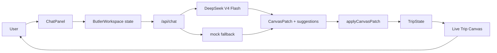
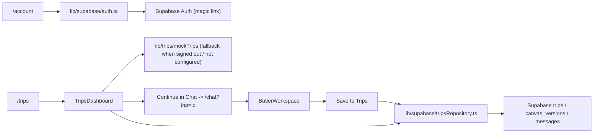
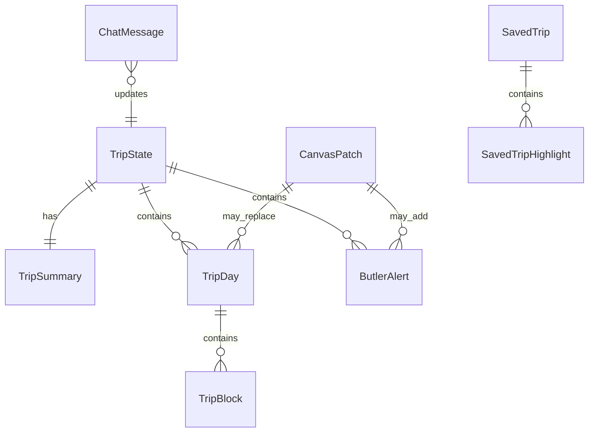

# VisePanda — 设计文档

## 架构概览

VisePanda 采用 Next.js App Router 架构。核心体验是 AI Butler workspace：用户在右侧聊天，客户端调用服务端 `/api/chat`，服务端优先使用 DeepSeek V4 Flash 返回结构化 canvas patch，失败时回落到 mock provider，左侧 Trip Canvas 实时更新。

`v0.1.11` 开始，Trips 和 Chat 共用一个真实 Supabase persistence 闭环：登录且配置 Supabase 时使用真实数据，否则回落到 `lib/trips/mockTrips`。

`v0.1.12` 起，`ButlerWorkspace` 在用户未登录时把当前 draft（`trip` + `messages`）写入 `localStorage`（`visepanda:guest-draft`），刷新或重新打开页面会还原；一旦该用户通过 magic link 登录成功，组件检测到 session 从 `null` 变为有值，且本地仍有未保存的草稿（`tripId` 为空且有消息），就自动调用与 "Save to Trips" 相同的保存路径，把草稿写入 Supabase 并清空本地存储，无需用户再手动点击保存。

### ADR-013：guest draft 迁移为什么用 `localStorage` + 登录事件触发，而不是服务端 session 合并

- 背景：guest 用户在未登录状态下使用 Chat 生成 trip draft，登录后这份草稿不应该丢失。
- 决策：用浏览器 `localStorage` 暂存 draft（trip canvas + 消息），在 `useSupabaseSession` 报告的 `session` 从 `null` 变为非空那一刻，于客户端自动调用现有的 `saveTripCanvas` / `appendMessage`（与手动 "Save to Trips" 完全相同的路径），而不是引入服务端 session 合并逻辑或匿名用户表。
- 原因：当前没有匿名 Supabase Auth 用户，guest 状态没有任何服务端身份可以关联草稿；用客户端 `localStorage` + 登录事件触发是最小实现，且复用已有的 persistence 入口（`tripsRepository.ts`），不引入新的数据模型或后端流程。
- 代价：草稿只存在发起浏览器的 `localStorage` 里，换设备/换浏览器或清除站点数据会丢失未登录草稿；这是当前阶段可接受的限制，留给未来如果要支持跨设备 guest 草稿时再升级为服务端匿名身份方案。

## 技术选型

| 选项 | 选择 | 理由 |
|------|------|------|
| 框架 | Next.js App Router | 原生适配 Vercel，后续可自然加入 API routes、server actions、动态页面。 |
| UI | React + TypeScript | Chat 状态驱动画布更新，组件化和类型契约更稳定。 |
| 样式 | 全局 CSS tokens + 组件 class | 第一阶段减少依赖，方便精确控制 warm New Chinese 视觉。 |
| 数据库 | Supabase（预留） | 后续适合 auth、trips、chat history、canvas snapshots。 |
| AI | DeepSeek V4 Flash + mock fallback | 真实 API 可以验证产品主链路；mock fallback 保证无 key 或模型异常时仍稳定可用。 |
| 部署 | Vercel | 与 Next.js 路线一致，适合静态页面 + API route。 |
| 测试 | Vitest + Testing Library + Playwright | 覆盖纯逻辑、组件交互、桌面/移动浏览器烟测。 |

## 数据模型

核心类型：

- `TripState`：画布完整状态，包括 summary、days、alerts、lastUpdatedReason。
- `TripSummary`：标题、天数、节奏、用户类型、目的地、置信状态。
- `TripDay`：单日行程，包括城市、节奏、时间块、餐饮、住宿、交通、备注。
- `ButlerAlert`：签证、支付、预订、交通、天气、语言、风险、应急提醒。
- `CanvasPatch`：AI provider 返回的结构化更新。
- `ChatMessage`：聊天记录。
- `suggestions`：`/api/chat` 顶层返回的两个上下文建议问题，不写入 `CanvasPatch`，避免污染行程数据契约。
- `SavedTrip`：Trips Dashboard 当前使用的静态行程卡类型，后续会映射到 Supabase trips。
- `UserRow` / `TripRow` / `CanvasVersionRow` / `MessageRow`（`lib/supabase/schema.ts`）：对应 `supabase/migrations/0001_init_trip_schema.sql` 中 `users`、`trips`、`canvas_versions`、`messages` 表的 TypeScript 契约，当前未接入真实 Supabase 客户端。

## 关键设计决策

### ADR-001：为什么 DeepSeek 接入后仍保留 mock fallback

- 背景：真实 AI 输出质量、key 配置、provider 可用性都会影响 MVP 稳定性。
- 方案对比：仅真实 AI 更接近最终产品，但任何 key、限流、格式错误都会阻断画布；DeepSeek + mock fallback 可验证真实链路，同时保留 deterministic fallback 兜底。
- 结论：`/api/chat` 优先调用 DeepSeek V4 Flash；缺少 `DEEPSEEK_API_KEY`、HTTP 失败或 JSON patch 不合法时回落到 mock。

### ADR-002：为什么先做 Chat，再逐步扩展 Trips / Explore / Tools

- 背景：用户明确要求 Chat 是本轮主体验，右侧持续聊天、左侧实时生成行程画布。
- 方案对比：同时做所有 tab 范围过大，容易牺牲核心体验；先做 Chat 可以更快验证产品主线。
- 结论：阶段一完整实现 Chat / AI Butler；`v0.1.8` 开始把 Trips 从占位扩展为行程库骨架。

### ADR-003：为什么场景化背景放到后续

- 背景：按北京/上海切换水墨背景会显著增强体验。
- 方案对比：当前立即实现需要 destination state、asset mapping、切换动画、性能处理；后续实现可以先保证基础背景和工作台稳定。
- 结论：当前使用单一水墨背景，destination-aware background switching 放入后续迭代。

### ADR-004：为什么 Day 详情使用抽屉而不是直接展开

- 背景：当前阶段优先电脑横屏端，主画布需要快速扫描，同时用户希望直接看到 Morning / Afternoon / Evening 的一天结构。
- 方案对比：主界面直接展开所有详情信息完整，但会挤压行程总览；三段式 Day 卡 + 抽屉详情让主画布可扫读，也保留编辑深度。
- 结论：Trip Canvas 主界面显示 Day 时间线和 Morning / Afternoon / Evening 三段摘要，完整描述、酒店、交通、备注和本地修改进入侧边抽屉。

### ADR-005：为什么桌面工作台固定为一屏

- 背景：Chat 是右侧持续对话，左侧是实时画布；横屏端应像稳定工作台，而不是长页面。
- 方案对比：页面级滚动实现简单，但聊天、画布和抽屉会互相错位；一屏固定 + 区域内部滚动更像产品工具。
- 结论：桌面端使用一屏固定布局，聊天流、日程列表、Trips 列表和抽屉内部自行滚动。

### ADR-006：为什么 suggestions 不放进 CanvasPatch

- 背景：建议问题属于聊天体验，不属于行程画布状态。
- 方案对比：放进 `CanvasPatch` 实现简单，但会污染 trip/canvas 数据契约；作为 `/api/chat` 顶层字段返回更清晰。
- 结论：`/api/chat` 返回 `{ patch, suggestions }`，其中 suggestions 固定为 2 个上下文相关问题。

### ADR-007：为什么 Trips 先用 mock data

- 背景：Trips 是保存行程、继续编辑和分享的关键入口，但 Supabase schema 尚未确认。
- 方案对比：立即接数据库会过早固定数据模型；先做静态 dashboard 可以验证页面信息结构、筛选和导航入口。
- 结论：`v0.1.8` Trips 使用 `lib/trips/mockTrips.ts`，后续再接 Supabase persistence 和 trip detail。

### ADR-010：为什么用 Supabase magic link 而不是密码或自建 auth

- 背景：任务 2.4 需要一个最小但真实的登录方式，把 owner_id 接到 `auth.users`，同时不引入密码存储和找回流程的复杂度。
- 方案对比：邮箱密码需要额外的找回密码、强度校验流程；自建 auth 要重新实现会话和安全机制；Supabase 内置 magic link（`signInWithOtp`）零密码、零自建后端代码，并且和已设计的 RLS policies 直接兼容。
- 结论：`/account` 只提供邮箱 magic link 登录，浏览器 Supabase 客户端默认 `detectSessionInUrl: true` 自动消费回跳链接中的 session,不需要额外的 OAuth 回调路由。

### ADR-011：为什么 Trips/Chat persistence 直接用浏览器端 Supabase 客户端而不是新建 API route

- 背景：`/api/trips` 之前是占位 route；真实保存只涉及 `trips`/`canvas_versions`/`messages`,不涉及任何服务端密钥。
- 方案对比：经过 `/api/trips` 服务端转发会多一层网络跳转和重复的 schema 校验代码；让浏览器端 Supabase 客户端（用 `NEXT_PUBLIC_SUPABASE_ANON_KEY`）直接读写，由 Postgres RLS policies（`auth.uid() = owner_id`）保证隔离,逻辑更直接也更安全。
- 结论：`lib/supabase/tripsRepository.ts` 是浏览器端读写 trips 数据的唯一入口，被 `ButlerWorkspace`（保存当前 canvas）和 `TripsDashboard`（读取行程列表/恢复 canvas）共用；`SUPABASE_SERVICE_ROLE_KEY` 仍保留给未来需要绕过 RLS 的服务端任务，目前未使用。

### ADR-012：为什么 Chat 用 `window.location` / `history.replaceState` 而不是 `next/navigation`

- 背景：需要把保存后的 trip id 写进 `/chat` 的 URL，并在打开 `/chat?trip=<id>` 时读取它来恢复 canvas。
- 方案对比：`useSearchParams`/`useRouter`（`next/navigation`）是 Next App Router 的标准方式，但它们需要被挂载在真实的 Next Router 树下；现有 Vitest 组件测试直接 `render(<ButlerWorkspace />)`，没有 Router context，会在测试里抛错，还需要额外的测试基础设施改造。直接用浏览器原生 `window.location.search` 读、`window.history.replaceState` 写，行为等价（同样不触发整页跳转），且不依赖任何 Router 上下文，测试和组件解耦更简单。
- 结论：`ButlerWorkspace` 用原生 `window.location` / `history.replaceState` 读写 `?trip=` 参数，不引入 `next/navigation` 依赖。

### ADR-009：为什么 Supabase schema 用 canvas_versions 而不是直接拆分 trip_days 表

- 背景：`TripState` 包含 summary、days、alerts，结构会随 AI patch 频繁整体替换；Trips 后续还需要支持恢复历史版本和分享某个快照。
- 方案对比：把 `TripDay`、`ButlerAlert` 拆成各自的表能做更细粒度查询，但会让 patch 应用从一次 JSON 替换变成多表事务，且历史版本难以整体回滚；用 `canvas_versions.canvas` 存整份 `TripState` JSON，能直接复用现有 `applyCanvasPatch` 输出，并天然支持版本历史和回滚。
- 结论：`trips` 表存元信息和状态，`canvas_versions` 表存每次保存的完整 `TripState` JSON 快照，`trips.current_canvas_version_id` 指向最新快照；`messages` 表存聊天记录，结构对应 `ChatMessage`。Schema 文件：`supabase/migrations/0001_init_trip_schema.sql`，对应 TypeScript 契约：`lib/supabase/schema.ts`。

### ADR-008：为什么移除 Canvas 顶部五张任务卡

- 背景：用户希望 Live Canvas 更像行程本体，而不是提醒/任务面板；Visa、Payment、Booking 等任务框占用了画布首屏空间。
- 方案对比：保留任务卡能表达 AI 管家提醒，但会压缩每日行程；移除任务卡能让 Day 1 / Day 2 / Day 3 和三段行程成为视觉主角。
- 结论：`v0.1.9` 从 `TripCanvas` 移除 `CanvasTaskStrip` 渲染。提醒能力暂时保留在数据和后续 Tools 深链规划中，不再显示在 Canvas 顶部。

### ADR-014：为什么分享链接用宽松的 RLS 读策略，而不是在数据库层匹配具体 token

- 背景：`v0.1.14` 需要让任何人（包括未登录访客）通过 `/share/[token]` 只读查看某条已分享行程，但 `trips`/`canvas_versions` 默认 RLS 只允许 `owner_id = auth.uid()`。
- 方案对比：可以尝试在 RLS policy 里直接比较 `share_token` 和请求参数，但 Postgres RLS policy 无法直接读取应用层传入的 query 参数（只能用 `auth.uid()`、`current_setting` 等会话级上下文），伪造这种比较意义不大；更简单可靠的方式是用一条宽松策略允许"任何 `share_token is not null` 的行可读"，真正的 token 精确匹配交给应用层查询的 `.eq("share_token", shareToken)` 完成。
- 结论：新增 `supabase/migrations/0002_trip_archive_and_share.sql`，为 `trips` 增加 `for select using (share_token is not null)` 策略，为 `canvas_versions` 增加基于 `exists` 子查询（检查对应 trip 是否有 `share_token`）的只读策略；`messages` 表不开放公开读取，保证分享页看不到聊天记录。该迁移是独立文件而不是直接改 `0001_init_trip_schema.sql`，因为已上线的 Supabase 项目已经执行过 0001，需要按顺序追加执行 0002。

### ADR-015：为什么 Explore provider 用接口 + 静态实现，而不是直接接 Amap/Trip.com/Meituan

- 背景：任务 4.1/4.2 需要让 Explore 展示城市、景点、美食、住宿，但真实第三方 API（Amap、Trip.com、Meituan）的能力边界、配额和合作关系还未验证；过早绑定某一家会让 UI 和数据格式被该厂商的响应结构锁死。
- 方案对比：可以先直接接一个真实 API 验证可行性，但这样会让 `ExploreBoard` 组件直接依赖该厂商的字段命名和分页逻辑，后续换厂商或多厂商聚合时需要重写 UI；用接口先行（`ExploreProvider`）能让 UI 只依赖稳定的领域类型（`ExploreCity`、`ExploreAttraction`、`ExploreFoodSpot`、`ExploreStay`），具体数据来源可以随时替换。
- 结论：`lib/explore/types.ts` 定义 `ExploreProvider` 接口和领域类型；`lib/explore/staticProvider.ts` 用精选静态数据实现该接口（覆盖 Beijing、Shanghai、Chengdu、Xi'an）；`lib/explore/index.ts` 的 `getExploreProvider()` 是组件唯一允许调用的工厂函数。后续接入真实 Amap/Trip.com/Meituan 时，只需要新增一个实现该接口的 provider 并在工厂里切换，`components/explore/ExploreBoard.tsx` 不需要改动。

## 路由/页面结构

- `/`：重定向到 `/chat`
- `/chat`：AI Butler 主工作台
- `/trips`：Saved Trips Dashboard 骨架
- `/trips/[id]`：Trip Detail 页面，支持归档状态切换和分享链接管理
- `/share/[token]`：公开只读分享页，无需登录即可查看已分享行程的 Canvas
- `/explore`：Explore 骨架，按城市展示景点、美食、住宿（静态 provider 驱动）
- `/tools`：Tools 占位页
- `/account`：Account 占位页
- `/api/chat`：DeepSeek V4 Flash chat API，失败时返回 mock canvas patch
- `/api/trips`：placeholder API
- `/api/explore`：placeholder API
- `/api/tools`：placeholder API

## 代码结构

- `app/`：Next.js routes、layout、global CSS、API routes。
- `components/shell/`：AppShell、NavTabs。
- `components/chat/`：ButlerWorkspace、ChatPanel。
- `components/canvas/`：TripCanvas、TripSummary、DayCard、DayDetailDrawer、CanvasTaskStrip（保留文件但当前不在 TripCanvas 渲染）。
- `components/trips/`：TripsDashboard。
- `components/placeholders/`：PlaceholderPage。
- `lib/ai/`：DeepSeek provider 与 fallback orchestration。
- `lib/mock-ai/`：mock butler fallback provider。
- `lib/canvas/`：canvas patch reducer。
- `lib/trips/`：Trips mock data 和后续 trip library helpers。
- `lib/supabase/`：Supabase 集成层 —— `schema.ts`（表结构契约）、`client.ts`（浏览器客户端 + 配置检测）、`auth.ts`（magic link 登录/登出/session）、`useSupabaseSession.ts`（React hook）、`tripsRepository.ts`（trips/canvas_versions/messages 读写，含归档状态更新和分享 token 生成/撤销/公开读取）。
- `supabase/migrations/`：Supabase SQL schema 迁移文件；需要按顺序在真实 Supabase 项目的 SQL Editor 中手动执行（`0001_init_trip_schema.sql` 之后追加 `0002_trip_archive_and_share.sql`）。
- `components/account/AccountPanel.tsx`：Account 页面的 magic link 登录 UI 和 guest-mode 文案。
- `app/trips/[id]/page.tsx`、`components/trips/TripDetail.tsx`：trip detail 页面，已登录且配置 Supabase 时渲染真实 `TripCanvas`，并提供 Mark as Ready / Archive / Restore from archive 状态切换和 Get share link / Revoke share link 操作；未登录或未配置时回落到示例行程摘要或 not-found 提示。
- `app/share/[token]/page.tsx`、`components/share/ShareView.tsx`：公开只读分享页，不依赖登录态，仅渲染分享行程的 `TripCanvas` 快照，不包含 `AppShell` 导航。
- `lib/explore/`：Explore provider abstraction —— `types.ts`（`ExploreProvider` 接口和领域类型）、`staticProvider.ts`（当前唯一实现，静态城市/景点/美食/住宿数据）、`index.ts`（`getExploreProvider()` 工厂，组件唯一允许调用的入口）。
- `app/explore/page.tsx`、`components/explore/ExploreBoard.tsx`：Explore 页面，城市筛选 + 该城市的景点/美食/住宿三栏展示，数据来自 `getExploreProvider()`。
- `lib/types/`：共享类型。
- `lib/env/`：环境变量状态 registry。
- `tests/`：Vitest 和 Playwright 测试。
- `public/`：项目静态资产。
