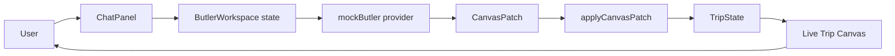
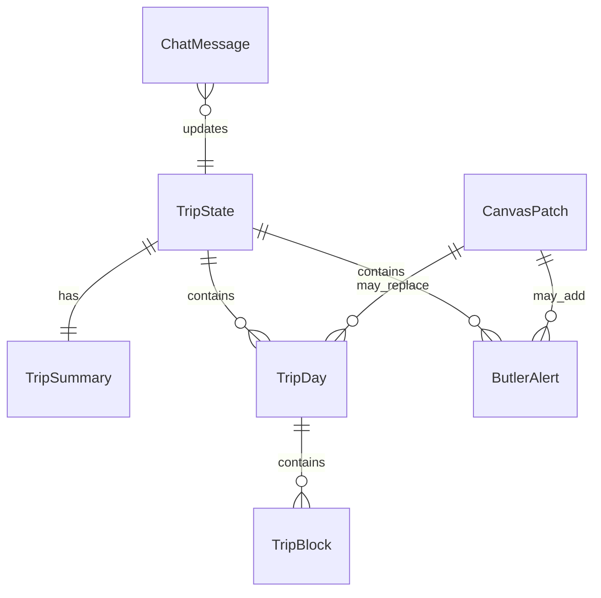

# VisePanda — 设计文档

## 架构概览

VisePanda 第一阶段采用前端优先的 Next.js App Router 架构。核心体验是一个 client-side AI Butler workspace：用户在右侧聊天，mock AI provider 返回结构化 canvas patch，左侧 Trip Canvas 实时更新。

## 技术选型

| 选项 | 选择 | 理由 |
|------|------|------|
| 框架 | Next.js App Router | 原生适配 Vercel，后续可自然加入 API routes、server actions、动态页面。 |
| UI | React + TypeScript | Chat 状态驱动画布更新，组件化和类型契约比原生 JS 更稳。 |
| 样式 | 全局 CSS tokens + 组件 class | 第一阶段减少依赖，方便精确控制 warm New Chinese 视觉。 |
| 数据库 | Supabase（预留） | 后续适合 auth、trips、chat history、canvas snapshots。 |
| AI | Mock provider（MVP），真实 provider 后接 | 先验证交互和数据契约，避免 key 和模型输出质量阻塞。 |
| 部署 | Vercel | 与 Next.js 路线一致，适合静态页面 + API route。 |
| 测试 | Vitest + Testing Library + Playwright | 覆盖纯逻辑、组件交互、桌面/移动浏览器烟测。 |

## 数据模型

### 核心类型

- `TripState`：画布完整状态，包括 summary、days、alerts、lastUpdatedReason。
- `TripSummary`：标题、天数、节奏、用户类型、目的地、置信状态。
- `TripDay`：单日行程，包括城市、节奏、时间块、餐饮、住宿、交通、备注。
- `ButlerAlert`：签证、支付、预订、交通、天气、语言、风险、应急提醒。
- `CanvasPatch`：AI provider 返回的结构化更新。
- `ChatMessage`：聊天记录。

## 关键设计决策

### ADR-001：为什么选 Next.js + React 而不是旧版 vanilla JS

- 背景：新版核心不是单列聊天，而是聊天状态实时驱动画布更新。
- 方案对比：
  - vanilla JS：依赖少，但复杂状态和组件维护成本高。
  - Next.js + React：更适合组件化、状态管理、测试和 Vercel 部署。
- 结论：选择 Next.js + React + TypeScript。

### ADR-002：为什么 MVP 使用 mock AI

- 背景：真实 AI 输出质量、key 配置、provider 选择都可能影响第一阶段进度。
- 方案对比：
  - 直接接真实 AI：看起来更完整，但容易被 prompt 和 key 阻塞。
  - mock provider：稳定、可测试、能先验证交互模式。
- 结论：MVP 使用 deterministic mock AI，真实 provider 后续替换同一接口。

### ADR-003：为什么只做 Chat 完整体验，其他 tab 占位

- 背景：用户明确要求这一轮着重 Chat 板块。
- 方案对比：
  - 同时做 Trips/Explore/Tools：范围大，容易牺牲核心体验。
  - 只做 Chat，其他占位：更快验证核心交互。
- 结论：第一阶段只完整实现 Chat / AI Butler。

### ADR-004：为什么场景化背景放到后续

- 背景：按北京/上海切换水墨背景会显著增强体验。
- 方案对比：
  - MVP 立即实现：需要 destination state、asset mapping、切换动画、性能处理。
  - 后续实现：先保证基础背景和工作台稳定。
- 结论：MVP 使用单一水墨背景，destination-aware background switching 放入后续迭代。

### ADR-005：为什么 Day 详情使用抽屉而不是直接展开在画布里

- 背景：当前阶段优先电脑横屏端，主画布需要快速扫描，不应被 Day 1 详情占满。
- 方案对比：
  - 主界面直接展开详情：信息完整，但会挤压行程总览，页面难以固定为一屏。
  - 每日一句摘要 + 抽屉详情：主画布更轻，用户需要时再查看完整行程。
- 结论：Trip Canvas 主界面只显示每日摘要，完整时间段、餐饮、住宿、交通、备注进入关闭状态的侧边抽屉。

### ADR-006：为什么桌面工作台固定为一屏

- 背景：Chat 是右侧持续对话，左侧是实时画布；横屏端应像一个稳定工作台，而不是长页面。
- 方案对比：
  - 页面级滚动：实现简单，但聊天、画布和抽屉会互相错位。
  - 一屏固定 + 区域内部滚动：更像产品工具，左右区域始终可见。
- 结论：桌面端使用一屏固定布局，聊天流、日程列表和抽屉内部自行滚动。

## 路由/页面结构

- `/`：重定向到 `/chat`
- `/chat`：AI Butler 主工作台
- `/trips`：Trips 占位页
- `/explore`：Explore 占位页
- `/tools`：Tools 占位页
- `/account`：Account 占位页
- `/api/chat`：mock chat API，返回 canvas patch
- `/api/trips`：placeholder API
- `/api/explore`：placeholder API
- `/api/tools`：placeholder API

## 代码结构

- `app/`：Next.js routes、layout、global CSS、API routes。
- `components/shell/`：AppShell、NavTabs。
- `components/chat/`：ButlerWorkspace、ChatPanel。
- `components/canvas/`：TripCanvas、TripSummary、DayCard、DayDetailDrawer、CanvasTaskStrip。
- `components/placeholders/`：PlaceholderPage。
- `lib/mock-ai/`：mock butler provider。
- `lib/canvas/`：canvas patch reducer。
- `lib/types/`：共享类型。
- `lib/env/`：环境变量状态 registry。
- `tests/`：Vitest 和 Playwright 测试。
- `public/`：项目静态资产。
