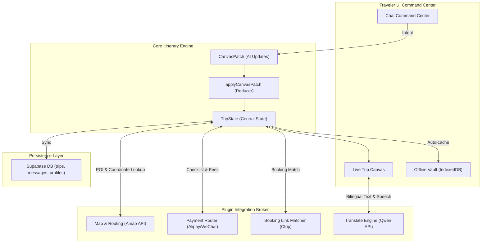

# VisePanda — One-Stop FIT Travel Butler Technical Blueprint (v0.1.53)

This strategic planning document defines the detailed technical architecture, plugin integration patterns, state contracts, offline synchronization protocols, and the concrete v0.1.53–v0.1.60 roadmap to implement VisePanda as a one-stop AI travel butler for independent foreign travelers (FITs).

---

## 1. Core Architectural Overview

To move from "six independent tabs" to a single, integrated travel operating system, VisePanda adopts a **Core-and-Plugin Broker Architecture**. The Trip Canvas state serves as the central operational model, and all external tools, maps, payments, and booking services hook into it as plugins.



---

## 2. Multi-Plugin Integration Specs

To prevent component coupling, we define a unified plugin schema inside `lib/plugins/types.ts`. All local utility, payment, maps, and booking engines must implement this interface.

### A. Maps & Transit Plugin (`lib/plugins/maps/`)
* **Understream API**: Amap Web Service Direction API.
* **Responsibilities**:
  1. **Coordinate Verification**: Match user-specified locations with latitude and longitude.
  2. **Inter-POI Travel Calculation**: Given POI A and POI B in a single day, automatically query travel time (walking, driving, transit) and inject travel-time blocks (`TransitBlock`) between cards in the UI.
  3. **Taxi Card Address Generation**: Extract large-print bilingual address text and offline static map snippets for the "Show Taxi Driver" card.

### B. Payment Router Plugin (`lib/plugins/payment/`)
* **Understream API**: Local checklist metadata + payment channel mapping.
* **Responsibilities**:
  1. **Fee Wizard**: Analyze user's credit card tier (e.g. Visa Signature vs. Amex Card) and generate setup steps for Alipay and WeChat Pay.
  2. **Rule groundings**: Highlight key payment barriers: e.g. transaction fees (3% fee on single transaction > 200 CNY), real-name ID verification requirements, and UnionPay ATM distributions.

### C. Booking Plugin (`lib/plugins/booking/`)
* **Understream API**: Ctrip / Trip.com POI Matcher API.
* **Responsibilities**:
  1. **Entity Matcher**: Query Ctrip with POI name + coordinates to retrieve Ctrip/Trip.com product IDs.
  2. **Dynamic CTA Generation**: Inject localized book buttons (e.g. "Book Ticket on Ctrip", "Reserve Hotel") directly inside the Trip Canvas detail drawer.

### D. Translation & Interpreter Plugin (`lib/plugins/translate/`)
* **Understream API**: Aliyun Bailian Qwen API (`qwen-mt-flash`, `qwen3.5-ocr`, `qwen3-tts-instruct-flash`).
* **Responsibilities**:
  1. **Menu Translation**: OCR scanning of Chinese menu images returning English names, ingredients, and allergen warnings.
  2. **Text & TTS**: Double-panel instant translation and Web Speech / Server-side TTS synthesis of Chinese words.

---

## 3. Offline-First Sync Protocol

Foreign travelers in China frequently lose stable connections due to VPN drops, tunnel transits, or local data limitations. The **Offline Vault** handles this.

```
                  +--------------------------------+
                  |  Stable Connection? (onLine)   |
                  +--------------------------------+
                             /          \
                           YES           NO
                           /              \
         +-----------------------+   +-------------------------------+
         |   "Online State"      |   |  "Offline Desk Mode" Activated|
         | - Read/Write Supabase |   | - Disable Chat Send           |
         | - Live API Calls      |   | - Load Cached TripState       |
         | - Auto-sync cache     |   | - Render Offline Tools/Maps   |
         +-----------------------+   +-------------------------------+
```

### A. Storage Architecture
1. **IndexedDB (via Dexie.js)**: Stores the active `TripState` JSON, offline phrasebooks, emergency cards, and offline static map screenshots.
2. **LocalStorage**: Stores the lightweight `UserPreferenceProfile` and the offline status token.

### B. Sync Lifecycle
1. **Cache Trigger**: On every successful `CanvasPatch` application or manual Save action, the app triggers a non-blocking background write of the full state to IndexedDB.
2. **Offline Detection**: Uses the `window.onLine` API and fetches timeouts. If any endpoint returns `504` or timeout > 5000ms, the app transitions to "Offline Desk Mode".
3. **Local Action Queue**: When offline, minor actions (such as marking pre-departure items as completed or stashing client notes) are written to a local transaction queue. Once connection resumes, the queue is synced back to Supabase in order.

---

## 4. Phase-by-Phase Technical Implementation Roadmap

Below is the detailed implementation path, tracking specific files, contracts, and verification plans for the upcoming iterations:

### Phase 1: Interaction Shell & Traveler-Facing Status (implemented in v0.1.54)
* **Goal**: Refine the first 60 seconds of planning and implement traveler-facing status copy mappings.
* **Key Tasks**:
  1. Completed: Home displays three high-confidence archetypes ("First China 10 Days Essentials", "Foodie China", "History & Nature").
  2. Completed: `components/chat/ButlerWorkspace.tsx` processes `?archetype=` URL parameter on launch and sends the mapped prompt through the Butler pipeline.
  3. Completed: `components/canvas/TripSummary.tsx` maps canvas confidence states to traveler-facing strings:
     - `Draft` -> `"Taking shape"`
     - `Refined` -> `"Looking good"`
     - `Ready` -> `"Travel-ready"`
  4. Completed: the structured `nextStep` action is displayed as a primary action card in the active Chat panel.
* **Verification**: Vitest coverage now asserts Home archetype links, Chat `?archetype=` auto-send, first-run starter chips, primary `nextStep` action, and traveler-facing Canvas title/status copy.

### Phase 2: Canvas Action Layer (v0.1.55)
* **Goal**: Enable travelers to modify and measure their itinerary completeness directly from the Canvas.
* **Key Tasks**:
  1. Implement a `CompletenessCalculator` in `lib/trips/completeness.ts` returning a score (0-100%) based on the presence of hotel coordinates, transport blocks, payment checks, and visa alerts.
  2. Render a dynamic progress bar inside `components/canvas/TripSummary.tsx`.
  3. Add quick action triggers inside `components/canvas/DayCard.tsx` ("Lighten Day", "Add Dinner", "Swap morning"). When clicked, these must send structured intent strings (e.g. `[intent: lighten_day, day: 2]`) to `ButlerWorkspace.handleSend()`.
* **Verification Plan**: Write unit tests in `tests/completeness.test.ts` asserting correct scores. Mock button clicks and verify they trigger correct orchestrator route requests.

### Phase 3: Inline Tool Cards (v0.1.56)
* **Goal**: Surface payment setup guides and visa checkers directly inside the conversation flow.
* **Key Tasks**:
  1. Update `components/chat/ChatPanel.tsx` to parse structured `ChatMessage.response` and render specialized card components (e.g., `<VisaCard />`, `<PaymentCard />`) inline.
  2. Implement local routing in `/api/chat` so if user intent is classified as `ask_factual`, it returns structured tool data from `lib/tools/staticProvider.ts` directly, bypassing the LLM.
* **Verification Plan**: Verify in `tests/chat-panel.test.tsx` that factual intents bypass LLM and render corresponding utility cards in under 150ms.

### Phase 4: TripBlock POI Embedding & Detail Upgrade (v0.1.57)
* **Goal**: Store rich POI coordinates and metadata persistently in the database.
* **Key Tasks**:
  1. Update `lib/types/trip.ts` to add optional fields to `TripBlock`: `{ rating: number, price_cny: number, lat: number, lng: number, phone: string, address_zh: string, opening_hours: string, ctrip_id: string }`.
  2. Create migration `0004_upgrade_trip_block_json.sql` in Supabase to support the schema updates.
  3. Upgrade `components/canvas/DayDetailDrawer.tsx` to display ratings, phone link, large-text address, and a Ctrip booking button.
* **Verification Plan**: Seed test database with rich POI blocks. Run database tests asserting successful schema writes and reads.

### Phase 5: Translate Everywhere & Nav Restructure (v0.1.58)
* **Goal**: Provide floating camera translation and condense navigation.
* **Key Tasks**:
  1. Move `/translate` tab to a floating button (FAB) in `components/shell/AppShell.tsx` which opens a lightweight OCR camera/microphone bottom sheet.
  2. Refine navigation tabs in `components/shell/NavTabs.tsx` to: Chat, Trips, Tools, Community.
  3. Add a "Show Taxi Driver" address card component in `components/canvas/DayCard.tsx` which displays translation and coordinates in full screen.
* **Verification Plan**: Run mobile view Playwright tests to check the floating translation button overlays. Verify it opens the OCR camera overlay without refreshing or losing the active Chat context.

### Phase 6: Tools Widgets (v0.1.59)
* **Goal**: Upgrade static checklist drawers into interactive widgets.
* **Key Tasks**:
  1. Build `components/tools/widgets/CurrencyConverter.tsx` (using ExchangeRate-API).
  2. Build `components/tools/widgets/VisaChecker.tsx` (interactive passport select questionnaire).
  3. Build `components/tools/widgets/PaymentWizard.tsx` (Visa/Mastercard fee router).
  4. Embed these widgets inside the Tools modal drawer.
* **Verification Plan**: Mock currency changes and assert calculated conversions. Verify card brand selections return correct fee advice in unit tests.

### Phase 7: Account Center & Lead Capture (v0.1.60)
* **Goal**: Implement a formal `/account` trust center and progressive profiling.
* **Key Tasks**:
  1. Create a dedicated `/account` page mapping profiles to user preferences.
  2. Add progressive lead fields (WeChat ID, nationality, arrival dates, travel budget).
  3. Implement a dynamic privacy policy checkbox and consent log persistence.
* **Verification Plan**: Test the lead form flow. Verify fields are stored in the local profile state and sync to Supabase only after explicit user consent.

### Phase 8: Admin Backend & Customer Briefs (v0.1.61)
* **Goal**: Connect user itineraries and preferences to a concierge admin board.
* **Key Tasks**:
  1. Create role-gated `/admin` view.
  2. Create server-side pipeline `/api/admin/brief` which runs a Moonshot/GLM analysis on user chat history and generates a structured `CustomerBrief`.
  3. Display active leads, trip completeness, and the customer brief card in the admin workspace.
* **Verification Plan**: Write tests mocking a traveler planning history. Check that the admin API parses the history and produces correct budgets, destinations, and a "ready-to-book" readiness score.
