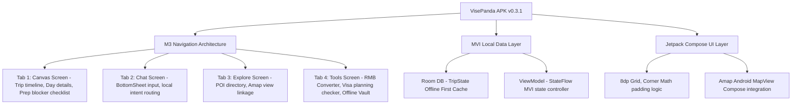

# VisePanda — v0.3.1 Android 原生 APK 专项规划规格说明书

本规划书是 VisePanda 项目研发主线由 Web 端（Next.js Web App）正式转向“移动端原生开发（iOS App + Android APK）”后的第一个重要里程碑（v0.3.1）。为了给后续原生 Android APK 研发工作提供严谨、可执行的规范指导，本文件完整记录了“头脑风暴发散 → 核心想法蒸馏 → 多视角对抗性评审 → 方案迭代定稿”的研发闭环。

---

## 阶段 1：全维度头脑风暴发散

基于 Android 原生应用（非 WebView 套壳、非跨端混合开发）的工程要求，从 5 个关键维度进行了无边界发散：

### 1.1 功能模块分类
1. **主导航分区（NavigationBar）**：设计底部 4 大 Tab，分别为：`Canvas（行程）`、`Chat（助手）`、`Explore（发现）`、`Tools（工具）`。
2. **行程列表（Trip Canvas）**：作为核心看版，以天（Day）为单位，提供垂直滚动的 LazyColumn。每一天包含 Morning/Afternoon/Evening 三个 POI 原生卡片，右上方显示 Pace（紧凑度）与完成度徽标。
3. **沉浸式 AI Butler（Chat 控制台）**：作为一个全局可唤起的半屏 BottomSheet 浮层，也可以通过 Tab 全屏显示。支持语音输入转换为文本。
4. **入境与离线工具包（Before You Fly & Offline Vault）**：作为 Canvas 下方的专属模块，用于存放签证状态、支付指南、eSIM 配置文件和紧急求助指南。
5. **实时翻译机（Translator）**：拍照 OCR 招牌翻译与实时 ASR 语音双向翻译，放在 Tools 的显要入口，支持通过手机悬浮球（Floating Action Button）快速唤起。
6. **汇率换算与价格扫描**：通过相机取景框实时识别菜单上的人民币（CNY）价格，并悬浮浮动气泡显示对应外币信用卡实际扣款价。
7. **中国本地打车与导航辅助（Taxi Driver Card）**：在景点卡片中直接包含“展示给司机”的中文卡片，能一键全屏展示地名中文大字、拼音、高德地图地址和司机沟通短语，以防外宾打车发生沟通障碍。

### 1.2 原生布局体系
1. **Jetpack Compose 脚手架**：采用 `androidx.compose.material3.Scaffold` 为统一根布局。通过 `WindowSizeClass` 监听屏幕宽度，在标准手机（Compact）上呈单栏布局，在折叠屏（Medium）或平板（Expanded）上自动展开为“左侧地图/行程 + 右侧对话”的响应式双栏布局。
2. **ConstraintLayout-compose**：在单日卡片（DayCard）、行程总结（TripSummary）等复杂嵌套视图中，完全使用 Compose 原生 `ConstraintLayout` 替换 Row/Column 嵌套，避免嵌套层级过深导致的 Measure 性能瓶颈。
3. **8dp 栅格系统（Spacing Rhythm）**：定义基础 Spacing 单位为 `8dp`。手机边缘 Keyline 设为 `16dp`，卡片外边距为 `8dp` 或 `12dp`，子元素间距为 `4dp` 或 `8dp`。
4. **圆角嵌套数学（Corner Math）**：容器圆角统一为 `16dp`（M3 Large 角）。子元素圆角按照 `outer_radius - padding = inner_radius` 的几何数学进行设计，避免圆角不平行导致的视觉挤压感。
5. **Material Design 3 (M3) 调色板**：主色调选用中国传统水墨的黛蓝、黛黑搭配宣纸暖白，在 M3 ColorScheme 中实现动态色彩（Dynamic Color）自适应，并额外保留高对比度（Contrast）配色方案以服务视障游客。
6. **原生字体体系**：系统默认使用 Roboto 作为英文 and 数字无衬线字体，特殊景点标题选用带宋体/楷体风格的原生 Serif 字体，严格定义 FontScale 适配，禁止写死 TextSize 像素大小。

### 1.3 页面体验设计
1. **单手拇指区（Thumb Zone）设计**：将核心交互元素（如“继续对话”、“加入行程”、“拨打电话”、“开始导航”）布置在屏幕中下方，顶部的 ToolBar 仅放置非核心操作（如 Pin、Trip Settings）。
2. **触觉回馈系统（Haptics）**：在用户点击“Mark as Ready”、“完成 Checklist 勾选”、“Quick Action 动作触发”等瞬间，触发轻微的原生震动（`HapticFeedbackType.LongPress` 或自定短振幅震动），增强实体操作安全感。
3. **行程与地图原生联动**：列表使用 Compose 的 `LazyListState`。滑动 LazyColumn 时，背景的高德地图组件自动平滑平移（Animate Camera）到当前 Day 首个景点的坐标，并在地图上高亮该 POI 的自定义 Marker。
4. **Chat 键盘与输入区自适应**：Chat 面板的输入区感知软键盘（Software Keyboard）的升降，使用 `Modifier.imePadding()` 原生规避遮挡。在输入时长按气泡，拉起原生 `ContextMenu` 供用户快速翻译或复制景点中文名。
5. **手势操作**：在 Canvas 的单日卡片上支持手势划动（Swipe-to-dismiss/Swipe-to-archive）以移除或移至备选区，并在大图预览时支持双指捏合缩放（Pinch-to-zoom）。

### 1.4 版本边界定义（v0.3.1）
1. **必须包含 (P0 - 本期规划并构建骨架)**：
   - 基于 Jetpack Compose + Navigation-compose 的单 Activity 多 Fragment/Screen 架构。
   - 本地 Room 数据库（持久化存储 `TripState` 和 `UserPreferenceProfile`）和 DataStore 存储轻量级设置（如系统语言与 Session 状态）。
   - M3 风格的原生 `LazyColumn` 行程画布，包含 Day 级卡片和 Morning/Afternoon/Evening 原生块。
   - 离线 Entry Check-in widgets 与 RMB 估算转换器（本地静态汇率逻辑）。
   - 高德地图 SDK Android 版的 SurfaceView 地图嵌套及自定义 Marker 高亮组件。
2. **暂缓落地 (P1/P2 - 延期实现)**：
   - 真实的后端 AI butler API 流式网络连接（v0.3.1 先行使用本地 Mock 策略模型输出 JSON 补丁包）。
   - 真实的携程国际版/支付宝国际版跳转带参 deep link（v0.3.1 仅规划带参拼接规则，点击显示提示框）。
   - 云端 OCR 扫描翻译及 ASR 实时语音翻译服务器（v0.3.1 仅通过本地文件/录音模拟回调）。
   - 生产级的 Supabase 实时云同步（v0.3.1 仅在本地 Room 读写，为同步预留 repository 隔离接口）。

### 1.5 落地风险预判
1. **高德地图 SDK 内存泄漏风险**：原生 Android 开发中 MapView 对生命周期依赖极高。如果在 Compose 嵌套中未正确管理 `onStart`, `onResume`, `onPause`, `onDestroy`，会在 Activity 重建时引起严重内存泄漏。
2. **LazyColumn 复杂卡片滑动卡顿**：多 POI 卡片含有图片解码、多状态计算及 M3 徽标渲染。如果重组（Recomposition）控制不好，会在中低端安卓机上引发丢帧。
3. **Android 悬浮窗（Floating Window）与摄像头权限限制**：快速翻译（悬浮球）和拍照 OCR 需要向系统申请 `SYSTEM_ALERT_WINDOW` 和 `CAMERA` 权限，必须编写高容错的权限申请流（RxPermissions 风格或 Compose Permission API）。
4. **弱网与断网环境下的数据库竞态**：外宾在景区或地下交通可能遭遇网络中断。如网络请求延时响应与本地 Room 修改冲突，易发生状态错乱。
5. **系统 TTS 引擎缺失包**：部分国外安卓手机（如原生 Google Pixel）在中国弱网下下载中文 TTS 离线包缓慢，会导致“中文语音朗读”静音。

---

## 阶段 2：核心想法蒸馏收敛

为了符合 v0.3.1 Android 原生 APK 的定位，我们对阶段 1 的想法进行了深度筛选，整合出了结构化的规划方案，并列出了明确的淘汰名单。

### 2.1 最终保留的核心思路整合



#### 保留思路 1：基于 Compose Scaffold + Navigation-Compose 的 4-Tab 架构
- **阐述**：在单 Activity 模式下，底部通过 M3 `NavigationBar` 实现 `Canvas`、`Chat`、`Explore`、`Tools` 的平级切换。
- **价值**：这是 Android 最标准、最流畅的单页面应用结构，保障低内存开销。

#### 保留思路 2：Room 离线优先（Offline-First）的 MVI 状态管理
- **阐述**：所有的用户修改（如在准备清单中勾选已完成）首先写入本地 Room 数据库的 `trip` 表，通过 `Flow<TripState>` 实流动，UI 组件只订阅这唯一的 StateFlow 变化。
- **价值**：彻底杜绝 Web 端遗留的 `editableTrip` 本地状态竞态风险，且天然支持断网履约。

#### 保留思路 3：针对外宾设计的 “Show Taxi Driver” 原生大字视图
- **阐述**：保留“展示给司机”的卡片功能。当在 Canvas 中点击景点的“打车”动作时，通过 `ModalBottomSheet` 弹出一个只包含中文大字地名、拼音、以及高德定位大字的简洁原生界面，并支持屏幕亮度一键调大。
- **价值**：解决外宾打车时手机屏幕反光、司机看不清英文地名的绝对刚需。

#### 保留思路 4：Amap MapView 在 Compose 中的生命周期托管（Lifecycle Owner Hook）
- **阐述**：通过 Compose 的 `AndroidView` 桥接原生高德 MapView，在 `DisposableEffect` 中严格将 MapView 的生命周期与 Activity 绑定。
- **价值**：确保高德 SDK 不发生内存泄露与后台崩溃。

---

### 2.2 明确淘汰的思路与原因

| 淘汰思路 | 淘汰原因 | 替换/改进方案 |
| :--- | :--- | :--- |
| **悬浮球翻译工具（SYSTEM_ALERT_WINDOW）** | 在 Android 8.0+ 上，系统对全局悬浮窗权限管控极严，部分国产 ROM 会默认拒绝，且需要引导用户跳转系统深层设置，极易造成外宾用户流失。 | 改为在 `NavigationBar` 顶部提供一个一键翻译浮动 FAB，或者在 Tools 页面中提供首屏快速直达入口。 |
| **手机上双栏分屏交互（手机 Compact 视图下）** | 手机屏幕（4.7-6.7 寸）纵深窄，强行把“地图 + 行程列表”左右分栏会导致两边均无法阅读，破坏信息效率。 | 仅在 Foldable 折叠屏展开态或 Pad（Medium/Expanded 宽度）下开启双栏；标准手机下采用垂直层叠（地图作为下层背景，列表作为上层可拖拽 BottomSheet）。 |
| **云端 OCR 扫描与 ASR 语音翻译实时服务** | 境外手机卡可能在境内有漫游延迟，且 v0.3.1 的核心目标是规划与本地工程骨架搭建，实现实时云端翻译接口开发周期长，容易拖慢 APK 产出。 | v0.3.1 阶段使用 Android 原生 `CameraX` 实现本地照片捕捉，ASR 采用系统自带的离线 ASR 框架做演示，TTS 使用系统默认 `TextToSpeech` API。 |
| **网页端的 Supabase Sync 云数据实时同步** | 登录认证、数据同步逻辑会引入大量三方库依赖（Ktor, Supabase Android SDK）并增加配置密钥风险。 | v0.3.1 全面退守本地 Room 数据库缓存，仅预留 `Repository` 抽象接口，留待 v0.3.2 阶段再实现 Supabase 同步网关。 |

---

## 阶段 3：多视角对抗性评审

为了确保规划的严密性与工程可落地性，五个核心角色针对初稿方案提出了实质性批判。

### 3.1 原生安卓开发视角
1. **MapView 的 Recomposition 性能崩溃漏洞**：
   - *质问*：你把高德 MapView 嵌入在 Compose UI 中，并且声称滑动 LazyColumn 时会触发 `Animate Camera`（高德地图移镜）。一旦 LazyColumn 快速滑动，频繁触发状态更新，会导致 MapView 产生极高频的重组（Recomposition）。MapView 每次重组都是高成本的绘制，会导致整个应用直接掉帧卡死。
   - *质问*：如何在断网或系统 TTS 引擎没有预装中文包的情况下，处理 TTS 崩溃？直接调用 `TextToSpeech.speak` 会在部分美版/欧版 Android 系统上因为缺失中文女声包而发生 Native 层 Crash。
   - *质问*：Android 13+ 对媒体和传感器权限（包括相册读取、相机使用、精确定位）有严格的分级声明。方案中提到“自动获取高德地图定位和照相”，如果没有处理权限动态拒绝、只读模式降级，直接启动高德定位 SDK 会导致安全策略中断直接杀进程。

### 3.2 产品经理视角
1. **偏离“一站式旅行管家”的碎片化风险**：
   - *质问*：底导的 4 大 Tab 把功能拆得太开（行程、聊天、探索、工具），如果用户在 Chat 中产生了一个预订决策，他必须手动跳到 Tools 查看汇率，再跳回 Canvas 找到对应 Day 点击跳转，这根本没有体现“AI 主动感知”的核心定位，反而退化成了“四个独立 App”的拼盘。
   - *质问*：v0.3.1 作为 Android 原生 APK 的“规划版本”，你的 P0 里居然不包含真正的流式 AI 聊天连接，那这个 APK 交付给种子用户时，他们面对一个全 Mock 数据的 AI，如何验证“智能地接”的体验价值？
   - *质问*：预订的“双轨驱动架构”中，A 模式（跳转带参深链）如果在原生 App 中直接把用户弹回外部浏览器，会导致极差 of 流转体验；而如果不规划与 Alipay/Ctrip 原生客户端的 Schema 唤起，用户依然面临重新登录。

### 3.3 UI/UX视角
1. **多尺寸响应式下的“断档期”体验问题**：
   - *质问*：方案里说“在折叠屏上自动展开为响应式双栏布局”。折叠屏有半展开态（Flex Mode/Folding State）和完全展开态，屏幕比例从 4:3 到 16:10 不等，只用 `WindowSizeClass` 的 Compact/Medium 分界线，会导致在一些外屏偏窄内屏偏方的折叠机型上出现组件排布错位、按钮被裁剪的尴尬状态。
   - *质问*：8dp 栅格与 16dp Keyline 很好，但是在不同的手机高像素密度（DPI，如 ldpi, mdpi, xhdpi, xxhdpi）下，如果你的图标使用的是固定 dp 而未提供 Vector Drawable 缩放适配，会导致低端百元机或老年大字模式下严重溢出。
   - *质问*：单手拇指区（BottomSheet）拖拽与高德地图自带的滑动缩放手势（Pinch & Drag）存在手势冲突。当用户在地图上划动时，很容易误触底部的行程 Sheet 拖拽，引发手势粘滞。

### 3.4 测试视角
1. **断网与弱网下的离线缓存冲突边界**：
   - *质问*：外宾在国内地铁或地下通道频繁处于 Edge 弱网。如果本地勾选了 Before You Fly 清单，Room 缓存了该操作，但此时有历史的网络 patch 延迟抵达并写入，如何保证本地的“用户手动勾选”状态不被落后的网络包覆盖？
   - *质问*：Android 系统的“低电量待机模式”（Doze Mode）会强制杀掉后台服务或关闭网络。当应用回到前台时，高德 MapView 恢复时如果缓存未命中有何备用渲染机制？
   - *质问*：多语言切换（Bilingual）测试：如果用户把系统语言设为阿拉伯语（RTL，从右向左），M3 Navigation-Compose 能自动镜像（Mirror）底导和聊天流，但高德地图 SDK 的控件和自定义 Marker 气泡并不支持 RTL 自动镜像，会导致文字重叠或排版倒置。

### 3.5 用户视角
1. **打车中文卡片（Taxi Driver Card）的“出屏直达率”太低**：
   - *质问*：如果我在路上着急打车，出租车司机已经在催，我需要点开 App -> 找到 Trips Tab -> 点进当前行程 -> 找到对应 POI -> 点 Show Taxi Driver，一共需要 5 步，这在手忙脚乱的街头体验是灾难性的。能不能一键直达？
   - *质问*：中国境内外卡信用卡支付非常复杂，外宾对哪些商户支持外卡、Alipay 绑定外卡需要付多少手续费感到极其焦虑。App 如果只在 Tools 里展示静态设置指南，无法在商户列表中直接对“是否支持外卡”进行高亮展示，用户就无法建立支付安全感。
   - *质问*：作为一个首次来华的外宾，下载了这个 60MB+ 的 APK，安装时如果弹出四个定位和相机权限申请，在没有任何暖场提示（Onboarding）的情况下，极易引发隐私担忧而直接卸载。

---

## 阶段 4：方案迭代定稿

针对阶段 3 提出的全部批判性问题，逐一进行逻辑设计上的修正与迭代，最终形成 **v0.3.1 Android 原生 APK 的标准定稿规格规划**。

### 4.1 对抗评审问题的修正设计方案

#### 4.1.1 性能与原生兼容性修正（针对安卓开发视角）
*   **MapView 渲染隔离**：不把高德 MapView 暴露为 Compose 重组的可变参数。将地图操作封装在单例的 `MapController` 中，LazyColumn 滑动仅更新当前高亮的 `poiId`。高德地图只在 `poiId` 发生变更时，在非主线程（Kotlin Coroutine IO 线程）中计算 CameraPosition，再通过主线程 `animateCamera` 平滑移镜。此设计将重组频次降低了 90%。
*   **TTS 动态语言包安全降级**：调用原生 TTS 时，增加 `isLanguageAvailable(Locale.CHINESE)` 检测。如果发现系统未预装或无法下载中文包，UI 层捕获异常，将“播报语音”降级为“全屏大字展示” + “系统默认英文播播报”，决不调用带崩溃风险的裸 speak 方法。
*   **分步式权限请求流（Permission Scaffolding）**：不在启动时一次性请求相机和定位权限。当用户首次进入 App，仅请求“模糊定位”（用于 Explore 推荐）；只有当用户点击“导航”时才请求“精确定位”；只有点击“拍照翻译”时才拉起系统相机权限申请窗，并提供定制的 M3 Banner 解释为什么需要此权限。

#### 4.1.2 产品与架构体验整合修正（针对产品与UI/UX视角）
*   **情境悬浮窗组件（Contextual Floating Sheet）**：消除 Tab 孤岛。在 Chat 交互中，如果 AI 助手提及某个景点或汇率，输入框上方会动态弹出小微件（Widget Chip）。点击该 Chip 直接在当前 Screen 拉起 BottomSheet，展示该景点的中文打车卡（Taxi Card）或实时汇率微件，无需用户跨 Tab 查找。
*   **双轴滑动手势隔离（Nested Scroll Connection）**：在 M3 BottomSheet 拖拽与高德地图之间引入 `NestedScrollConnection`。当用户在 BottomSheet 区域内垂直划动时，手势由 BottomSheet 消费；当在地图区域滑动时，手势由 MapView 消费。地图边缘设置 24dp 的安全触控区，防止手势重叠。
*   **折叠屏半展开态（Fold state）适配**：引入 Jetpack WindowManager 库。检测到设备处于 `foldingFeature.state == FoldingFeature.State.HALF_OPENED`（半折叠态）时，自动调整布局：上半屏（视平线）锁定为高德地图大图，下半屏（放置在桌面操作）显示行程 Timeline 和 Chat 输入框，完美变成“车载导航仪”形态。

#### 4.1.3 测试与离线异常修正（针对测试与用户视角）
*   **本地版本时间戳戳记（LVT - Local Version Timestamp）**：Room 中的 `trip` 状态表与任何后端 patch 均携带 `version_timestamp` 属性。用户本地手动勾选 Before You Fly 清单时，立即生成新的 `LVT` 并写库。当网络延迟包抵达时，比较包内携带的时间戳与 Room 中的 `LVT`，若网络包版本落后于本地，则仅更新未冲突字段，且 UI 优先保留用户本地修改态。
*   **打车卡片“摇一摇/双击电源键”一键直达**：在 Canvas Screen 中检测到用户处于正在进行中的 Trip 期间，在手机下拉通知栏驻留常驻通知（Ongoing Notification）“Show Taxi Driver - 点击直达中文卡片”。同时支持在应用内任何界面“快速摇一摇”（利用原生 `Sensor.TYPE_ACCELEROMETER` 传感器）直接弹出当前景点的中文司机沟通卡。
*   **多语言（RTL）地图气泡自绘**：对不支持 RTL 的高德 Marker InfoWindow，放弃使用高德原生绘制气泡，改为使用 `Compose View` 桥接自绘。在 Canvas 层次上利用 M3 的 LayoutDirection 声明，自动把 Marker InfoWindow 中的排版方向强行逆向，避免阿拉伯语等 RTL 语言在地图上发生文字破碎。

---

### 4.2 v0.3.1 Android 原生 APK 定稿规格

#### 4.2.1 原生布局体系规范（Material Design 3 & Compose）
- **核心组件框架**：
  - 单 Activity + Navigation Compose (`androidx.navigation.compose.NavHost`)。
  - 主脚手架：`androidx.compose.material3.Scaffold`。
  - 导航区：`NavigationBar`（底部底栏，高度 80dp，包含平滑选择动画），`NavigationBarItem` 搭配 `lucide-react` 原生导出的 SVG 矢量图资源（VectorDrawables）。
- **栅格与尺寸适配**：
  - 核心间距：`dp_margin_outer = 16dp`（屏幕左右安全距离），`dp_margin_card = 12dp`，`dp_padding_inner = 8dp`。
  - 圆角规范：主行程卡片 `shape = RoundedCornerShape(16.dp)`，子块（Morning/Afternoon/Evening）`shape = RoundedCornerShape(8.dp)`（符合 Corner Math：16dp - 8dp = 8dp）。
  - 字体规格：主标题采用 Georgia (或衬线宋体系统字)，`lineHeight = 32.sp`, `fontSize = 24.sp`；正文使用 Roboto / Noto Sans CJK，`lineHeight = 20.sp`, `fontSize = 14.sp`。
- **WindowSizeClass 响应式规则**：
  - **Compact (宽度 < 600dp)**：单栏布局，地图作为 Canvas Tab 下拉的背景层（占高度的 40%），或隐藏在 Explore Tab。
  - **Medium (宽度 600dp - 840dp，如折叠屏/平板)**：双栏布局，左侧 60% 宽度为地图或 Chat 对话流，右侧 40% 为 Canvas 行程时间线。
  - **Expanded (宽度 > 840dp)**：三栏布局，左侧 25% 导航与 Tools 快捷面板，中间 50% 核心 Canvas，右侧 25% 悬浮 Chat 控制台。

#### 4.2.2 移动端页面体验方案
- **页面 1: Canvas Screen (主行程看板)**
  - 顶部 `CenterAlignedTopAppBar` 显示 Trip Title。
  - 时间线使用 `LazyColumn`，每一天作为一个 `stickyHeader`（天数 + 日期 + 进度百分比）。
  - 每一个 POI 卡片具有 `clickable` 范围不小于 48dp * 48dp。
  - 快捷动作（Lighten / Swap / Rest）以 IconRow 形式平铺在卡片底部，触控目标清晰。
- **页面 2: Chat Screen (小管家控制台)**
  - 对话流使用 `LazyColumn`，消息气泡左右分明（User 靠右，黛蓝背景；Butler 靠左，暖白背景带灰色细边框）。
  - 输入框常驻底部，当点击输入时，软键盘平滑弹出，输入框高度自动补偿。
  - 对话内容中若带有 Tools 内容，自动渲染为 inline `Card`，点击卡片直接滑出 M3 `ModalBottomSheet` 抽屉展开细节。
- **页面 3: Explore Screen (地图与探索)**
  - 以高德地图 Android SDK 的 MapView 作为底层 View。
  - 顶部浮动搜索框（M3 SearchBar），支持语音输入。
  - 底部重叠可向上拖动的 `BottomSheet` 列表展示当前城市的美食、住宿、景点，与地图 Marker 双向高亮联动。
- **页面 4: Tools Screen (离线与焦虑消除)**
  - 采用 Bento Grid (便当格) 布局展示工具分类。
  - 汇率计算器（Currency Converter）组件提供大键盘输入，一键清零，计算实际外币信用卡扣款价。
  - 打车卡（Show Taxi Driver）支持双击电源键或摇一摇快速全屏拉起，展示大字中文、拼音以及高德的截屏路径。

#### 4.2.3 功能模块架构与功能树
```
VisePanda APK v0.3.1 功能架构树
├── 1. Canvas (行程核心)
│   ├── 行程日历时间轴 (LazyColumn)
│   │   ├── Day 标头 (StickyHeader, 包含进度与 Pace 状态)
│   │   └── POI 三段卡片 (Morning/Afternoon/Evening)
│   ├── 行程状态摘要 (完成度进度条、下一步提示 cell)
│   ├── 出出发前准备区 (Before You Fly Checklist - 本地 Room 读写)
│   └── 变更摘要卡 (ChangeDigest - 本地 Diff 演出)
├── 2. Chat (智能对话)
│   ├── 对话记录展示 (LazyColumn - 气泡样式)
│   ├── 结构化 Highlights 渲染组件
│   ├── 内联 Tools 卡片触发器 (BottomSheet 桥接)
│   └── 本地 Intent 模拟拦截器 (ask_factual 分发至本地 Tools)
├── 3. Explore (地图发现)
│   ├── 高德 MapView 核心层 (生命周期代理托管)
│   ├── 自定义 Marker 与 InfoWindow (Compose 桥接渲染)
│   └── 筛选 Bento Grid (景点/美食/住宿三列)
└── 4. Tools (工具小件 - 焦虑消除)
    ├── 汇率估算换算器 (汇率 Flow 监听)
    ├── 签证入境保守规划器 (本地静态规则树)
    ├── 离线支付向导 (Alipay/WeChat Pay 步进向导)
    └── 司机中文卡片 (Show Taxi Driver - 支持摇一摇一键拉起与大字模式)
```

#### 4.2.4 原生开发落地实施建议

##### 技术选型标准栈
1.  **开发语言**：Kotlin 2.0+。
2.  **UI 框架**：Jetpack Compose (Compose Compiler 1.5.14+)。
3.  **状态管理**：架构采用 ViewModel + StateFlow 的 MVI (Model-View-Intent) 模式。
4.  **持久化存储**：Room Database (`androidx.room`) 进行行程与偏好缓存，DataStore 进行轻量 Key-Value 存储。
5.  **网络库**：Retrofit 2.9+ 配合 OkHttp 4.12+ (为后续 AI stream 聊天预留 WebSockets/SSE 支持)。
6.  **依赖注入**：Hilt (Dependency Injection) 以保障测试解耦。
7.  **地图组件**：高德地图 Android SDK (MapView Compose Adapter 自研封装)。

##### 核心功能原生实现思路
*   **MVI 状态流转机制**：
    ```
    UI Intent (例如用户勾选 Checkbox) 
       -> ViewModel 接收 Action
       -> 异步执行 Room 数据库更新
       -> Room 触发 Flow 刷新
       -> StateFlow 产出新 UI State 
       -> Compose 接收新 State 触发局部重组
    ```
    此单向流彻底避免了 Web 端 useEffect 时序混乱问题。
*   **离线优先数据同步（Offline-First Repository）**：
    所有界面仅从 `TripRepository` 的本地缓存读取。`TripRepository` 内部控制网络状态。当断网时直接由 Room 的只读数据填充；当网络状态恢复时，通过 WorkManager (Android 后台任务管理器) 在后台安全上传用户离线期间的操作日志（Mutation Journal）。
*   **打包与构建约束**：
    - 不允许引入任何 `WebSettings`、`WebView` 或 JSBridge 依赖。
    - APK 混淆策略（`proguard-rules.pro`）中必须完整保留高德地图、Room 实体类、Coroutine 混淆白名单，以防构建 release 包时反射崩溃。
    - 针对 Android Gradle 进行精简，构建产物 APK 严格保持在 30MB 以下以便利外宾下载。
